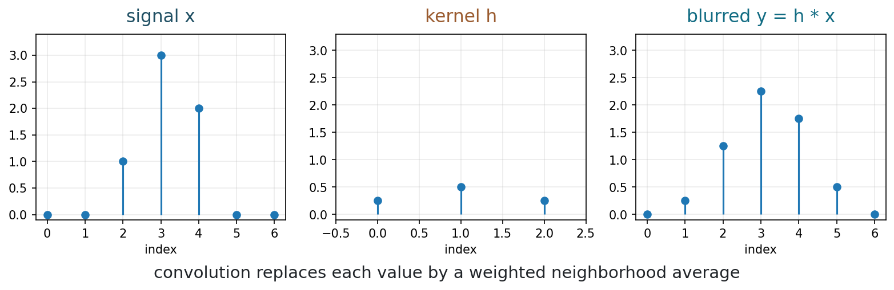
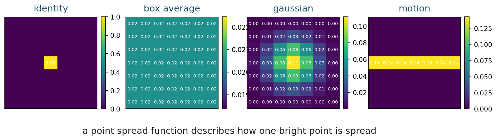
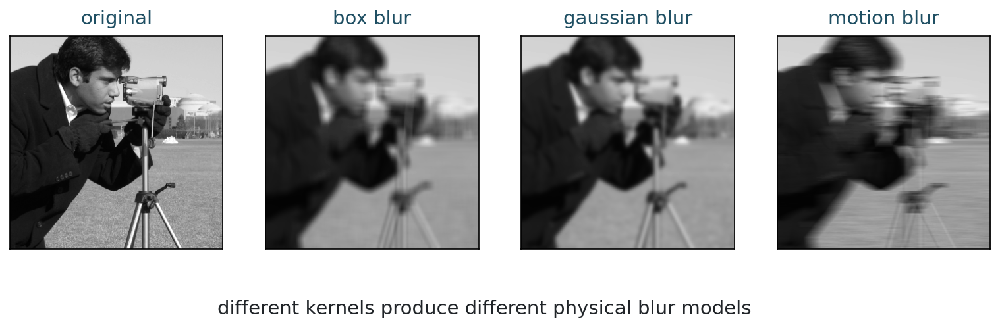
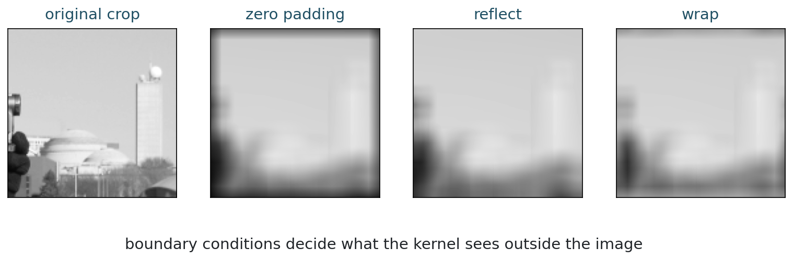
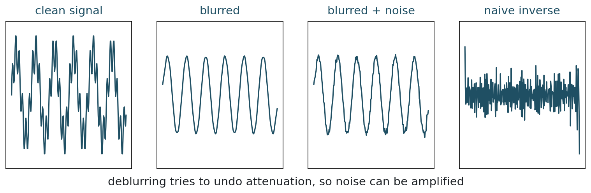

[Slides](../slides/week-02-convolution-blur.html) | [Notebook](../notebooks/week02_convolution_blur.ipynb) | [Open in Colab](https://colab.research.google.com/github/lnajman/math435-mathematical-imaging/blob/main/notebooks/week02_convolution_blur.ipynb)

## Learning Goals

By the end of this chapter, you should be able to:

- compute a simple 1D convolution;
- interpret a blur kernel as a point spread function;
- explain why fixed blur is a linear operator;
- describe the role of boundary conditions;
- explain why deblurring is unstable.

## Local Weighted Averages

Convolution begins with a local rule. For a one-dimensional signal $x$, define

$$
y_i = \frac{1}{4}x_{i-1}+\frac{1}{2}x_i+\frac{1}{4}x_{i+1}.
$$

The output at index $i$ is a weighted average of nearby input values. The weights

$$
h =
\begin{bmatrix}
\frac{1}{4} & \frac{1}{2} & \frac{1}{4}
\end{bmatrix}
$$

form a convolution kernel.

If the weights are nonnegative and sum to 1, the operation preserves average brightness for constant signals.

::: {.figure}
{fig-alt="One dimensional signal, convolution kernel, and blurred output"}

Convolution spreads a local peak into neighboring positions.
:::

## The Convolution Formula

One common discrete convention is

$$
(h*x)_i = \sum_k h_k x_{i-k}.
$$

For symmetric kernels, convolution and correlation produce the same result. For nonsymmetric kernels, the reversal in the index convention matters.

For a fixed kernel $h$, convolution is linear:

$$
h*(a x + b z) = a(h*x)+b(h*z).
$$

It is also shift-invariant: the same local rule is applied at every position.

## Two-Dimensional Convolution

For an image $x[i,j]$ and a 2D kernel $h[a,b]$,

$$
y[i,j]
=
(h*x)[i,j]
=
\sum_{a,b} h[a,b]\,x[i-a,j-b].
$$

The output pixel is a weighted combination of nearby input pixels.

## Point Spread Function

The point spread function (PSF) describes how an imaging system records a single ideal bright point.

If a point is recorded as a small Gaussian blob, then the image is blurred by approximately the same Gaussian pattern at every location. Under that assumption, the imaging model is convolution.

::: {.figure}
{fig-alt="Identity, box average, gaussian, and motion blur kernels"}

Common kernels model different kinds of blur.
:::

| Kernel | Effect | Possible interpretation |
|---|---|---|
| identity | no blur | ideal sampling |
| box average | local averaging | simple smoothing |
| Gaussian | smooth blur | defocus or optics |
| motion | directional streak | camera or object motion |

## Blur As A Forward Operator

If $h$ is fixed, then blur can be written as

$$
y = h*x.
$$

After vectorization, this becomes

$$
y = Ax,
$$

where $A$ is the matrix that represents convolution by $h$ under the chosen boundary convention.

::: {.callout-note}
A fixed blur is linear. This does not mean every image formation process is linear. It means this particular controlled model is linear.
:::

## Real Image Blur

::: {.figure}
{fig-alt="Real grayscale image with box, gaussian, and motion blur"}

Different kernels remove different details from the same image.
:::

Blur reduces local contrast. Edges become less sharp, fine textures disappear, and point-like structures spread into neighborhoods.

## Boundary Conditions

Near the edge of an image, a convolution kernel asks for values outside the recorded grid. Boundary conditions decide what those values mean.

Common choices include:

| Boundary condition | Meaning |
|---|---|
| zero padding | outside pixels are zero |
| reflection | image reflects at the boundary |
| periodic | image wraps around |
| nearest | outside pixels copy the nearest boundary value |

::: {.figure}
{fig-alt="Boundary-condition effects for image convolution"}

The same kernel can produce different edge behavior depending on the boundary rule.
:::

Boundary choices are part of the mathematical model. They should not be treated as harmless implementation details.

## Why Deblurring Is Hard

Deblurring asks for an image $x$ from a blurred observation $y$:

$$
y = Ax + \eta.
$$

If blur attenuates fine details, then trying to invert the blur must amplify the components that were weakened. Unfortunately, noise is also amplified in those same directions.

::: {.figure}
{fig-alt="Naive deblurring instability in a one-dimensional signal"}

Naive inversion can turn small noise into large oscillations.
:::

This is the first appearance of a central course theme: reconstruction is not only inversion. It is stabilized inversion.

## Computation

The Week 2 notebook lets you change kernels, boundary modes, and deblurring stabilizers.

Run:

```bash
python3 examples/week02_convolution_blur.py
```

or open the notebook in Colab from the link at the top of this chapter.

## Exercises

1. Compute one output value for the kernel $[1/4,1/2,1/4]$ and the signal $[0,0,1,3,2,0,0]$.
2. Explain why a normalized blur kernel preserves constant images.
3. Compare zero-padding and reflection near an image boundary.
4. Explain in your own words why deblurring amplifies noise.

## Takeaways

- Convolution is a local weighted averaging rule.
- A point spread function models how one ideal point is spread by the imaging system.
- Fixed blur is linear and can be written as $y=Ax$.
- Boundary conditions are modeling choices.
- Deblurring is unstable because blur weakens information that inversion tries to recover.

