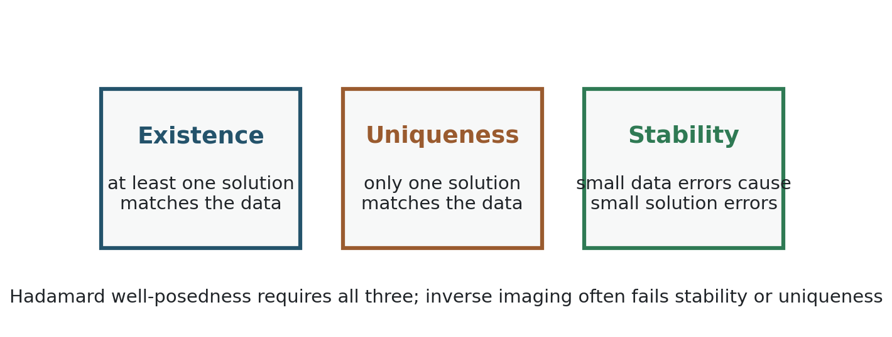
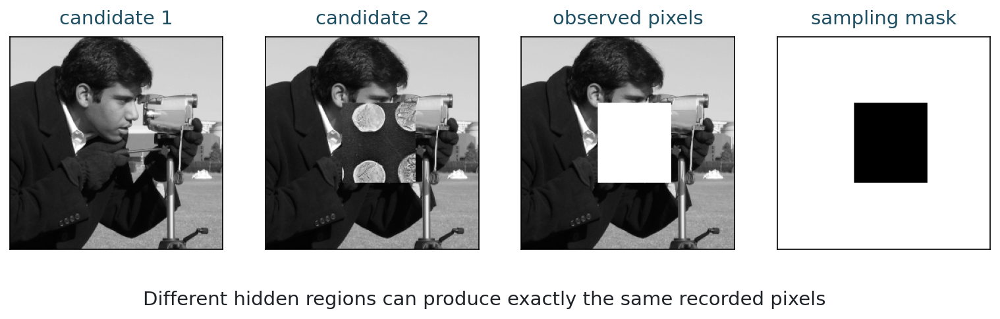
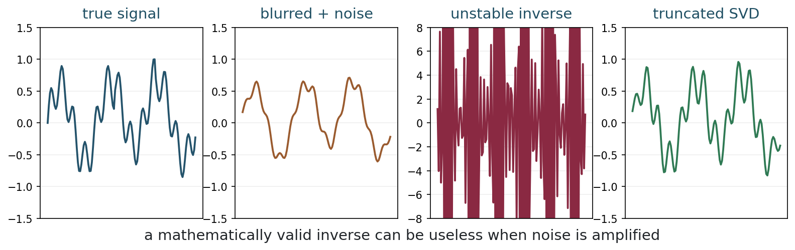
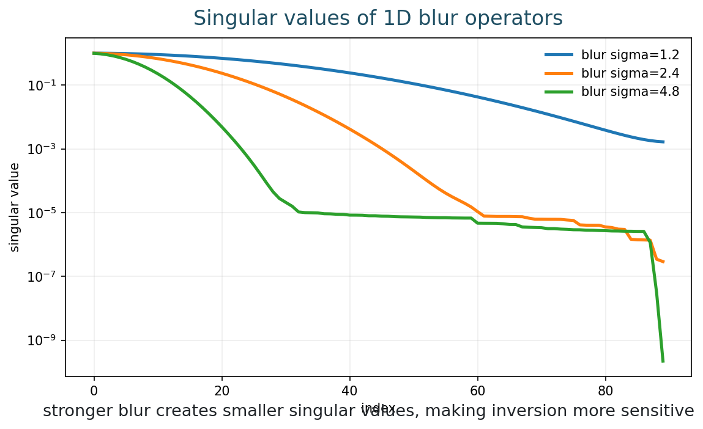
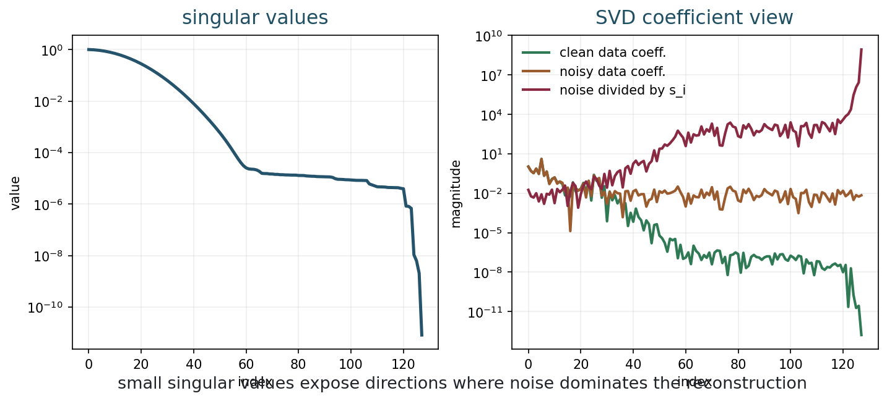

[Slides](../slides/week-05-ill-posed-inverse-problems.html) | [Notebook](../notebooks/week05_ill_posed_inverse_problems.ipynb) | [Open in Colab](https://colab.research.google.com/github/lnajman/math435-mathematical-imaging/blob/main/notebooks/week05_ill_posed_inverse_problems.ipynb)

## Learning Goals

By the end of this chapter, you should be able to:

- state Hadamard's three conditions for well-posedness;
- identify non-uniqueness in missing-data imaging;
- distinguish missing recorded pixels from physical occlusion;
- explain stability and instability;
- interpret small singular values as noise-amplifying directions.

## The Inverse Problem

A forward problem maps a cause to an effect:

$$
x \longmapsto y = f(x).
$$

An inverse problem asks us to recover a cause from an observed effect:

$$
y \longmapsto x.
$$

In imaging, $x$ may be an unknown image or scene, and $y$ may be a blurred, noisy, incomplete, or transformed measurement.

When the imaging model is linear, we write

$$
y = Ax.
$$

Linear models include idealized blur, Fourier sampling, and recorded-pixel selection after image formation. But physical scene occlusion is different: hidden content may never reach the sensor, so the inverse problem is not simply "undoing a linear operator."

## Hadamard Well-Posedness

Hadamard called a problem well posed if three conditions hold:

::: {.figure}
{fig-alt="Existence, uniqueness, and stability as the three Hadamard conditions"}

Existence, uniqueness, and stability are three different ways an inverse problem can fail.
:::

The three questions are:

| Condition | Question |
|---|---|
| Existence | Does at least one solution fit the data? |
| Uniqueness | Is there only one such solution? |
| Stability | Do small data errors cause small solution errors? |

A well-posed problem may still be computationally expensive. An ill-posed problem may be small and fast but mathematically unreliable.

Well-posedness is about the behavior of the map from data to solution.

## Existence

Existence can fail when the data are inconsistent with the model. For example, suppose a model claims that all measured intensities must be nonnegative and below one, but the data contain values outside that range. Or suppose we demand exact agreement with noisy measurements that no model image can produce.

In practice, noise and model error often make exact existence too strict. This is one reason reconstruction methods use data fidelity terms rather than exact constraints.

## Non-Uniqueness

Non-uniqueness means several different images explain the same observation.

::: {.figure}
{fig-alt="Two candidate images, the same observed pixels, and a sampling mask"}

Different images can agree on all observed pixels.
:::

Let $M$ be a recorded-pixel selection mask:

$$
y = Mx.
$$

If two images differ only where $M$ does not observe, then

$$
Mx_1 = Mx_2.
$$

The recorded data alone cannot choose between $x_1$ and $x_2$.

## Masking Versus Occlusion

It is important to separate two ideas.

| Situation | Mathematical description | Interpretation |
|---|---|---|
| Recorded-pixel masking | a linear projection of an already formed image | pixels are missing from the stored image |
| Physical occlusion | hidden scene content may not be measured at all | the sensor never received that information |

Both create missing information, but they are not the same physical model. If a person is hidden behind a tree in a single image, the hidden content is not encoded in the pixels behind the tree. No inverse algorithm can recover exact information that was never measured.

## Nullspace Language

For a linear operator $A$, the nullspace is

$$
\mathcal{N}(A)=\{z:Az=0\}.
$$

If $z\in \mathcal{N}(A)$, then

$$
A(x+z)=Ax.
$$

The nullspace contains invisible changes. If $A$ has a nontrivial nullspace, data fidelity cannot identify a unique image:

$$
D(y,Ax)=D(y,A(x+z)).
$$

To choose between possible reconstructions, we need extra information: smoothness, sparsity, edge preservation, training data, physical constraints, or some other modeling assumption.

## Stability

An inverse map is stable if nearby data give nearby solutions. Informally,

$$
\|y_1-y_2\| \text{ small}
\quad\Rightarrow\quad
\|x_1-x_2\| \text{ small}.
$$

Stability is the reason noise matters mathematically.

Consider the one-dimensional model

$$
y=\varepsilon x.
$$

The inverse is

$$
x = y/\varepsilon.
$$

If $\varepsilon$ is small, tiny errors in $y$ become large errors in $x$.

## Imaging Instability

Blur suppresses some directions in image space. Deblurring tries to divide by those suppressions.

The unstable directions are the directions that the forward model almost erases.

::: {.figure}
{fig-alt="True signal, blurred noisy signal, unstable inverse, and truncated SVD reconstruction"}

A direct inverse can be mathematically defined and still useless in the presence of noise.
:::

In this picture:

- a solution exists;
- the model is known;
- the data error is tiny;
- the direct inverse is still unstable.

This is a stability failure.

## Singular Values

The singular value decomposition gives a coordinate system for sensitivity.

For a linear operator $A$,

$$
A v_i = \sigma_i u_i.
$$

The singular value $\sigma_i$ tells how strongly $A$ transmits the input direction $v_i$.

Large singular values correspond to directions that are visible in the data. Small singular values correspond to directions that are weakly visible or nearly invisible.

## Inverting In SVD Coordinates

If

$$
y=Ax
$$

and

$$
y=\sum_i \alpha_i u_i,
$$

then the formal inverse is

$$
x=\sum_i \frac{\alpha_i}{\sigma_i}v_i.
$$

With noisy data

$$
y^\delta=Ax+\eta,
$$

the inverse includes terms of the form

$$
\frac{\langle \eta,u_i\rangle}{\sigma_i}.
$$

Small singular values divide noise by a small number.

::: {.figure}
{fig-alt="Decaying singular values of blur operators with several blur strengths"}

Stronger blur typically makes singular values decay faster.
:::

## Reading Singular-Value Plots

Singular values help diagnose instability:

- stronger blur gives faster singular-value decay;
- later singular vectors often represent oscillatory detail;
- small singular values mean details are weakly observed;
- inversion becomes sensitive where singular values are small.

::: {.figure}
{fig-alt="Singular values and SVD coefficients showing noise divided by small singular values"}

The dangerous coefficients are those where noise is divided by small singular values.
:::

## Condition Number

For an invertible matrix,

$$
\kappa(A)=\frac{\sigma_{\max}}{\sigma_{\min}}.
$$

A large condition number means there is a direction that is transmitted much more weakly than another.

The condition number warns us about worst-case sensitivity, but it is not the whole story. In imaging we also care about:

- where the noise lives;
- whether small singular directions contain important image details;
- how the reconstruction will be used.

## Stabilization Idea

If small $\sigma_i$ amplify noise, one crude stabilization idea is:

$$
\frac{\alpha_i}{\sigma_i}
\quad\text{only for sufficiently large } \sigma_i.
$$

This is the idea behind truncated SVD.

Truncated SVD keeps stable directions that are well observed and discards unstable directions that may contain detail. This is already a bias-stability tradeoff.

The next chapter replaces a hard cutoff with Tikhonov regularization:

$$
\min_x
\|Ax-y\|_2^2 + \lambda\|x\|_2^2.
$$

## Computation

The Week 5 notebook lets you vary blur strength, noise level, and the number of singular values kept.

Run:

```bash
python3 examples/week05_ill_posed.py
```

or open the notebook in Colab from the link at the top of this chapter.

## Exercises

1. Give an example of an inverse problem where existence fails.
2. Give an example of an inverse problem where uniqueness fails.
3. Explain why a missing square in an image creates many possible completions.
4. For singular values $1,0.7,0.3,0.02,0.0001$, identify the dangerous directions to invert.
5. Explain in your own words why direct deblurring can fail even when the blur model is known.

## Takeaways

- Ill-posedness is a structural issue, not merely a computational inconvenience.
- Hadamard's conditions are existence, uniqueness, and stability.
- Missing information causes non-uniqueness.
- Small singular values cause instability because inverse formulas divide by them.
- Regularization is motivated by the need for stable reconstruction.
