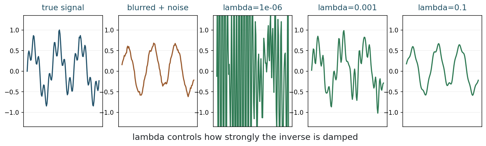
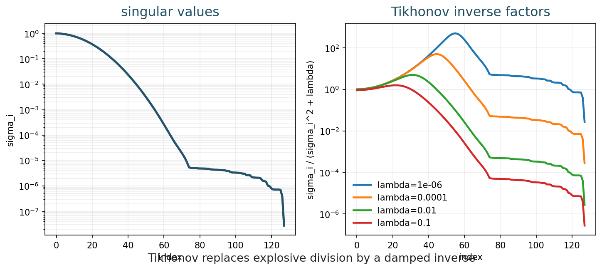
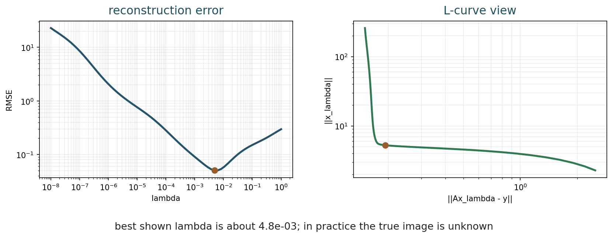
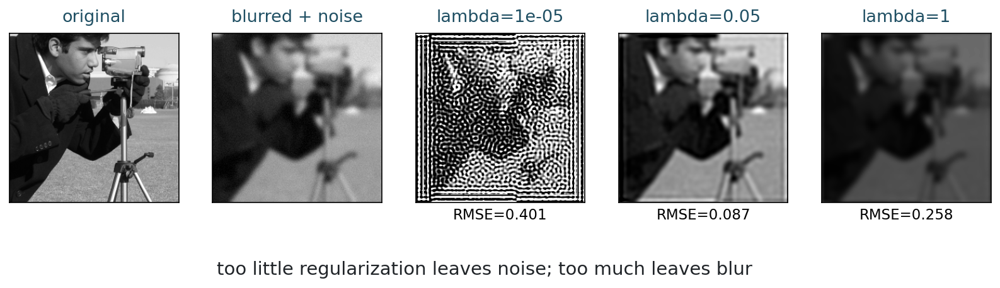
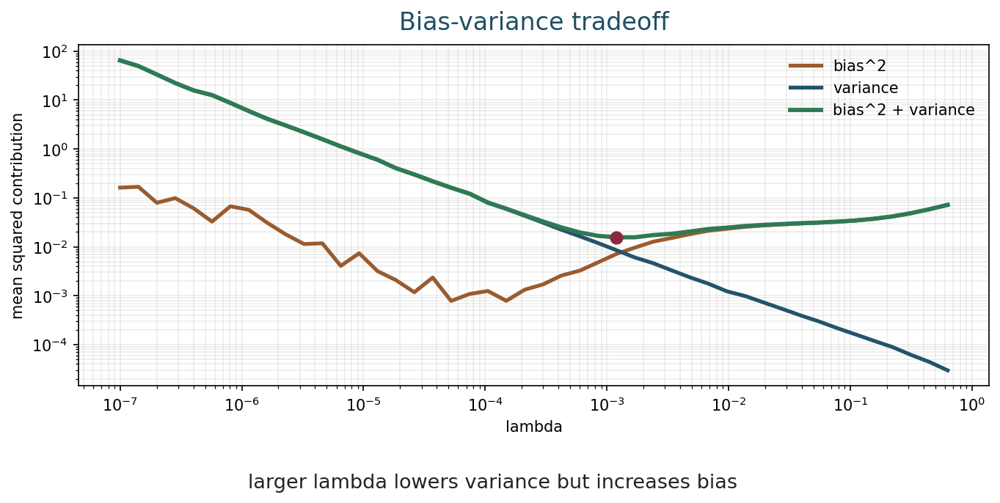

[Slides](../slides/week-06-tikhonov-regularization.html) | [Notebook](../notebooks/week06_tikhonov_regularization.ipynb) | [Open in Colab](https://colab.research.google.com/github/lnajman/math435-mathematical-imaging/blob/main/notebooks/week06_tikhonov_regularization.ipynb)

## Learning Goals

By the end of this chapter, you should be able to:

- formulate Tikhonov regularization;
- derive the normal equations;
- interpret the regularization parameter $\lambda$;
- read Tikhonov filter factors;
- audit whether $\lambda$ is under- or over-regularizing;
- explain the bias-stability tradeoff.

## Why Regularize?

Chapter 5 showed that direct inversion can amplify noise through terms such as

$$
\frac{\langle \eta,u_i\rangle}{\sigma_i}.
$$

When $\sigma_i$ is small, division by $\sigma_i$ is dangerous. Regularization changes the inverse problem so that weakly observed directions are not trusted blindly.

For a linear imaging model

$$
y=Ax+\eta,
$$

the Gaussian least-squares data fit is

$$
\|Ax-y\|_2^2.
$$

If $A$ is ill-conditioned, least squares can fit noise. Data fit alone does not know which data components are reliable.

Tikhonov regularization is the first full example of the course template

$$
\operatorname*{argmin}_x D(Ax,y)+\lambda R(x).
$$

Here the data term comes from the Gaussian noise model of Chapter 4, and the regularization term is a simple prior on the image. This makes Tikhonov a useful bridge: it is elementary enough to derive completely, but it already contains the logic behind many modern reconstruction methods.

## Tikhonov Regularization

The simplest Tikhonov model is

$$
x_\lambda
=
\operatorname*{argmin}_x
\|Ax-y\|_2^2+\lambda\|x\|_2^2.
$$

The parameter $\lambda>0$ controls the strength of regularization.

The objective has two terms:

| Term | Role |
|---|---|
| $\|Ax-y\|_2^2$ | prefer reconstructions that explain the measurements |
| $\lambda\|x\|_2^2$ | prefer smaller-energy solutions |

If two images explain the data similarly, Tikhonov prefers the one with smaller norm.

::: {.figure}
{fig-alt="True signal, blurred noisy data, and Tikhonov reconstructions for three lambda values"}

Changing $\lambda$ moves the reconstruction along a path from unstable to over-damped.
:::

Very small $\lambda$ leaves unstable directions barely damped. Moderate $\lambda$ can control noise while preserving structure. Large $\lambda$ over-damps the solution.

The phrase "smaller-energy solution" should be interpreted carefully. For a signal represented as a vector, $\|x\|_2^2$ penalizes large coefficients. For images, this can shrink contrast and suppress detail. It does not directly say "prefer sharp edges" or "prefer natural texture." This is why basic Tikhonov is stable but often visually too smooth.

## Probabilistic Interpretation

Tikhonov can also be read as a maximum a posteriori estimate. Suppose

$$
y=Ax+\eta,
\qquad
\eta\sim\mathcal{N}(0,\sigma^2I),
$$

and suppose we place a Gaussian prior on $x$:

$$
p(x)\propto \exp\left(-\frac{\lambda}{2\sigma^2}\|x\|_2^2\right).
$$

Maximizing the posterior probability is equivalent to minimizing

$$
\|Ax-y\|_2^2+\lambda\|x\|_2^2.
$$

This interpretation is useful because it makes the modeling assumptions explicit. The data term says the measurement noise is Gaussian. The regularizer says smaller-energy images are more likely before seeing the data. Whether that prior is appropriate depends on the imaging task.

## Deriving The Normal Equations

Let

$$
J(x)=\|Ax-y\|_2^2+\lambda\|x\|_2^2.
$$

Expanding,

$$
J(x)=(Ax-y)^T(Ax-y)+\lambda x^T x.
$$

The gradient is

$$
\nabla J(x)=2A^T(Ax-y)+2\lambda x.
$$

At a minimizer,

$$
\nabla J(x_\lambda)=0.
$$

Setting the gradient to zero gives

$$
A^T(Ax_\lambda-y)+\lambda x_\lambda=0.
$$

Therefore,

$$
(A^TA+\lambda I)x_\lambda=A^Ty.
$$

These are the Tikhonov normal equations.

The normal equations also show why $\lambda$ stabilizes the computation. Even when $A^TA$ has very small eigenvalues, the matrix $A^TA+\lambda I$ has eigenvalues shifted by $\lambda$. This does not make the original measurement more informative, but it prevents the reconstruction from chasing directions where the data are nearly silent.

## Closed-Form Solution

If $\lambda>0$,

$$
x_\lambda
=
(A^TA+\lambda I)^{-1}A^Ty.
$$

Tikhonov replaces an unstable inverse by a stabilized linear solve.

If $A$ has singular values $\sigma_i$, then $A^TA$ has eigenvalues $\sigma_i^2$. Tikhonov shifts them:

$$
\sigma_i^2
\quad\longmapsto\quad
\sigma_i^2+\lambda.
$$

Small eigenvalues are lifted away from zero.

For small educational examples, the direct matrix form is:

```python
lhs = A.T @ A + lam * np.eye(n)
rhs = A.T @ y
x_lam = np.linalg.solve(lhs, rhs)
```

For large imaging problems, one usually avoids forming dense matrices explicitly and uses iterative methods or operator implementations.

This point is practical. A $512\times512$ image has 262,144 pixels. The matrix for a general linear operator on that image would have more than 68 billion entries if stored densely. Imaging algorithms therefore usually apply $A$ and $A^T$ as functions: blur an image, subsample pixels, apply a Fourier transform, backproject, and so on.

## SVD Interpretation

Let

$$
A v_i = \sigma_i u_i.
$$

Then Tikhonov can be written as

$$
x_\lambda
=
\sum_i
\frac{\sigma_i}{\sigma_i^2+\lambda}
\langle y,u_i\rangle v_i.
$$

Compare this with direct inversion, whose factor is

$$
\frac{1}{\sigma_i}.
$$

Tikhonov replaces it with

$$
\frac{\sigma_i}{\sigma_i^2+\lambda}.
$$

When $\sigma_i$ is small, Tikhonov avoids division by a tiny number.

::: {.figure}
{fig-alt="Singular values and Tikhonov inverse filter factors for several lambda values"}

Filter factors show how each singular direction is damped.
:::

This plot is the SVD version of the reconstruction story. Direct inversion uses very large factors when $\sigma_i$ is small. Tikhonov bends those factors down. The parameter $\lambda$ decides where that bending begins.

## Reading Filter Factors

Filter factors reveal the effect of $\lambda$:

- small $\lambda$ behaves more like the direct inverse;
- larger $\lambda$ damps weak singular directions;
- strong damping reduces noise but also removes detail.

For example, if $\sigma=0.001$, direct inversion uses $1/\sigma=1000$. With $\lambda=0.01$, Tikhonov uses

$$
\frac{0.001}{0.001^2+0.01}
\approx 0.1.
$$

The unstable amplification is replaced by strong damping.

The price is that the same damping also affects true signal components in weakly observed directions. If fine details live in directions with small $\sigma_i$, Tikhonov may remove them along with the noise. This is the central bias-stability tradeoff.

## A Two-Direction Calculation

Consider two singular directions. One is strongly observed:

$$
\sigma_1=1.
$$

The other is weakly observed:

$$
\sigma_2=0.01.
$$

Direct inversion uses the factors

$$
\frac{1}{\sigma_1}=1,
\qquad
\frac{1}{\sigma_2}=100.
$$

So any noise component in the second direction is multiplied by 100.

With Tikhonov regularization and $\lambda=0.01$, the factors become

$$
\frac{\sigma_1}{\sigma_1^2+\lambda}
=
\frac{1}{1.01}
\approx 0.99,
$$

and

$$
\frac{\sigma_2}{\sigma_2^2+\lambda}
=
\frac{0.01}{0.0001+0.01}
\approx 0.99.
$$

The inverse factor for the weak direction is no longer 100. It is brought down to about the same numerical scale as the strong direction.

But notice what this means for true image information. A true coefficient in direction $v_i$ is multiplied overall by

$$
\frac{\sigma_i^2}{\sigma_i^2+\lambda}.
$$

For the weak direction above, this is

$$
\frac{0.0001}{0.0101}
\approx 0.01.
$$

So if the true image had important information in that weak direction, most of that information is also damped. Tikhonov does not know whether a weak-direction coefficient is noise or true detail. It only knows that the data do not measure that direction reliably. Regularization is therefore a controlled refusal to trust unstable information too much.

## Generalized Tikhonov

The basic penalty $\|x\|_2^2$ is not the only possibility. A common generalized form is

$$
x_\lambda
=
\operatorname*{argmin}_x
\|Ax-y\|_2^2+\lambda\|Lx\|_2^2,
$$

where $L$ is another linear operator. If $L$ is a finite-difference gradient, then the penalty discourages large variations. If $L$ is a Laplacian, then the penalty discourages curvature.

This is still a quadratic model, but it is already more image-aware than penalizing the image intensity itself. It also previews later chapters: once we begin choosing penalties that better match image structure, we are designing priors.

## Choosing Lambda

The parameter $\lambda$ is the lesson.

Small $\lambda$ gives better data fit but more noise amplification. Large $\lambda$ gives more stability but more bias and blur.

::: {.figure}
{fig-alt="RMSE versus lambda and L-curve for Tikhonov regularization"}

The best parameter balances data fit and regularization.
:::

The true image is usually unknown, so an RMSE curve is a teaching diagnostic rather than a practical parameter-choice method. In practice, parameter choice may use validation data, discrepancy principles, cross-validation, L-curve heuristics, or domain-specific performance criteria.

::: {.figure}
{fig-alt="Original image, blurred noisy image, and Tikhonov deblurring with several lambda values"}

The visually best value of $\lambda$ depends on the task and risk.
:::

In a low-stakes photograph, a visually pleasing reconstruction may be enough. In medical imaging, a parameter that hides small structures can be unacceptable even if the image looks smoother.

When reading the image panel, do not search only for the prettiest image. Ask what changed as $\lambda$ increased. Are noise oscillations reduced? Are edges softened? Are small features removed? The correct parameter depends on which errors matter for the application.

## Choosing Lambda Without The Truth

In notebooks, we often plot RMSE because the clean image is known. In a real inverse problem, the clean image is usually unknown. That means students should not develop the habit of saying "choose the $\lambda$ with the lowest RMSE" as if it were always available.

Without the truth, useful evidence includes:

| Evidence | Question it answers |
|---|---|
| residual norm $\|Ax_\lambda-y\|$ | does the reconstruction fit the measured data at the expected noise level? |
| solution norm or penalty $\|x_\lambda\|$ or $\|Lx_\lambda\|$ | how strongly is the prior shaping the image? |
| parameter sweep | does the conclusion survive a range of $\lambda$ values? |
| visual inspection of known structures | are expected features preserved or erased? |
| validation data or repeated measurements | does the choice generalize beyond one observation? |
| task metric | does the reconstruction support the intended scientific or practical decision? |

No single diagnostic is universal. A residual can be small because the method fit noise. A smooth image can look clean while hiding important detail. A parameter that works for one blur strength or noise level may fail for another.

This is why a parameter sweep is often the most honest first report. Instead of showing only one reconstruction, show what changes as $\lambda$ moves from too small to too large. Then explain why the chosen value is defensible for the task.

## Lambda As A Trust Parameter

The regularization parameter can be read as a trust parameter.

Small $\lambda$ trusts the data fit strongly, including components that may be mostly noise. Large $\lambda$ trusts the prior strongly, including the possibility that the prior suppresses true structure.

This is not a moral choice between data and prior. Both are needed. The question is how much confidence the data deserve in each situation.

| Regime | Data residual | Image appearance | Risk |
|---|---|---|---|
| too small $\lambda$ | very small | noisy or oscillatory | fits noise and unstable directions |
| moderate $\lambda$ | compatible with noise level | structure preserved, artifacts controlled | task-dependent compromise |
| too large $\lambda$ | unnecessarily large | over-smoothed or low contrast | ignores measured detail |

The middle row does not mean perfect truth. It means the reconstruction is using the data and prior in a defensible balance.

In projects and notebooks, this is why a parameter sweep is more informative than a single chosen image. A sweep shows whether the conclusion is stable across a reasonable range or whether it depends on one fragile value.

## Bias And Variance

Imagine repeating the noisy measurement many times.

Bias is systematic error from the average reconstruction. Variance is random variation across noise realizations.

::: {.figure}
{fig-alt="Bias squared, variance, and total mean squared error versus lambda"}

Regularization trades variance for bias.
:::

Increasing $\lambda$ usually reduces variance and increases bias. The best mean squared error often lies between the extremes.

The error can be large for two opposite reasons:

- if $\lambda$ is too small, noise amplification remains;
- if $\lambda$ is too large, the reconstruction is over-smoothed and biased.

This language will reappear when we discuss learned methods. A neural network can also reduce variance by restricting reconstructions to images that look familiar from training data. But that restriction can introduce bias: unusual structures may be suppressed because they are not well represented in the training set.

## Residual Checks

A regularized reconstruction should not be judged only by the image. The residual

$$
r_\lambda = Ax_\lambda-y
$$

also contains information.

If the residual is much smaller than the expected noise level, the method may be fitting noise. If the residual is much larger than expected, the method may be over-regularized, using a wrong forward model, or using a prior that is too restrictive.

The residual is not a proof of correctness. In an ill-posed problem, many images can have similar residuals. But residual checks help separate three different situations:

- the reconstruction does not explain the data;
- the reconstruction explains the data but looks implausible;
- the reconstruction looks plausible but is not data-consistent.

This diagnostic remains useful for neural reconstruction. A learned output should still be passed through the forward model and compared with the measurement whenever $A$ is known.

## What Tikhonov Does Not Solve

Tikhonov is a first regularization method, not the final answer to imaging.

It tends to prefer small-energy solutions, which may over-smooth edges or texture. It also depends on a linear model and a quadratic penalty in its basic form.

Later chapters introduce more expressive regularizers, including variational penalties, total variation, sparsity, wavelets, and learned priors.

## From Tikhonov To Learned Reconstruction

Tikhonov teaches a pattern that will survive even when the methods become more sophisticated:

$$
\text{reconstruction}
=
\text{data consistency}
+
\text{image model}.
$$

In Tikhonov, the image model is the simple penalty $\|x\|_2^2$. In total variation, the image model prefers piecewise-smooth images with edges. In sparse reconstruction, it prefers concise representations. In neural imaging, the image model may be learned from data.

The learned version is not conceptually unrelated to Tikhonov. It is a richer answer to the same question: how should the reconstruction behave in directions where the measurement is weak, ambiguous, or noisy?

This is why the course builds toward neural networks through inverse problems. Neural networks become meaningful when we understand what they are being asked to replace or augment: the prior, the optimizer, the inverse map, or some combination of these.

## Common Mistakes

A first mistake is to think that increasing $\lambda$ always improves the reconstruction. It improves stability, but it can also erase true structure.

A second mistake is to judge $\lambda$ only by visual smoothness. Smooth images can be wrong. A reconstruction should be judged against the task, the data, and the measurement model.

A third mistake is to form large dense matrices because the formula contains $A^TA$. The formula is useful for analysis, but practical imaging code often works with operators.

A fourth mistake is to choose $\lambda$ from one image only and then treat it as universal. The best value can change with noise level, blur strength, image content, and the task.

## Computation

The Week 6 notebook lets you change blur strength, noise level, and $\lambda$, then observe the resulting bias-stability tradeoff.

Run:

```bash
python3 examples/week06_tikhonov.py
```

or open the notebook in Colab from the link at the top of this chapter.

In the notebook, try to find three regimes: under-regularized, reasonable, and over-regularized. Then look at the filter factors and identify which singular directions are being trusted or damped.

## Exercises

1. Predict what happens to the Tikhonov objective when $\lambda\to 0$ and when $\lambda\to\infty$.
2. Derive the normal equations for $\|Ax-y\|_2^2+\lambda\|x\|_2^2$.
3. If singular values are $1,0.1,0.001$, compare the smallest eigenvalue of $A^TA$ with that of $A^TA+\lambda I$ for $\lambda=0.01$.
4. For $\sigma=0.001$ and $\lambda=0.01$, compare $1/\sigma$ with $\sigma/(\sigma^2+\lambda)$.
5. Explain why increasing $\lambda$ can both improve and damage a reconstruction.
6. Explain how Tikhonov regularization anticipates the role of learned priors in neural imaging.
7. Describe what you would expect to see in the residual if $\lambda$ is much too small or much too large.

## Takeaways

- Tikhonov solves $\min_x \|Ax-y\|_2^2+\lambda\|x\|_2^2$.
- The normal equations are $(A^TA+\lambda I)x=A^Ty$.
- In SVD coordinates, Tikhonov damps weak singular directions.
- $\lambda$ controls a bias-stability tradeoff.
- Residual checks help judge whether regularization is consistent with the data and noise model.
- Regularization is a modeling choice, not magic.
- Neural reconstruction methods can be viewed as replacing or enriching simple regularizers with learned image models.
