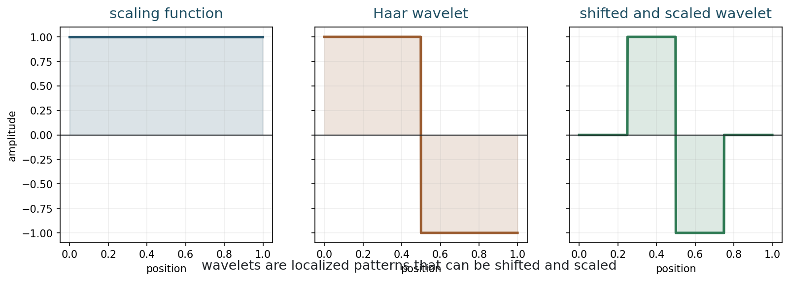
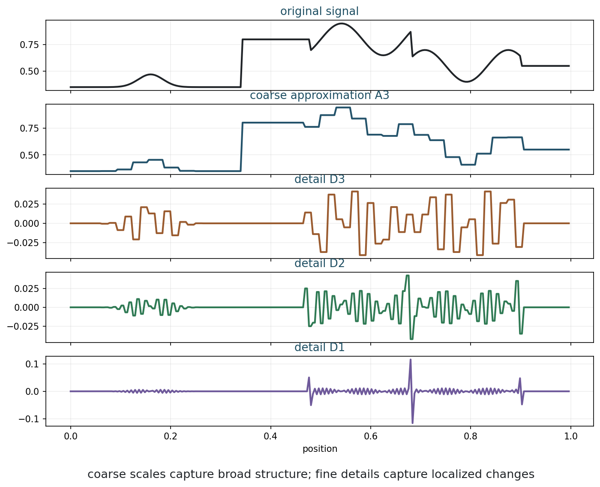
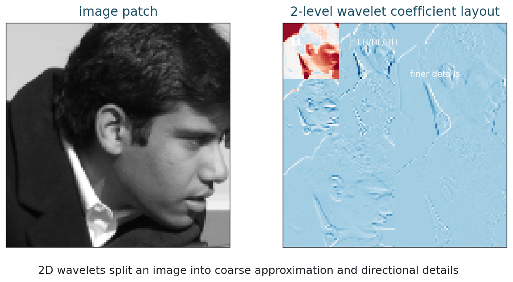
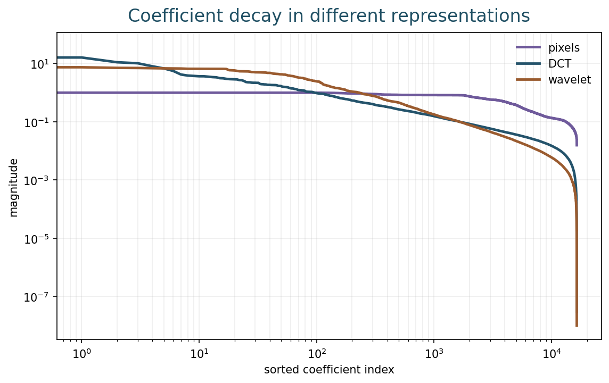
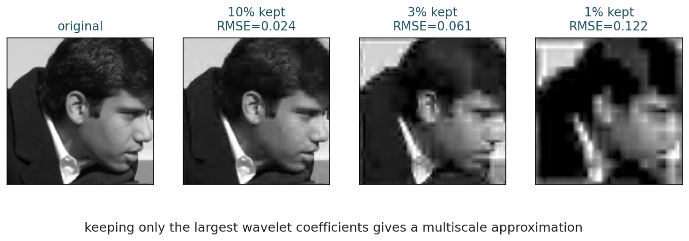
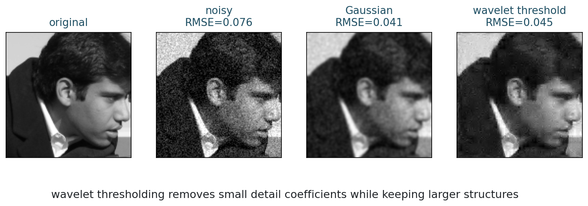
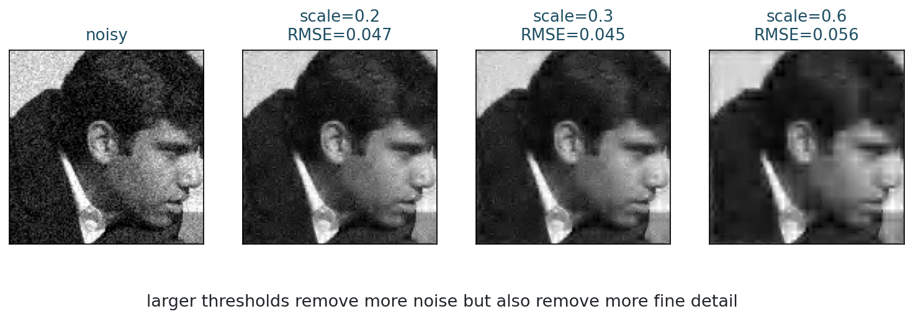

[Slides](../slides/week-11-wavelets.html) | [Notebook](../notebooks/week11_wavelets.ipynb) | [Open in Colab](https://colab.research.google.com/github/lnajman/math435-mathematical-imaging/blob/main/notebooks/week11_wavelets.ipynb)

## Learning Goals

By the end of this chapter, you should be able to:

- explain wavelets as localized multiscale patterns;
- read a 2D wavelet decomposition;
- connect wavelet coefficients to sparsity;
- use thresholding for compression and denoising;
- compare wavelet denoising with ordinary smoothing.

## Why Wavelets?

Fourier analysis tells us which frequencies are present, but Fourier modes are global. A local edge affects many Fourier coefficients.

Wavelets are local and multiscale. They can be shifted in position, scaled in size, and used to describe coarse and fine image structures.

This makes wavelets a natural representation for localized edges and details.

The contrast can be stated sharply:

- Fourier basis functions have global support over the whole discrete image, or infinite support in the continuous setting.
- Many wavelet basis functions have compact support, so each atom lives only on a limited region of the domain.

This difference changes how information is organized. Fourier asks: which global oscillations are present? Wavelets ask: what changes occur, where do they occur, and at what scale?

There is still a Pythagorean idea in the background. Orthogonal Fourier bases and orthogonal wavelet bases both decompose an image into perpendicular directions. In both cases, energy can be expressed as a sum of squared coefficients when the basis is orthonormal. What changes is the geometry of the basis vectors: global oscillations for Fourier, localized multiscale atoms for wavelets.

## Why This Chapter Matters

Chapter 10 explained that sparse reconstruction depends on representation. Wavelets are one of the most important fixed representations for images because they combine three ideas:

- location: where something happens;
- scale: how large the structure is;
- direction: whether the structure is horizontal, vertical, or diagonal.

Fourier coefficients are excellent for global frequency content. Wavelet coefficients are better suited to local events such as edges, corners, and transitions. This makes wavelets a bridge between classical harmonic analysis and the multiscale features used in modern image models.

Wavelets also give a concrete example of a representation that is not learned but already feels "feature-like." This makes them a useful stepping stone toward convolutional neural networks.

The price is a localization tradeoff. Fourier is perfectly localized in frequency but not in space. Compactly supported wavelets are localized in space and scale, but they do not isolate a single exact frequency. This is a practical form of the time-frequency or space-frequency uncertainty principle: one cannot be perfectly localized in both domains at once.

In the course arc, wavelets resolve a tension introduced in Chapter 3. Fourier gives orthogonal directions and a Pythagorean energy decomposition, but those directions are global. Wavelets keep the orthogonal-decomposition viewpoint while making many basis functions local. That is why wavelets are a natural last fixed representation before learned features enter the course.

## Haar Intuition

The Haar wavelet is the simplest wavelet example.

::: {.figure}
{fig-alt="Haar scaling function, Haar wavelet, and a shifted scaled Haar wavelet"}

The scaling function stores averages; the wavelet stores differences.
:::

For two neighboring values $a$ and $b$,

$$
\text{average}=\frac{a+b}{2},
\qquad
\text{detail}=\frac{a-b}{2}.
$$

The average stores coarse information. The detail stores local change.

Repeating this idea on averages gives a multiscale decomposition: fine details first, then coarser details at larger scales.

The Haar example is simple enough to compute by hand, but it contains the whole idea. If two neighboring values are almost equal, the detail coefficient is small. If they differ strongly, the detail coefficient is large. Thus, detail coefficients detect local changes.

For images, local changes often correspond to edges, texture, or noise. Wavelet methods work because these different phenomena leave different patterns across scales and locations.

## Multiscale Decomposition

::: {.figure}
{fig-alt="A 1D signal decomposed into coarse approximation and several wavelet detail scales"}

A signal can be decomposed into a coarse approximation plus details at several scales.
:::

The approximation contains the broad trend. Coarse details capture large jumps. Fine details capture narrow changes and oscillations.

The transform does not create new information. It reorganizes information into coarse approximation plus details.

For orthogonal wavelets, energy is preserved up to normalization.

This reorganization is useful because many tasks become easier in wavelet coordinates. Compression keeps large coefficients. Denoising removes small detail coefficients. Sparse reconstruction asks for an image whose wavelet coefficients are mostly small or zero.

The original signal and its wavelet coefficients contain the same information when the transform is invertible. The advantage is not extra information; it is a better coordinate system.

For orthogonal wavelets, the Pythagorean viewpoint remains valid:

$$
\|x\|_2^2
=
\sum_j |c_j|^2,
$$

up to normalization, where $c_j$ are wavelet coefficients. This is the same energy-conservation logic as Parseval's identity for Fourier coefficients.

The difference is interpretive. A large Fourier coefficient means a global oscillation is present. A large wavelet coefficient means a localized pattern is present at a particular scale and location.

## Two-Dimensional Wavelets

For images, the wavelet transform is applied along rows and columns. At each scale, we get:

- approximation coefficients;
- horizontal detail coefficients;
- vertical detail coefficients;
- diagonal detail coefficients.

::: {.figure}
{fig-alt="Image patch and 2-level wavelet coefficient layout"}

The coefficient layout separates coarse image content from directional details.
:::

| Subband | Rough meaning |
|---|---|
| LL | coarse approximation |
| LH | horizontal-type detail |
| HL | vertical-type detail |
| HH | diagonal or corner-like detail |

Naming conventions vary by library, but the main idea is directional detail at multiple scales.

When reading a 2D wavelet coefficient image, do not interpret it like an ordinary photograph. Large bright coefficients mark locations and scales where the image changes. The LL block shows a coarse version of the image. The detail blocks show where horizontal, vertical, and diagonal changes occur.

At deeper levels, the approximation is decomposed again. This creates a hierarchy: coarse structure near the top of the decomposition, and finer details in smaller-scale subbands.

## Wavelet Sparsity

Many image regions are locally smooth. Only edges and texture create large detail coefficients.

::: {.figure}
{fig-alt="Sorted coefficient magnitudes for pixels, DCT, and wavelet representations"}

Wavelet coefficients often decay quickly for piecewise-smooth images.
:::

This is why wavelets are useful for sparse imaging: they represent many natural images with many small coefficients and a few large ones.

Wavelet sparsity is especially effective for piecewise-smooth images. Smooth regions produce small detail coefficients. Edges produce significant coefficients, but only near the edge and at relevant scales. This is much more economical than a global Fourier representation, where a local edge can influence many coefficients across the whole domain.

Textures are more complicated. Repeated fine patterns can produce many significant coefficients. This is why wavelet denoising may remove texture along with noise when the threshold is too aggressive.

## Compression

Compression keeps only the most important coefficients.

::: {.figure}
{fig-alt="Original image and wavelet reconstructions keeping different fractions of largest coefficients"}

Keeping a small fraction of large coefficients can preserve recognizable structure.
:::

Hard thresholding keeps a coefficient only if it is large enough:

$$
H_T(c)=
\begin{cases}
c, & |c|\geq T,\\
0, & |c|<T.
\end{cases}
$$

Hard thresholding is useful for compression, but it can create artifacts.

Soft thresholding shrinks coefficients:

$$
S_T(c)=\operatorname{sign}(c)\max(|c|-T,0).
$$

Soft thresholding is the proximal operator behind l1 regularization.

The difference between hard and soft thresholding is important. Hard thresholding keeps large coefficients unchanged and removes small ones. Soft thresholding removes small coefficients and shrinks the remaining ones. Hard thresholding is closer to pure coefficient selection; soft thresholding is more connected to convex l1 optimization.

Both methods express the same modeling idea: small coefficients are more likely to be noise or insignificant detail than essential structure.

## Wavelet Denoising

Noise often creates many small detail coefficients. Wavelet denoising:

1. transforms the noisy image;
2. thresholds detail coefficients;
3. reconstructs the image.

::: {.figure}
{fig-alt="Original, noisy, Gaussian-smoothed, and wavelet-denoised images"}

Wavelet denoising can remove noise while preserving localized structure.
:::

The threshold controls the tradeoff.

::: {.figure}
{fig-alt="Wavelet denoising with several threshold strengths"}

Small thresholds leave noise; large thresholds remove real detail.
:::

Wavelet denoising works best when noise is spread across many small coefficients and the true image is concentrated in fewer larger coefficients. This is often a reasonable approximation for Gaussian noise and piecewise-smooth images.

The threshold can be chosen by theory, heuristic rules, visual inspection, validation data, or task-specific criteria. The wrong threshold can either leave noise or erase meaningful details.

When reading the threshold sweep, look for the moment where the image stops merely becoming cleaner and starts losing structure. That point is the same kind of bias-stability tradeoff seen in Tikhonov, TV, and sparse reconstruction.

## Wavelets Versus TV

| Model | Prior | Typical strength | Typical artifact |
|---|---|---|---|
| TV | sparse gradients | sharp edges | staircasing |
| wavelets | sparse multiscale coefficients | localized detail | ringing or texture loss |

Both are sparse priors, but they encode different structure.

Wavelets are not automatic truth machines. The wavelet family, boundary handling, threshold value, texture structure, and forward model all matter.

## Scale And Boundary Choices

Wavelet methods contain practical modeling choices.

The number of decomposition levels decides which scales are represented explicitly. Too few levels may miss broad structure. Too many levels can make coarse coefficients dominate or create artifacts near boundaries.

Boundary handling also matters. A wavelet filter near the edge of an image needs values beyond the recorded grid, just like convolution. Reflection, periodization, zero padding, and other conventions can produce different coefficients near the boundary.

These details are not secondary. A thresholding rule acts on the coefficients it is given. If the transform creates boundary artifacts or represents texture poorly, the sparse prior may remove or preserve the wrong structures.

## Wavelets In Inverse Problems

Wavelets are not only for denoising and compression. They can also be used inside inverse problems:

$$
\min_x
D(y,Ax)+\lambda\|Wx\|_1,
$$

where $W$ is a wavelet transform. This says: fit the measurements, but prefer images with sparse wavelet coefficients.

Equivalently, in a synthesis view,

$$
x=W^{-1}c,
$$

and one solves for sparse coefficients $c$:

$$
\min_c
D(y,AW^{-1}c)+\lambda\|c\|_1.
$$

This is the wavelet version of the sparse DCT model from Chapter 10. The difference is that wavelets are localized and multiscale, which often matches images better than global cosine atoms.

This is also the bridge back to Chapter 3. Fourier diagonalizes convolution and is therefore natural for blur. Wavelets do not make convolution as simple, but they often make local image structure sparse. The choice of representation depends on which part of the inverse problem we want to simplify:

| Representation | What it simplifies | Main limitation |
|---|---|---|
| Fourier | convolution, blur, global frequency response | poor spatial localization |
| Wavelets | local edges, multiscale sparse structure | less exact frequency localization |

For imaging, both are valuable. Fourier explains the physics of blur and instability. Wavelets explain why local edges and multiscale details can be represented sparsely.

## Wavelets And Neural Networks

Wavelets and convolutional neural networks share some intuitions:

- both use localized filters;
- both respond to structures at different positions;
- both can represent features at multiple scales;
- both transform an image into coefficient or feature maps.

The difference is that wavelet filters are designed mathematically, while neural filters are learned from data. This gives neural networks more flexibility, but less immediate interpretability.

Wavelets therefore give students a useful reference point. Before saying that a neural network has learned features, we can understand a fixed feature transform where every coefficient has a clear meaning: scale, location, and orientation.

## Common Mistakes

A first mistake is to say that wavelets are simply another name for Fourier analysis. Both are transforms, but Fourier modes are global while wavelets are localized.

A second mistake is to think thresholding is harmless because small coefficients look unimportant. Many small coefficients can collectively encode texture or subtle detail.

A third mistake is to ignore the wavelet family and boundary handling. Different choices can produce different artifacts, especially near image borders.

A fourth mistake is to treat the threshold as a purely visual parameter. It controls the balance between detail preservation and noise removal.

## Computation

The Week 11 notebook lets you change the wavelet family, number of decomposition levels, retained coefficient fraction, and denoising threshold.

Run:

```bash
python3 examples/week11_wavelets.py
```

or open the notebook in Colab from the link at the top of this chapter.

In the notebook, compare compression and denoising. Compression asks how many coefficients are needed to preserve structure. Denoising asks which coefficients are likely to be noise. These are related questions, but they are not identical.

## Exercises

1. What makes wavelets different from Fourier modes?
2. Compute the Haar average and detail for the pair $(8,6)$.
3. What information does a detail coefficient store?
4. Why can wavelet coefficients be sparse for piecewise-smooth images?
5. Compare hard thresholding and soft thresholding.
6. Explain one similarity and one difference between wavelet features and learned convolutional features.
7. Explain the support difference between Fourier atoms and compactly supported wavelets.
8. How does the Pythagorean theorem appear in both Fourier and orthogonal wavelet decompositions?
9. Why can boundary handling affect wavelet denoising near image borders?

## Takeaways

- Wavelets represent images across position, scale, and direction.
- Fourier atoms are global; many wavelets are compactly supported and localized.
- Orthogonal wavelet decompositions preserve energy through the same Pythagorean principle as Fourier decompositions.
- A wavelet transform splits images into coarse approximation and detail subbands.
- Many images are approximately sparse in wavelet coefficients.
- Thresholding gives compression and denoising algorithms.
- Wavelet family, scale depth, threshold, and boundary handling are modeling choices.
- Representation choice controls the success of sparse reconstruction.
- Wavelets are fixed multiscale features; neural networks can learn more flexible feature representations from data.
- Wavelets make the Fourier-to-neural bridge concrete: from global handcrafted coordinates to localized handcrafted features to learned features.
