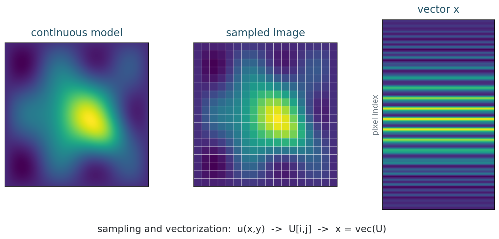

## Section Divider {.section-slide}

::: {.section-kicker}
Part 1
:::

The big conceptual turn

## Learning Goals

By the end of this lecture, students should be able to:

- state the mathematical object being modeled;
- identify the forward operator and observed data;
- explain why the inverse problem is difficult;
- implement the minimal computational representation.

## Definition Slide

::: {.definition-box}
::: {.tag}
Definition
:::

An image is modeled as a function

$$
u : \Omega \subset \mathbb{R}^2 \to \mathbb{R}
$$

or, after sampling, as an array $U \in \mathbb{R}^{m \times n}$.
:::

## Model Slide

::: {.model-box}
::: {.tag}
Forward model
:::

$$
y = A x + \eta
$$

- $x$: unknown image
- $A$: forward imaging operator
- $y$: observed data
- $\eta$: noise or model error
:::

## Figure Slide

::: {.two-col-wide}
::: {.figure-frame}
{fig-alt="Synthetic image, pixel grid, and vector representation"}

::: {.caption}
Use one strong visual per slide when possible.
:::
:::

::: {.compact}
The figure should carry the idea before the equations formalize it.
:::
:::

## Code Slide {.code-small}

```{python}
import numpy as np

m, n = 4, 5
U = np.arange(m * n).reshape(m, n)
x = U.reshape(-1)

print(U)
print(x)
```

## Exercise Slide

::: {.exercise-box}
::: {.tag}
In class
:::

Suppose an operator keeps only every other pixel. What information is lost, and what kind of prior knowledge could help recover a plausible image?
:::

## Takeaway Slide

::: {.takeaway-box}
::: {.tag}
Takeaway
:::

The course repeatedly moves through the same chain:

$$
\text{physics} \to \text{operator} \to \text{inverse problem} \to \text{regularized computation}.
$$
:::
