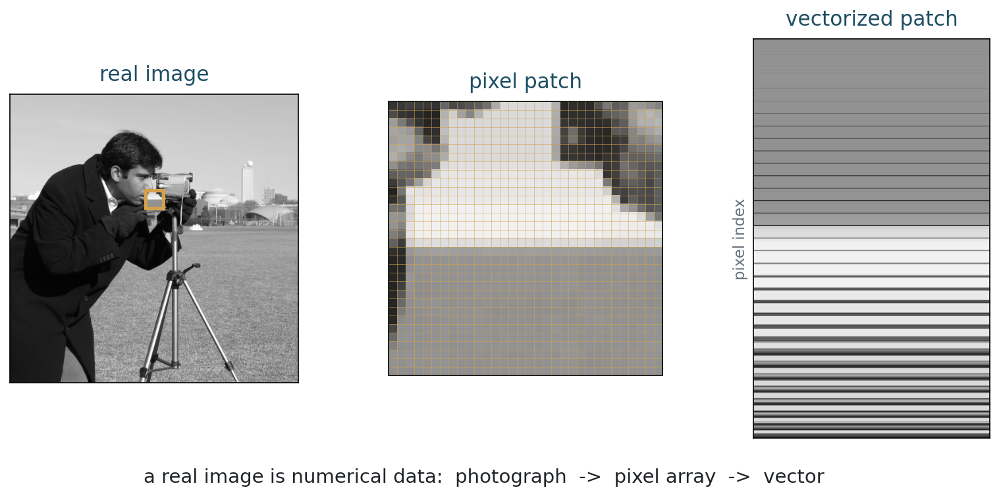
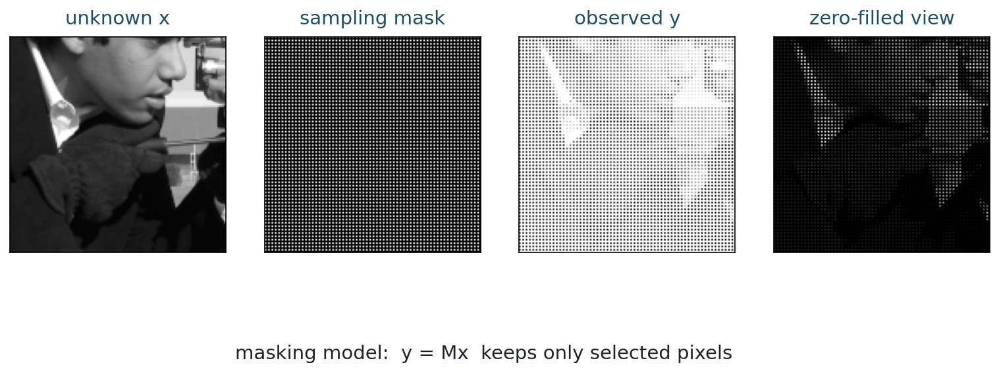

## Opening Question {.inverse-slide}

::: {.section-kicker}
Mathematical imaging begins here
:::

If a scanner gives us imperfect data, what exactly are we trying to recover?

## Today

::: {.checklist}
- Model an image as a function, an array, and a vector.
- Connect pixel grids to linear algebra.
- Introduce the forward model $y = Ax + \eta$.
- Separate image formation from image reconstruction.
- Write the first NumPy representations.
:::

## 75-Minute Plan

| Time | Work |
|---:|---|
| 0-10 min | motivation and course pattern |
| 10-30 min | image models, pixels, vectorization |
| 30-45 min | hand activity and NumPy representation |
| 45-60 min | forward model and inverse problem |
| 60-72 min | masking example with a real image |
| 72-75 min | exit checkpoint |

## The Course Pattern

```{mermaid}
flowchart LR
  P["physics or sensing"] --> A["forward operator A"]
  A --> Y["data y"]
  Y --> R["reconstruction method"]
  R --> X["image estimate x-hat"]
```

::: {.caption}
Most of the course studies the middle two arrows: how data are produced, and how reconstruction stabilizes the inverse problem.
:::

## What Is an Image?

::: {.definition-box}
::: {.tag}
Continuous model
:::

At the mathematical level, a grayscale image is often modeled as a function

$$
u : \Omega \subset \mathbb{R}^2 \to \mathbb{R}.
$$

The value $u(x,y)$ is the intensity at location $(x,y)$.
:::

## Color and Multichannel Images

::: {.two-col}
::: {.model-box}
For color images, the value at each point has several components:

$$
u : \Omega \to \mathbb{R}^3.
$$

Each location stores red, green, and blue intensities.
:::

::: {.question-box}
::: {.tag}
Question
:::

What changes mathematically when a medical image has many channels, time frames, or slices?
:::
:::

## From Continuous to Discrete

Digital images are sampled on a grid:

$$
u_{i,j} \approx u(x_i, y_j).
$$

For an image with $m$ rows and $n$ columns:

$$
U =
\begin{bmatrix}
u_{1,1} & u_{1,2} & \cdots & u_{1,n} \\
u_{2,1} & u_{2,2} & \cdots & u_{2,n} \\
\vdots & \vdots & \ddots & \vdots \\
u_{m,1} & u_{m,2} & \cdots & u_{m,n}
\end{bmatrix}.
$$

## Activity 1: Vectorize by Hand

::: {.time-tag}
8 minutes
:::

::: {.exercise-box}
Given

$$
U =
\begin{bmatrix}
10 & 20 & 30 & 40 \\
50 & 60 & 70 & 80 \\
90 & 100 & 110 & 120
\end{bmatrix},
$$

write $\operatorname{vec}(U)$ using row-major order.
:::

## Activity 1 Debrief

Row-major order reads rows from left to right:

$$
\operatorname{vec}(U) =
\begin{bmatrix}
10 & 20 & 30 & 40 & 50 & 60 & 70 & 80 & 90 & 100 & 110 & 120
\end{bmatrix}^{T}.
$$

::: {.question-box}
How would the vector change under column-major order?
:::

## A Real Image as Data

::: {.figure-frame}
{fig-alt="Real grayscale photograph, zoomed pixel patch, and vectorized patch"}

::: {.caption}
Real sample image from `skimage.data.camera()`. The mathematical object is not the displayed photograph alone; it is the numerical array behind it.
:::
:::

## Matrix or Vector?

::: {.two-col}
::: {.definition-box}
::: {.tag}
Visualization
:::

For display, a grayscale image is naturally a matrix:

$$
U \in \mathbb{R}^{m \times n}.
$$
:::

::: {.model-box}
::: {.tag}
Computation
:::

For linear algebra, reshape the image as

$$
x = \operatorname{vec}(U) \in \mathbb{R}^{mn}.
$$
:::
:::

## Why Vectorize?

Once $U$ is written as a vector $x$, we can use matrices to represent many controlled imaging operations:

$$
x \mapsto Ax.
$$

Examples:

- masking pixels;
- blurring;
- sampling Fourier coefficients;
- projecting along lines;
- combining channels or frames.

::: {.caption}
This is a modeling choice, not a claim that all image formation is linear.
:::

## First NumPy Representation {.code-small}

```{python}
import numpy as np

m, n = 4, 5
U = np.arange(m * n).reshape(m, n)

x = U.reshape(-1)
U_back = x.reshape(m, n)

print(U)
print(x)
```

::: {.caption}
The same image can be an array for display and a vector for linear algebra.
:::

## Vectorization Convention

NumPy uses row-major order by default:

```{python}
U = np.array([[1, 2, 3],
              [4, 5, 6]])

print(U.reshape(-1))
# [1 2 3 4 5 6]
```

::: {.exercise-box}
When translating formulas into code, always state your vectorization convention.
:::

## Indexing Matters

::: {.two-col}
::: {.model-box}
For an image $U \in \mathbb{R}^{m \times n}$, a pixel has two indices:

$$
U_{i,j}.
$$
:::

::: {.definition-box}
After vectorization, the same pixel has one index:

$$
x_k.
$$

For row-major order, $k = (i-1)n + j$.
:::
:::

## Micro-Check

::: {.exercise-box}
::: {.tag}
2 minutes
:::

For a $4 \times 5$ image, where does pixel $(i,j) = (3,2)$ appear in row-major vectorization?

$$
k = (i-1)n + j
$$
:::

## The Forward Model {.section-slide}

::: {.section-kicker}
The central equation
:::

From image formation to inverse problems

## The Central Model

::: {.model-box}
::: {.tag}
First forward model
:::

$$
y = A x + \eta.
$$

- $x$: unknown clean image;
- $A$: forward imaging operator;
- $y$: observed data;
- $\eta$: noise or modeling error.
:::

::: {.caption}
This linear model is the first mathematical language of the course. We will also need nonlinear and information-losing models.
:::

## What Does $A$ Mean?

| Operator | Imaging meaning | Typical difficulty |
|---|---|---|
| $I$ | direct observation | noise |
| fixed masking | selected pixels are recorded | incomplete data |
| convolution | blur | lost high frequencies |
| Fourier sampling | MRI-style acquisition | indirect measurements |
| projection | tomography | incomplete angles |

## Important Caveat

::: {.definition-box}
::: {.tag}
Linear model
:::

If the measurement rule is fixed in advance, then many operators are linear:

$$
x \mapsto Ax.
$$
:::

::: {.question-box}
::: {.tag}
But real scenes
:::

Visibility, occlusion, saturation, shadows, reflection, and segmentation can make the image formation process nonlinear or irreversible.
:::

## Image Formation vs Reconstruction

::: {.two-col}
::: {.model-box}
::: {.tag}
Forward problem
:::

Given $x$, predict the measured data:

$$
y = Ax + \eta.
$$

Usually stable.
:::

::: {.definition-box}
::: {.tag}
Inverse problem
:::

Given $y$, estimate the unknown image:

$$
\hat{x} \approx x.
$$

Often unstable.
:::
:::

## Fixed Mask vs Occlusion

::: {.two-col}
::: {.model-box}
::: {.tag}
Fixed mask
:::

If we decide in advance which pixels to keep, then

$$
y = Mx
$$

is linear.
:::

::: {.definition-box}
::: {.tag}
Occlusion
:::

If a tree hides a person, the visible image depends on scene geometry, depth, and visibility.

The hidden person is not encoded in the pixels.
:::
:::

## Information That Is Not Measured

::: {.takeaway-box}
Some inverse problems are unstable but still contain indirect information.

Other situations are simply not observed. If an object is completely occluded, no algorithm can recover its true appearance from that image alone without outside information.
:::

## Audio Mixing vs Image Visibility

::: {.two-col}
::: {.model-box}
::: {.tag}
Audio
:::

Sound waves approximately superpose:

$$
y(t) \approx s_1(t) + s_2(t) + \cdots.
$$

Separation is still hard, but the mixture can contain all sources.
:::

::: {.definition-box}
::: {.tag}
Images
:::

Visibility is different: the camera records the visible surface.

If a surface is hidden, its appearance is absent from that image.
:::
:::

## Why the Inverse Problem Is Hard

The naive answer would be:

$$
x = A^{-1}y.
$$

::: {.question-box}
What could go wrong with this answer?
:::

## Why the Naive Inverse Fails

The naive answer would be:

$$
x = A^{-1}y.
$$

But this can fail because:

1. $A$ may not be invertible.
2. $A$ may be badly conditioned.
3. Noise can be amplified by inversion.
4. Many plausible images may explain the same data.

## A Toy Masking Operator

Suppose a fixed set of pixels is measured.

```{python}
import numpy as np

x = np.linspace(0, 1, 12)
mask = np.array([1, 1, 0, 1, 0, 1, 1, 0, 1, 1, 0, 1], dtype=bool)

y = x[mask]

print("unknown image vector:", x)
print("observed entries:", y)
```

The mask is fixed independently of the unknown image.

## Matrix View of Masking

::: {.large-math}
$$
y = Mx
$$
:::

Here $M$ selects rows from the identity matrix.

::: {.question-box}
If $M$ has fewer rows than columns, can there be a unique inverse?
:::

## Worked Masking Matrix

Let

$$
x =
\begin{bmatrix}
x_1 \\ x_2 \\ x_3 \\ x_4 \\ x_5
\end{bmatrix}
$$

and suppose we observe only entries 1, 3, and 5:

$$
y =
\begin{bmatrix}
x_1 \\ x_3 \\ x_5
\end{bmatrix}
=
\begin{bmatrix}
1 & 0 & 0 & 0 & 0 \\
0 & 0 & 1 & 0 & 0 \\
0 & 0 & 0 & 0 & 1
\end{bmatrix}
x.
$$

## What Is Lost?

::: {.two-col}
::: {.definition-box}
The matrix $M$ has shape $3 \times 5$.

It cannot have an inverse that recovers all five unknowns from three measurements.
:::

::: {.question-box}
::: {.tag}
Class question
:::

Can you describe two different vectors $x$ that produce the same $y$?
:::
:::

## A Real Masking Operator

::: {.figure-frame}
{fig-alt="Real image, sampling mask, observed pixels, and zero-filled view"}
:::

::: {.caption}
This is a fixed sampling mask. It is not the same as physical occlusion by an object in the scene.
:::

## Python Demo: Masking a Real Image {.code-small}

```{python}
from skimage import data
import numpy as np

image = data.camera().astype(float) / 255

mask = np.zeros_like(image, dtype=bool)
mask[::2, ::2] = True

y = image[mask]
zero_filled = np.where(mask, image, 0)

print(image.shape)
print(y.shape)
```

## In-Class Exercise 2

::: {.exercise-box}
::: {.tag}
Think, then discuss
:::

Suppose an operator keeps only every other pixel.

1. What information has been lost?
2. Can interpolation recover the original image exactly?
3. What assumptions could make recovery plausible?
:::

## Why Assumptions Enter

::: {.takeaway-box}
The missing pixels are not hidden somewhere in $y$.

To choose one reconstruction among many possible images, we need a principle:

$$
\text{data fit} + \text{prior knowledge}.
$$
:::

## Prior Knowledge

Reconstruction needs information not present in the data alone.

Common priors in this course:

- small energy or smoothness;
- sparse representation;
- piecewise smoothness with edges;
- physical constraints;
- learned or data-driven regularity.

## Modeling Habit {.section-slide}

::: {.section-kicker}
A practical checklist
:::

Ask these questions for every problem.

## The Five Questions

::: {.takeaway-box}
1. What is the unknown $x$?
2. What is measured as data $y$?
3. What is the forward operator $A$?
4. What noise model is reasonable for $\eta$?
5. What prior knowledge should guide reconstruction?
:::

## Mini-Case: Blurred Photograph

::: {.two-col}
::: {.model-box}
The data are a blurred and noisy image:

$$
y = h * x + \eta.
$$

The operator $A$ is convolution by the point spread function $h$.
:::

::: {.question-box}
::: {.tag}
Preview
:::

Next week, we will make this precise and compute it.
:::
:::

## End-of-Class Checkpoint

::: {.exercise-box}
::: {.tag}
Exit ticket
:::

For each situation, identify $x$, $y$, $A$, and one reasonable prior:

1. a blurred phone photograph;
2. a CT scan with few projection angles;
3. an old photograph with scratches and missing regions.
:::

## Suggested Answers

| Situation | $A$ | Possible prior |
|---|---|---|
| blurred photo | convolution | sharp edges, natural-image smoothness |
| few-angle CT | projection operator | piecewise smooth anatomy |
| missing regions | fixed masking, if mask is known | texture or geometric continuation |
| object hidden by a tree | nonlinear visibility/occlusion | cannot recover true appearance from one image alone |

## What Students Should Remember

::: {.takeaway-box}
- A digital image can be treated as a function, matrix, or vector.
- Linear operators are a powerful first model for many controlled imaging systems.
- Real image formation can also be nonlinear and information-losing.
- Reconstruction is difficult because the inverse map may be unstable, nonunique, or physically impossible.
- Regularization adds mathematical prior knowledge to stabilize recovery.
:::

## After Class

::: {.checklist}
- Use the [class roadmap](../classes.html) to find the book chapter, notebook, and weekly practice prompt.
- Run the week notebook and change at least one important parameter.
- Write one claim-evidence-limit sentence about today's model.
:::

## Next Time

Convolution and blur:

- 1D and 2D convolution;
- point spread functions;
- boundary conditions;
- blur as a linear operator;
- first deblurring experiment.
