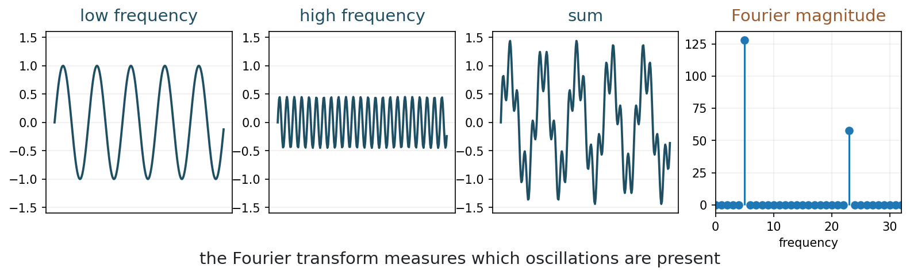
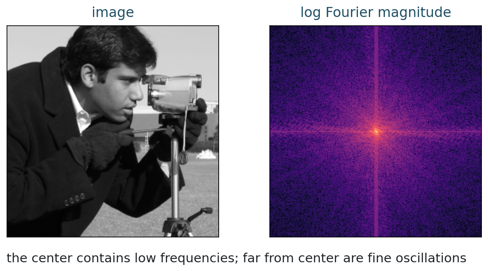
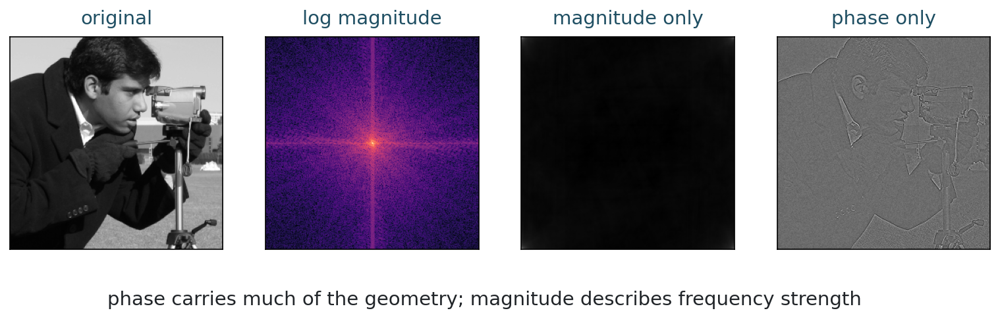
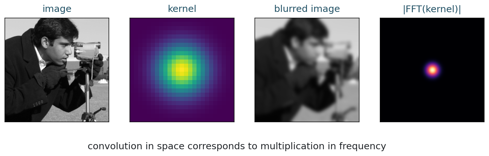
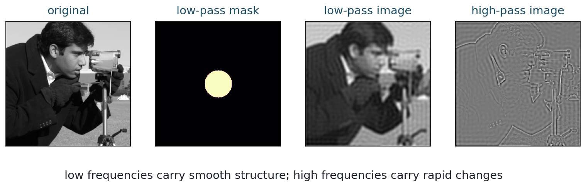
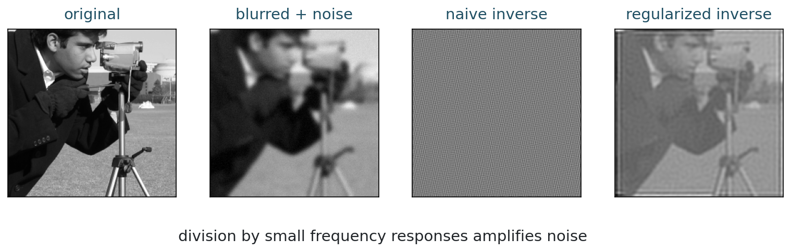

## Opening Question {.inverse-slide}

::: {.section-kicker}
From blur to frequency
:::

What does it mean for an image to contain high frequencies?

## Today

::: {.checklist}
- Interpret 1D and 2D frequencies.
- Compute and read Fourier magnitudes.
- Separate magnitude and phase.
- Use the convolution theorem.
- Explain blur and deblurring in frequency space.
:::

## 75-Minute Plan

| Time | Work |
|---:|---|
| 0-10 min | recap convolution and blur |
| 10-25 min | 1D frequencies and the DFT |
| 25-40 min | 2D Fourier transform of images |
| 40-52 min | magnitude, phase, and geometry |
| 52-63 min | convolution theorem |
| 63-72 min | filtering and deblurring |
| 72-75 min | exit checkpoint |

## Reminder from Week 2

::: {.model-box}
For a fixed blur kernel $h$,

$$
y = h * x.
$$
:::

::: {.question-box}
Why does blur remove fine details?
:::

## The Big Idea

::: {.takeaway-box}
Fourier analysis rewrites an image as a sum of oscillations.
:::

Low frequencies describe slow variation.

High frequencies describe rapid variation, edges, and texture.

## Part 1: 1D Frequencies {.section-slide}

::: {.section-kicker}
Start with signals
:::

Frequency counts oscillations

## A Sine Wave

A simple oscillation can be written as

$$
s_k[n] = \sin\left(2\pi k n / N\right).
$$

::: {.definition-box}
The integer $k$ is the frequency index. Larger $k$ means more oscillations over the same interval.
:::

## Activity 1: Predict the Spectrum

::: {.time-tag}
5 minutes
:::

::: {.exercise-box}
Suppose

$$
x[n] = \sin(2\pi 5n/N) + 0.5\sin(2\pi 20n/N).
$$

Where should the Fourier magnitude be large?
:::

## Frequency Components

::: {.figure-frame}
{fig-alt="Low frequency sine, high frequency sine, their sum, and Fourier magnitude"}
:::

## The Discrete Fourier Transform

For a length-$N$ signal:

$$
\widehat{x}[k] =
\sum_{n=0}^{N-1} x[n] e^{-2\pi i kn/N}.
$$

::: {.caption}
Each coefficient measures how much frequency $k$ is present.
:::

## Fourier as Projection

The DFT compares $x$ with oscillating directions:

$$
\phi_k[n] = e^{2\pi i kn/N}.
$$

::: {.takeaway-box}
A Fourier coefficient is an inner product with a basis vector:

$$
\widehat{x}[k] = \langle x,\phi_k\rangle
$$

up to the normalization convention.
:::

## Parseval = Pythagoras

For an orthonormal Fourier basis:

$$
\|x\|_2^2 =
\sum_k |\langle x,\phi_k\rangle|^2.
$$

::: {.model-box}
The energy of the signal is the sum of the squared lengths of its orthogonal projections.
:::

This is the Pythagorean theorem in many dimensions.

## Fourier Atoms Are Global

Each Fourier basis vector extends across the whole signal or image.

::: {.two-col}
::: {.definition-box}
Good at describing:

- periodic texture;
- convolution and filtering;
- global frequency content.
:::

::: {.question-box}
Harder for:

- isolated edges;
- small objects;
- local missing information.
:::
:::

::: {.caption}
This will motivate wavelets: local atoms at several scales.
:::

## Complex Coefficients

Fourier coefficients are usually complex:

$$
\widehat{x}[k] = a_k + i b_k.
$$

::: {.two-col}
::: {.definition-box}
Magnitude:

$$
|\widehat{x}[k]|
$$
strength of frequency $k$
:::

::: {.model-box}
Phase:

$$
\arg(\widehat{x}[k])
$$
alignment of the oscillation
:::
:::

## What FFT Returns

::: {.code-small}
```{python}
import numpy as np

spectrum = np.fft.fft(signal)
magnitude = np.abs(spectrum)
phase = np.angle(spectrum)
```
:::

::: {.caption}
`fft` computes the DFT quickly. The mathematics is the same transform.
:::

## Part 2: 2D Fourier Transform {.section-slide}

::: {.section-kicker}
Images are 2D signals
:::

Frequencies have direction

## Images as 2D Signals

A grayscale image is an array $x[m,n]$.

The 2D Fourier transform uses horizontal and vertical frequency indices:

$$
\widehat{x}[u,v] =
\sum_{m,n} x[m,n] e^{-2\pi i(um/M + vn/N)}.
$$

## Image Spectrum

::: {.figure-frame}
{fig-alt="Real image and centered log Fourier magnitude"}
:::

## Centered Spectrum

Most software places the zero frequency at the corner.

For visualization, we often use:

::: {.code-small}
```{python}
F = np.fft.fft2(image)
F_centered = np.fft.fftshift(F)
log_magnitude = np.log1p(np.abs(F_centered))
```
:::

## Reading the Spectrum

::: {.three-col}
::: {.model-box}
::: {.tag}
Center
:::

Average and slow variation.
:::

::: {.definition-box}
::: {.tag}
Far from center
:::

Fine oscillations and texture.
:::

::: {.question-box}
::: {.tag}
Direction
:::

Frequency orientation.
:::
:::

## Mini-Check

::: {.exercise-box}
An image has strong vertical stripes.

Which direction of frequency should be strong: horizontal, vertical, or both?
:::

## Part 3: Magnitude and Phase {.section-slide}

::: {.section-kicker}
What is stored in a coefficient?
:::

Strength and alignment

## Magnitude and Phase

For each Fourier coefficient:

$$
\widehat{x}[u,v] =
|\widehat{x}[u,v]| e^{i\phi[u,v]}.
$$

::: {.caption}
Magnitude says how much. Phase says where the oscillation lines up.
:::

## Magnitude Versus Phase

::: {.figure-frame}
{fig-alt="Original image, Fourier magnitude, magnitude-only reconstruction, and phase-only reconstruction"}
:::

## Discussion

::: {.question-box}
Which reconstruction preserves more recognizable geometry?

What does that suggest about the importance of phase?
:::

## Python Demo: Spectrum of an Image {.code-small}

```{python}
from skimage import data
import numpy as np

image = data.camera().astype(float) / 255
F = np.fft.fft2(image)
magnitude = np.abs(F)
phase = np.angle(F)
```

## Run Today's Code {.code-small}

From the repository root:

```bash
python3 examples/week03_fourier_imaging.py
python3 examples/make_week03_figures.py
python3 scripts/build_notebooks.py
./scripts/quarto render
```

## Part 4: Convolution Theorem {.section-slide}

::: {.section-kicker}
The Week 2 bridge
:::

Convolution becomes multiplication

## The Convolution Theorem

If

$$
y = h * x,
$$

then

$$
\widehat{y} = \widehat{h}\,\widehat{x}.
$$

::: {.takeaway-box}
Blur is easier to understand in frequency space.
:::

## Why This Matters

If $\widehat{h}$ is small at high frequencies, then

$$
\widehat{y}[u,v] = \widehat{h}[u,v]\widehat{x}[u,v]
$$

has weak high-frequency content.

::: {.caption}
This is the frequency-space explanation for smoothing.
:::

## Convolution Theorem Picture

::: {.figure-frame}
{fig-alt="Image, blur kernel, blurred image, and Fourier magnitude of the kernel"}
:::

## Activity 2: Translate the Model

::: {.time-tag}
6 minutes
:::

::: {.exercise-box}
Translate each statement between image space and frequency space:

1. blur averages nearby pixels;
2. blur suppresses fine detail;
3. deblurring divides by the blur response.
:::

## Part 5: Filtering {.section-slide}

::: {.section-kicker}
Manipulating frequencies
:::

Masks in the Fourier domain

## Low-Pass and High-Pass

::: {.two-col}
::: {.definition-box}
Low-pass filter:

keeps slow variation and removes rapid variation.
:::

::: {.model-box}
High-pass filter:

keeps rapid variation and removes smooth background.
:::
:::

## Low-Pass and High-Pass Image

::: {.figure-frame}
{fig-alt="Original image, low-pass Fourier mask, low-pass reconstruction, and high-pass reconstruction"}
:::

## Frequency Masks Are Models

::: {.question-box}
A sharp circular cutoff is mathematically simple.

Is it always a good physical model of an imaging system?
:::

::: {.caption}
We use it to learn the idea. Real systems often have smoother frequency responses.
:::

## Part 6: Deblurring Revisited {.section-slide}

::: {.section-kicker}
The inverse problem, now visible
:::

Division is dangerous

## Inverse Filtering

If

$$
\widehat{y} = \widehat{h}\widehat{x} + \widehat{\eta},
$$

the naive inverse is

$$
\widehat{x} = \frac{\widehat{y}}{\widehat{h}}.
$$

::: {.question-box}
What happens where $|\widehat{h}|$ is close to zero?
:::

## Inverse Filtering Picture

::: {.figure-frame}
{fig-alt="Original image, blurred noisy image, naive inverse, and regularized inverse"}
:::

## Why the Naive Inverse Fails

::: {.takeaway-box}
Deblurring amplifies frequencies that blur suppressed.
:::

If the measurement contains noise, those frequencies may be mostly noise.

## A Stabilized Alternative

One common frequency-domain stabilizer is

$$
\widehat{x}_\lambda =
\frac{\overline{\widehat{h}}}{|\widehat{h}|^2 + \lambda}\widehat{y}.
$$

::: {.caption}
The parameter $\lambda$ controls how much we trust weak frequencies.
:::

## In-Class Notebook Activity

::: {.time-tag}
8 minutes
:::

::: {.exercise-box}
Open the Week 3 notebook.

Change the low-pass radius and the deblurring stabilizer.

Record one visual effect and one numerical effect.
:::

## End-of-Class Checkpoint

::: {.exercise-box}
For each item, give one sentence:

1. What does a Fourier magnitude show?
2. Where are low frequencies in a centered spectrum?
3. What does the convolution theorem say?
4. Why does inverse filtering amplify noise?
:::

## Suggested Answers

| Question | Short answer |
|---|---|
| Fourier magnitude | strength of each frequency |
| centered low frequencies | near the center |
| convolution theorem | convolution in space is multiplication in frequency |
| noise amplification | division by small blur response magnifies noise |

## What Students Should Remember

::: {.takeaway-box}
- Fourier coefficients describe oscillations.
- Images have horizontal and vertical frequencies.
- Magnitude and phase carry different information.
- Blur is low-pass behavior in frequency space.
- Deblurring needs regularization because inverse filtering is unstable.
:::

## Next Time

Noise and statistical image models:

- additive noise;
- Gaussian and Poisson models;
- signal-to-noise ratio;
- likelihoods for reconstruction.
