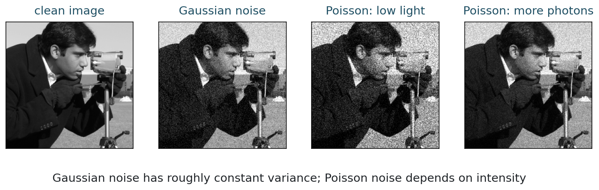
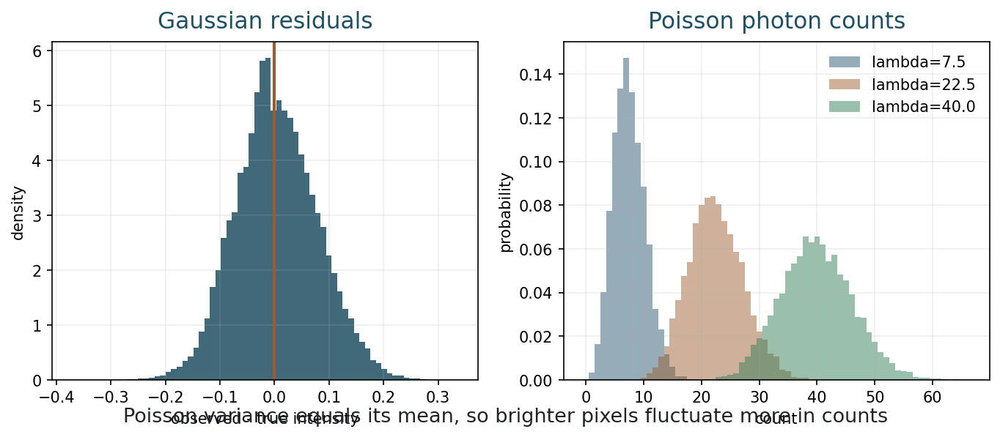
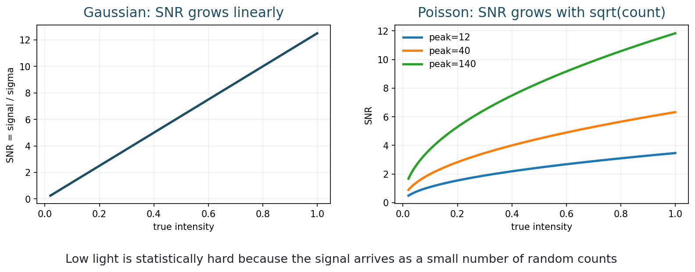
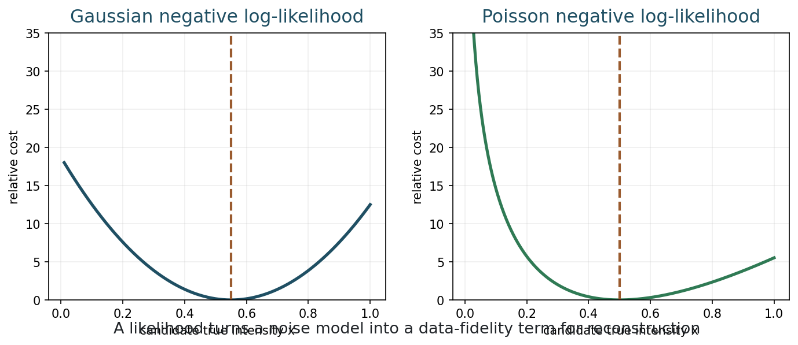
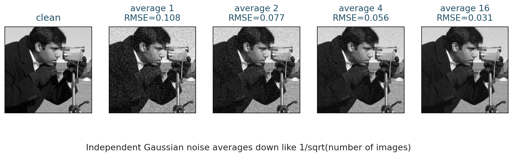

## Opening Question {.inverse-slide}

::: {.section-kicker}
From images to statistics
:::

If two pixels have the same recorded value, do we have the same confidence in both of them?

## Today

::: {.checklist}
- Distinguish deterministic degradation from random noise.
- Model additive Gaussian noise.
- Model photon-counting Poisson noise.
- Compare signal-to-noise behavior.
- Derive likelihood-based data terms for reconstruction.
:::

## 75-Minute Plan

| Time | Work |
|---:|---|
| 0-8 min | recap Fourier and inverse filtering |
| 8-18 min | observe noise in real images |
| 18-32 min | Gaussian noise model |
| 32-47 min | Poisson noise model |
| 47-58 min | SNR and repeated measurements |
| 58-68 min | likelihoods and data fidelity |
| 68-73 min | notebook activity |
| 73-75 min | exit checkpoint |

## Bridge from Week 3

Last time we wrote a noisy deblurring model as

$$
\widehat{y} = \widehat{h}\widehat{x} + \widehat{\eta}.
$$

::: {.question-box}
We discussed why deblurring amplifies noise. Today: what is that noise?
:::

## Observation Model

In imaging, we often write

$$
y = f(x) + \eta.
$$

::: {.definition-box}
$x$ is the unknown scene or image, $f$ is the forward imaging process, $y$ is the recorded data, and $\eta$ is random noise.
:::

## Linear Is a Special Case

When the forward model is linear, we can write

$$
y = A x + \eta.
$$

::: {.takeaway-box}
But not every imaging process is linear. Occlusion, saturation, thresholding, and many camera pipelines can break linearity.
:::

## Why Noise Models Matter

::: {.three-col}
::: {.model-box}
::: {.tag}
Uncertainty
:::

How much should we trust a measurement?
:::

::: {.definition-box}
::: {.tag}
Fidelity
:::

Which reconstructions agree with data?
:::

::: {.question-box}
::: {.tag}
Algorithms
:::

What objective should we minimize?
:::
:::

## Part 1: Seeing Noise {.section-slide}

::: {.section-kicker}
Before formulas
:::

Look at the image

## Same Image, Different Noise

::: {.figure-frame}
{fig-alt="Clean image, Gaussian noisy image, low-light Poisson noisy image, and higher-photon Poisson noisy image"}
:::

## First Discussion

::: {.time-tag}
4 minutes
:::

::: {.exercise-box}
Compare the three noisy images.

1. Which noise looks independent of brightness?
2. Which noise looks worse in dark or low-count regions?
3. Which model seems closer to low-light photography?
:::

## Random Variables at Pixels

For a pixel $i$, the recorded value $y_i$ is a random variable.

::: {.model-box}
The noise model specifies the probability law of $y_i$ when the unknown true value is $x_i$.
:::

## What We Want from a Model

A useful noise model should answer:

::: {.checklist}
- What values of $y_i$ are likely?
- How large are typical errors?
- Does the variance depend on intensity?
- What cost should penalize disagreement with data?
:::

## Part 2: Gaussian Noise {.section-slide}

::: {.section-kicker}
Additive errors
:::

Constant variance

## Gaussian Model

The simplest model is

$$
y_i = x_i + \eta_i,
\qquad
\eta_i \sim \mathcal{N}(0,\sigma^2).
$$

::: {.definition-box}
The parameter $\sigma$ is the standard deviation of the noise.
:::

## Gaussian Assumptions

::: {.checklist}
- Errors are additive.
- Errors have mean zero.
- Errors are often assumed independent.
- Error variance is the same for all pixels.
:::

::: {.caption}
These assumptions are useful, not universal.
:::

## Gaussian Residuals

::: {.figure-frame}
{fig-alt="Histogram of Gaussian residuals and histograms of Poisson counts for several intensities"}
:::

## Activity 1: Constant Variance

::: {.time-tag}
5 minutes
:::

::: {.exercise-box}
If $y_i=x_i+\eta_i$ and $\eta_i\sim\mathcal{N}(0,\sigma^2)$, what are

$$
\mathbb{E}[y_i\mid x_i]
\quad\text{and}\quad
\mathrm{Var}(y_i\mid x_i)?
$$

Does the variance depend on $x_i$?
:::

## Gaussian Density

For one pixel:

$$
p(y_i\mid x_i)
=
\frac{1}{\sqrt{2\pi\sigma^2}}
\exp\left(
-\frac{(y_i-x_i)^2}{2\sigma^2}
\right).
$$

::: {.caption}
The most likely value is $x_i=y_i$.
:::

## Independent Pixels

If the pixel errors are independent,

$$
p(y\mid x)=
\prod_i p(y_i\mid x_i).
$$

Taking negative logarithms gives

$$
-\log p(y\mid x)
=
\frac{1}{2\sigma^2}\sum_i (y_i-x_i)^2
+ \text{constant}.
$$

## Gaussian Data Fidelity

For the direct observation model $y=x+\eta$:

$$
\operatorname*{argmin}_x
\frac{1}{2}\|y-x\|_2^2
= y.
$$

::: {.takeaway-box}
Gaussian noise leads naturally to least squares.
:::

## With a Linear Forward Model

If the forward model is linear:

$$
y = A x + \eta,
\qquad
\eta\sim\mathcal{N}(0,\sigma^2 I),
$$

then the Gaussian negative log-likelihood is

$$
\frac{1}{2\sigma^2}\|Ax-y\|_2^2.
$$

## With a General Forward Model

If the forward model is nonlinear:

$$
y = f(x)+\eta,
$$

the Gaussian data term becomes

$$
\frac{1}{2\sigma^2}\|f(x)-y\|_2^2.
$$

::: {.caption}
The likelihood idea does not require linearity.
:::

## Python Demo: Gaussian Noise {.code-small}

```{python}
import numpy as np
from skimage import data

image = data.camera().astype(float) / 255
rng = np.random.default_rng(43504)

sigma = 0.08
noisy = np.clip(image + sigma * rng.standard_normal(image.shape), 0, 1)
residual = noisy - image

print(residual.mean(), residual.std())
```

## Gaussian Limitations

::: {.question-box}
Can an additive Gaussian model produce negative pixel intensities or values above the sensor maximum?
:::

::: {.caption}
In practice we often clip values. Clipping changes the statistical model.
:::

## Part 3: Poisson Noise {.section-slide}

::: {.section-kicker}
Photon counting
:::

Variance depends on signal

## Why Poisson?

Light arrives as photons.

A sensor counts random arrivals during exposure.

::: {.model-box}
Poisson noise is a natural model when the dominant randomness is photon counting.
:::

## Poisson Model

Let $z_i$ be the photon count at pixel $i$.

$$
z_i \sim \operatorname{Poisson}(\lambda_i).
$$

The Poisson law is

$$
\mathbb{P}(z_i=k\mid \lambda_i)
= e^{-\lambda_i}\frac{\lambda_i^k}{k!}.
$$

## Mean Equals Variance

For a Poisson random variable:

$$
\mathbb{E}[z_i]=\lambda_i,
\qquad
\mathrm{Var}(z_i)=\lambda_i.
$$

::: {.takeaway-box}
The standard deviation is $\sqrt{\lambda_i}$, so absolute noise increases with brightness.
:::

## Relative Noise

The relative fluctuation is roughly

$$
\frac{\sqrt{\lambda_i}}{\lambda_i}
=
\frac{1}{\sqrt{\lambda_i}}.
$$

::: {.caption}
More photons means better relative precision.
:::

## SNR Picture

::: {.figure-frame}
{fig-alt="Gaussian and Poisson signal-to-noise ratio curves"}
:::

## Activity 2: Photon Counts

::: {.time-tag}
5 minutes
:::

::: {.exercise-box}
A pixel has expected count $\lambda=25$.

1. What is the standard deviation?
2. What is the approximate SNR?
3. What happens to the SNR if exposure gives $\lambda=100$?
:::

## Intensity Scaling

Digital images often store normalized intensities in $[0,1]$.

If $\alpha$ is the maximum expected photon count, a simple model is

$$
z_i \sim \operatorname{Poisson}(\alpha x_i),
\qquad
y_i = z_i / \alpha.
$$

## Low Light Is Hard

::: {.question-box}
Which is more reliable: observing 5 photons or 500 photons?
:::

::: {.takeaway-box}
Low-light imaging is difficult because the data are made of small random counts.
:::

## Poisson Likelihood

For independent counts:

$$
p(z\mid x)
=
\prod_i
e^{-\alpha x_i}
\frac{(\alpha x_i)^{z_i}}{z_i!}.
$$

Ignoring constants independent of $x$:

$$
-\log p(z\mid x)
=
\sum_i
\alpha x_i - z_i\log(\alpha x_i).
$$

## Poisson Data Fidelity

For a general positive forward model $f_i(x)>0$:

$$
z_i \sim \operatorname{Poisson}(f_i(x)).
$$

Then

$$
-\log p(z\mid x)
=
\sum_i f_i(x) - z_i\log(f_i(x))
+ \text{constant}.
$$

::: {.caption}
This is not a least-squares data term.
:::

## Likelihood Curves

::: {.figure-frame}
{fig-alt="Gaussian and Poisson negative log-likelihood curves for one pixel"}
:::

## Activity 3: Compare Costs

::: {.time-tag}
6 minutes
:::

::: {.exercise-box}
For one pixel, compare:

$$
\frac{1}{2\sigma^2}(y-x)^2
\quad\text{and}\quad
\alpha x - z\log(\alpha x).
$$

Which one is symmetric around its minimizer? Which one requires $x>0$?
:::

## Gaussian vs Poisson

| Feature | Gaussian | Poisson |
|---|---|---|
| Data type | continuous intensity | integer counts |
| Variance | constant $\sigma^2$ | equals mean |
| Typical fidelity | squared error | count likelihood |
| Natural for | read noise, aggregate errors | photon-limited imaging |
| Constraint | often unconstrained | positive mean |

## Part 4: Repeated Measurements {.section-slide}

::: {.section-kicker}
Noise can average out
:::

Independence matters

## Averaging Gaussian Noise

If

$$
y^{(j)} = x + \eta^{(j)},
\qquad
\eta^{(j)}\sim\mathcal{N}(0,\sigma^2),
$$

and the noise samples are independent, then

$$
\bar{y}=\frac{1}{m}\sum_{j=1}^m y^{(j)}
$$

has noise standard deviation $\sigma/\sqrt{m}$.

## Averaging Picture

::: {.figure-frame}
{fig-alt="Clean image and averages of 1, 2, 4, and 16 Gaussian noisy observations"}
:::

## What Averaging Cannot Do

::: {.question-box}
If the person is hidden behind a tree, can averaging many photographs reveal the hidden person?
:::

::: {.takeaway-box}
Averaging reduces random noise in recorded data. It does not recover scene content that never reached the sensor.
:::

## Part 5: From Likelihood to Reconstruction {.section-slide}

::: {.section-kicker}
The inverse problem bridge
:::

Data term plus prior

## Maximum Likelihood

Given data $y$, maximum likelihood estimates $x$ by

$$
\operatorname*{argmax}_x p(y\mid x).
$$

Equivalently,

$$
\operatorname*{argmin}_x -\log p(y\mid x).
$$

## Why Maximum Likelihood Is Not Enough

::: {.question-box}
If many images agree almost equally well with the noisy data, how should we choose among them?
:::

::: {.caption}
This is where regularization enters.
:::

## Regularized Reconstruction

A common form is

$$
\operatorname*{argmin}_x
D(y, f(x)) + \lambda R(x).
$$

::: {.two-col}
::: {.definition-box}
$D$ is the data fidelity term from the noise model.
:::

::: {.model-box}
$R$ is a regularizer encoding prior information.
:::
:::

## Examples of Data Terms

::: {.two-col}
::: {.definition-box}
Gaussian:

$$
D(y,f(x))=
\frac{1}{2\sigma^2}\|y-f(x)\|_2^2.
$$
:::

::: {.model-box}
Poisson:

$$
D(z,f(x))=
\sum_i f_i(x)-z_i\log f_i(x).
$$
:::
:::

## Code Demo: Run Week 4 Examples {.code-small}

From the repository root:

```bash
python3 examples/week04_noise_likelihood.py
python3 examples/make_week04_figures.py
python3 scripts/build_notebooks.py
./scripts/quarto render
```

## In-Class Notebook Activity

::: {.time-tag}
5 minutes
:::

::: {.exercise-box}
Open the Week 4 notebook.

1. Change Gaussian `sigma`.
2. Change Poisson `peak_photons`.
3. Compare RMSE, residual histograms, and image appearance.
:::

## Quiz-Style Check

::: {.exercise-box}
For each observation, choose Gaussian, Poisson, or neither:

1. independent additive errors with fixed variance;
2. photon counts with variance equal to the mean;
3. saturation at the maximum sensor value;
4. low-light measurements with very few photons.
:::

## End-of-Class Checkpoint

::: {.exercise-box}
Answer in one sentence each:

1. Why does Gaussian noise lead to least squares?
2. Why is Poisson noise signal-dependent?
3. What is SNR?
4. What does a likelihood contribute to an inverse problem?
:::

## Suggested Answers

| Question | Short answer |
|---|---|
| Gaussian to least squares | the negative log of a Gaussian density is quadratic |
| Poisson signal dependence | mean and variance are both $\lambda$ |
| SNR | signal strength divided by typical noise size |
| likelihood role | it defines the data fidelity term |

## What Students Should Remember

::: {.takeaway-box}
- A noise model is a probability law for measurements.
- Gaussian noise has constant variance and leads to least squares.
- Poisson noise models counts and has variance equal to the mean.
- Likelihoods turn measurement assumptions into reconstruction objectives.
- Regularization is still needed when data alone do not determine a stable image.
:::

## After Class

::: {.checklist}
- Use the [class roadmap](../classes.html) to find the book chapter, notebook, and weekly deliverable.
- Run the week notebook and change at least one important parameter.
- Write one claim-evidence-limit sentence about today's model.
:::

## Next Time

Bayesian and variational reconstruction:

- priors and regularization;
- maximum a posteriori estimation;
- Tikhonov regularization;
- choosing the balance parameter.
