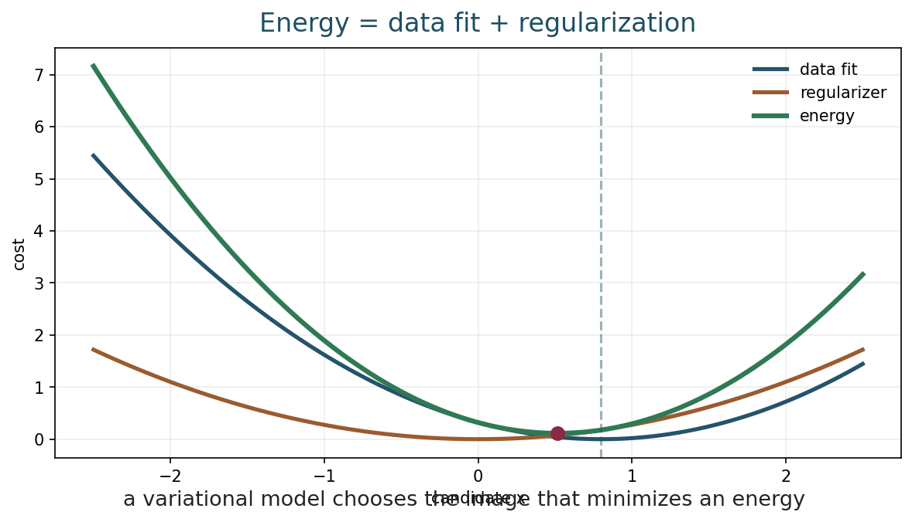
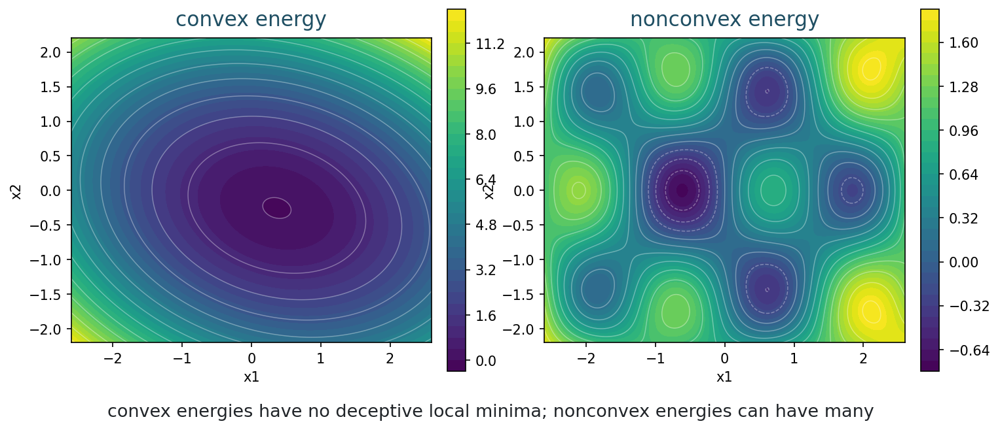
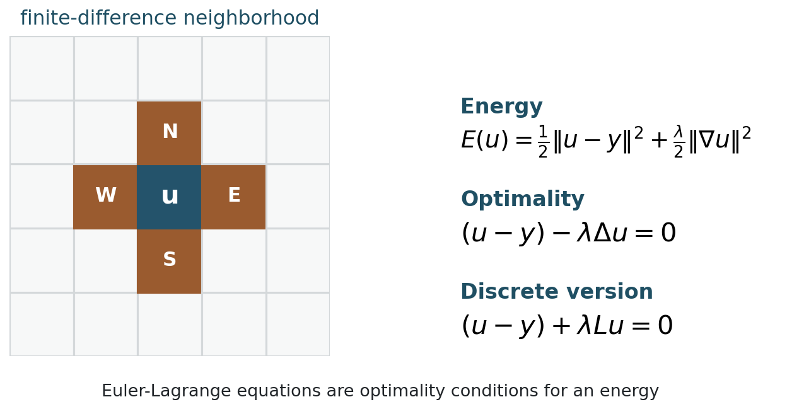
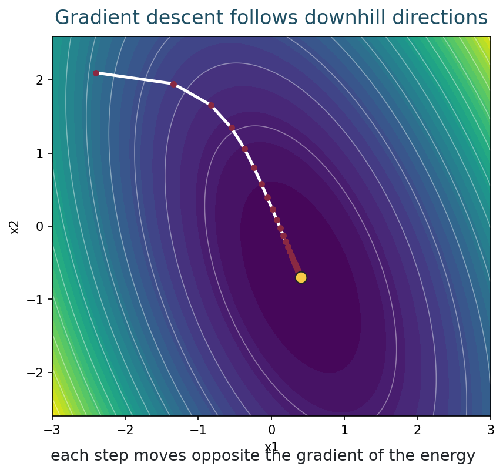
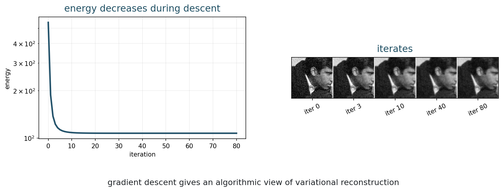
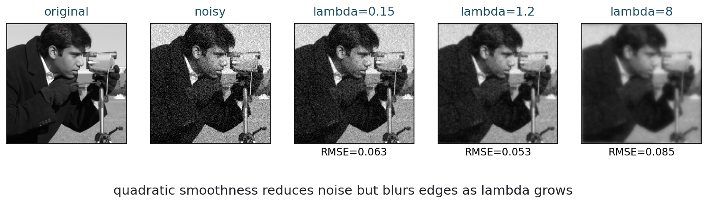

## Opening Question {.inverse-slide}

::: {.section-kicker}
From formula to framework
:::

What does it mean to reconstruct an image by minimizing an energy?

## Today

::: {.checklist}
- Interpret reconstruction as energy minimization.
- Separate data fidelity and regularization.
- Read convexity geometrically.
- Derive the Euler-Lagrange equation for an $\ell_2$ model.
- Connect optimality to gradient descent.
:::

## 75-Minute Plan

| Time | Work |
|---:|---|
| 0-8 min | recap Tikhonov regularization |
| 8-20 min | variational energy viewpoint |
| 20-32 min | convexity as geometry |
| 32-50 min | Euler-Lagrange derivation for $\ell_2$ smoothing |
| 50-62 min | gradient descent intuition |
| 62-70 min | real-image quadratic denoising |
| 70-75 min | synthesis check |

## Bridge from Week 6

Tikhonov regularization solves

$$
\min_x \|Ax-y\|_2^2+\lambda\|x\|_2^2.
$$

::: {.takeaway-box}
This is one example of a much larger idea: choose an energy and minimize it.
:::

## Variational Reconstruction

We write reconstruction as

$$
\hat{x}
=
\operatorname*{argmin}_x E(x).
$$

Often:

$$
E(x)=D(y,f(x))+\lambda R(x).
$$

## What the Terms Mean

::: {.two-col}
::: {.definition-box}
Data fidelity:

$$
D(y,f(x))
$$

agreement with measurements.
:::

::: {.model-box}
Regularization:

$$
R(x)
$$

preferred image structure.
:::
:::

## Part 1: Energy Viewpoint {.section-slide}

::: {.section-kicker}
One objective, many models
:::

Data plus prior preference

## Energy as a Model

::: {.figure-frame}
{fig-alt="Data term, regularizer, and total energy as functions of a scalar candidate"}
:::

## Why This Is Powerful

::: {.checklist}
- The data model decides the fidelity term.
- The image prior decides the regularizer.
- The optimization method decides how we minimize.
- The minimizer is the reconstruction.
:::

## Examples from Previous Weeks

| Model | Energy |
|---|---|
| Gaussian direct denoising | $\|x-y\|_2^2$ |
| Tikhonov | $\|Ax-y\|_2^2+\lambda\|x\|_2^2$ |
| Quadratic smoothing | $\|u-y\|_2^2+\lambda\|\nabla u\|_2^2$ |
| Poisson data | $\sum_i f_i(x)-z_i\log f_i(x)$ |

## Activity 1: Name the Terms

::: {.time-tag}
5 minutes
:::

::: {.exercise-box}
For

$$
E(u)=\frac12\|u-y\|_2^2+\frac{\lambda}{2}\|\nabla u\|_2^2,
$$

identify the data term, the regularizer, and the parameter.
:::

## Part 2: Convexity {.section-slide}

::: {.section-kicker}
Geometry of energies
:::

Can we trust local descent?

## Convexity Picture

::: {.figure-frame}
{fig-alt="Convex and nonconvex energy landscapes shown by contours"}
:::

## Convex Function, Informally

A function is convex if the line segment between two points on its graph stays above the graph.

::: {.definition-box}
For minimization, convexity means there are no deceptive local minima.
:::

## Why Convexity Matters

For a convex energy:

::: {.checklist}
- every local minimizer is global;
- first-order optimality is meaningful;
- many algorithms have reliable behavior.
:::

::: {.caption}
Convex does not always mean easy, but it removes a major ambiguity.
:::

## Quadratic Energies Are Convex

The energy

$$
E(u)=\frac12\|u-y\|_2^2+\frac{\lambda}{2}\|\nabla u\|_2^2
$$

is convex for $\lambda\ge 0$.

::: {.takeaway-box}
This is why it is a good first variational model.
:::

## Activity 2: Convex or Not?

::: {.time-tag}
5 minutes
:::

::: {.exercise-box}
Which energies are convex?

1. $E(x)=x^2$;
2. $E(x)=(x-1)^2+0.5x^2$;
3. $E(x)=x^4-x^2$;
4. $E(x)=|x|$.
:::

## Part 3: Euler-Lagrange Equation {.section-slide}

::: {.section-kicker}
Optimality condition
:::

Set the first variation to zero

## The Model

Consider the denoising energy

$$
E(u)
=
\frac12\int_\Omega (u-y)^2\,dx
+
\frac{\lambda}{2}\int_\Omega |\nabla u|^2\,dx.
$$

::: {.caption}
$y$ is the noisy image and $u$ is the reconstruction.
:::

## Perturb the Candidate

To test optimality, perturb $u$ in direction $v$:

$$
u_\epsilon = u+\epsilon v.
$$

At a minimizer, the derivative with respect to $\epsilon$ must vanish at $\epsilon=0$:

$$
\left.\frac{d}{d\epsilon}E(u+\epsilon v)\right|_{\epsilon=0}=0.
$$

## Data Term Variation

For the data term:

$$
\frac12\int_\Omega (u+\epsilon v-y)^2\,dx.
$$

Differentiate:

$$
\left.\frac{d}{d\epsilon}\right|_{\epsilon=0}
\frac12\int_\Omega (u+\epsilon v-y)^2\,dx
=
\int_\Omega (u-y)v\,dx.
$$

## Regularizer Variation

For the smoothness term:

$$
\frac{\lambda}{2}\int_\Omega |\nabla(u+\epsilon v)|^2\,dx.
$$

Differentiate:

$$
\lambda\int_\Omega \nabla u\cdot \nabla v\,dx.
$$

## Integration by Parts

Ignoring boundary terms for this guided derivation:

$$
\int_\Omega \nabla u\cdot \nabla v\,dx
=
-\int_\Omega (\Delta u)v\,dx.
$$

So the first variation is:

$$
\int_\Omega \left[(u-y)-\lambda\Delta u\right]v\,dx.
$$

## Euler-Lagrange Equation

Since this must hold for all perturbations $v$:

$$
(u-y)-\lambda\Delta u=0.
$$

Equivalently:

$$
u-\lambda\Delta u=y.
$$

::: {.takeaway-box}
The minimizer solves a differential equation.
:::

## Discrete Version

On a pixel grid:

$$
(u-y)+\lambda L u=0,
$$

where $L$ is a discrete negative Laplacian.

::: {.figure-frame}
{fig-alt="Finite-difference neighborhood and Euler-Lagrange equations for quadratic smoothing"}
:::

## Activity 3: Fill the Gap

::: {.time-tag}
6 minutes
:::

::: {.exercise-box}
For

$$
E(u)=\frac12\|u-y\|_2^2+\frac{\lambda}{2}\|Du\|_2^2,
$$

show that the discrete optimality condition is

$$
(u-y)+\lambda D^T D u=0.
$$
:::

## Relationship to Tikhonov

This is Tikhonov with a different penalty:

::: {.two-col}
::: {.definition-box}
Week 6:

$$
\|Ax-y\|_2^2+\lambda\|x\|_2^2.
$$
:::

::: {.model-box}
Week 7:

$$
\|u-y\|_2^2+\lambda\|\nabla u\|_2^2.
$$
:::
:::

## What the Regularizer Says

The term

$$
\|\nabla u\|_2^2
$$

penalizes changes between neighboring pixels.

::: {.takeaway-box}
It prefers smooth images.
:::

## Part 4: Gradient Descent Intuition {.section-slide}

::: {.section-kicker}
From equation to algorithm
:::

Move downhill

## Gradient Descent

For an energy $E(u)$:

$$
u^{k+1}=u^k-\tau\nabla E(u^k).
$$

::: {.definition-box}
$\tau$ is the step size. It controls how far we move each iteration.
:::

## Downhill Picture

::: {.figure-frame}
{fig-alt="Gradient descent path on a convex quadratic energy landscape"}
:::

## For Quadratic Denoising

The gradient is

$$
\nabla E(u)
=
(u-y)+\lambda L u.
$$

So gradient descent is:

$$
u^{k+1}
=
u^k-\tau\left[(u^k-y)+\lambda L u^k\right].
$$

## Step Size Matters

::: {.question-box}
What happens if $\tau$ is too large?
:::

::: {.caption}
Gradient descent can overshoot or diverge even for a convex quadratic.
:::

## Energy Decreases

::: {.figure-frame}
{fig-alt="Energy decreasing under gradient descent and denoising iterates"}
:::

## Activity 4: Interpret Iterates

::: {.time-tag}
5 minutes
:::

::: {.exercise-box}
In the gradient descent figure:

1. Why does the energy decrease?
2. Why does the image become smoother?
3. Why is the lowest RMSE not necessarily the final iterate?
:::

## Part 5: Real Image Denoising {.section-slide}

::: {.section-kicker}
Quadratic smoothing in practice
:::

Noise reduction versus edge blur

## Quadratic Denoising

::: {.figure-frame}
{fig-alt="Original image, noisy image, and quadratic denoising with several lambda values"}
:::

## What This Model Gets Right

::: {.checklist}
- It is convex.
- The optimality condition is linear.
- It reduces Gaussian-like noise.
- It is mathematically transparent.
:::

## What This Model Gets Wrong

::: {.question-box}
Edges are also large gradients.

What does $\|\nabla u\|_2^2$ do to edges?
:::

::: {.takeaway-box}
Quadratic smoothing reduces noise and blurs edges.
:::

## Preview of Week 8

Total Variation replaces squared gradients by gradient magnitude:

$$
\int_\Omega |\nabla u|\,dx.
$$

::: {.caption}
This changes the behavior near edges.
:::

## Code Demo: Run Week 7 Examples {.code-small}

From the repository root:

```bash
python3 examples/week07_variational.py
python3 examples/make_week07_figures.py
python3 scripts/build_notebooks.py
./scripts/quarto render
```

## In-Class Notebook Activity

::: {.time-tag}
8 minutes
:::

::: {.exercise-box}
Open the Week 7 notebook.

1. Change $\lambda$ in quadratic denoising.
2. Change the gradient descent step size.
3. Compare the closed-form solution with gradient descent iterates.
4. Record when smoothness helps and when it destroys edges.
:::

## Quiz-Style Check

::: {.exercise-box}
For each expression, identify its role:

1. $D(y,f(u))$;
2. $R(u)$;
3. $(u-y)-\lambda\Delta u=0$;
4. $u^{k+1}=u^k-\tau\nabla E(u^k)$.
:::

## End-of-Class Checkpoint

::: {.exercise-box}
Answer in one sentence each:

1. What is a variational model?
2. Why is convexity useful?
3. What is an Euler-Lagrange equation?
4. What does gradient descent do?
:::

## Suggested Answers

| Question | Short answer |
|---|---|
| variational model | reconstruct by minimizing an energy |
| convexity | local minima are global minima |
| Euler-Lagrange | first-order optimality condition for an energy |
| gradient descent | iterative movement opposite the energy gradient |

## What Students Should Remember

::: {.takeaway-box}
- Variational imaging models are energy minimization models.
- Energies combine data fidelity and regularization.
- Convexity gives a safer optimization landscape.
- Euler-Lagrange equations express optimality.
- Quadratic smoothness is clear and useful, but it blurs edges.
:::

## After Class

::: {.checklist}
- Use the [class roadmap](../classes.html) to find the book chapter, notebook, and weekly practice prompt.
- Run the week notebook and change at least one important parameter.
- Write one claim-evidence-limit sentence about today's model.
:::

## Next Time

Total Variation regularization:

- TV norm;
- edge preservation;
- comparison with $\ell_2$ smoothing;
- staircasing effect.
