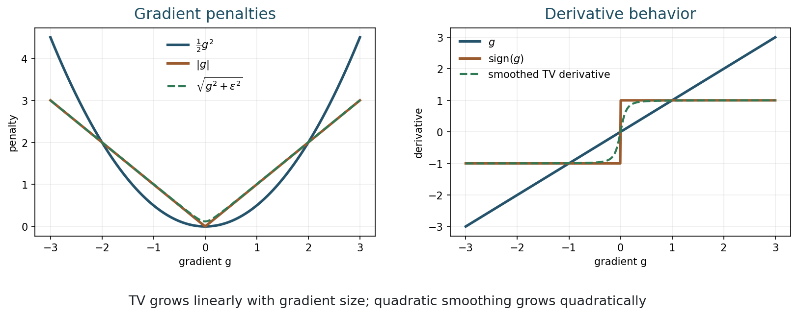
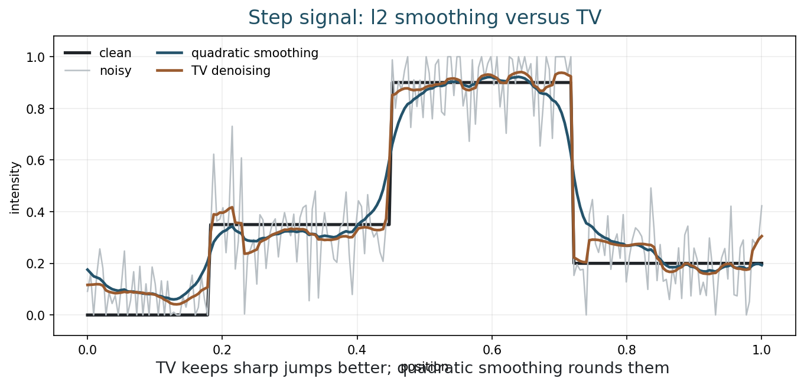
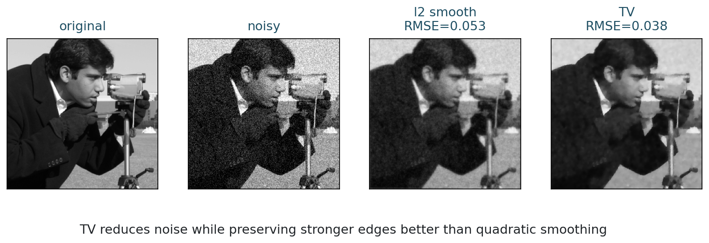
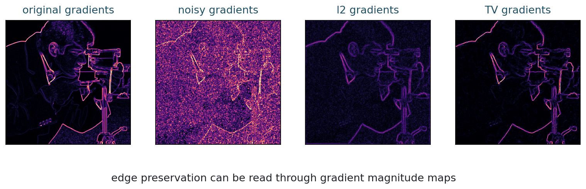
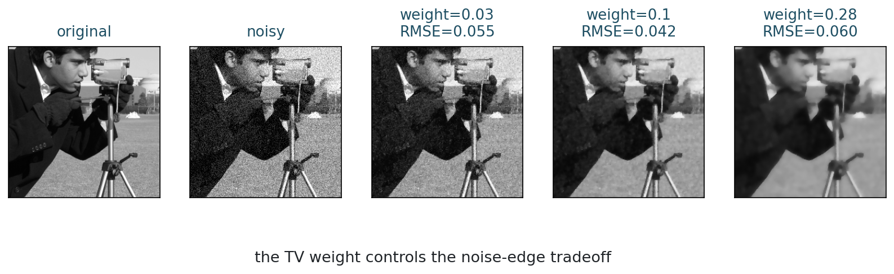
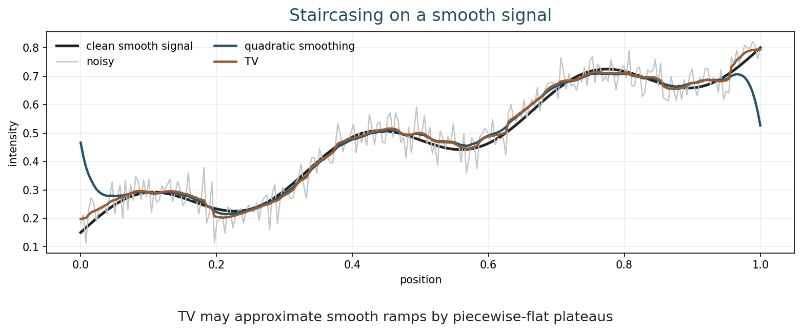

## Opening Question {.inverse-slide}

::: {.section-kicker}
Edges are not noise
:::

How can a regularizer remove noise without treating every edge as a mistake?

## Today

::: {.checklist}
- Define Total Variation (TV).
- Compare TV with quadratic smoothness.
- Explain why TV preserves edges better.
- Observe the staircasing effect.
- Use TV denoising on signals and images.
:::

## 75-Minute Plan

| Time | Work |
|---:|---|
| 0-8 min | recap variational energy models |
| 8-22 min | TV definition and gradient penalties |
| 22-38 min | edge preservation in 1D |
| 38-52 min | image denoising: l2 versus TV |
| 52-62 min | staircasing and limitations |
| 62-69 min | notebook activity |
| 69-75 min | midterm/course checkpoint |

## Bridge from Week 7

Week 7 used the quadratic smoothing energy:

$$
E(u)=\frac12\|u-y\|_2^2+\frac{\lambda}{2}\|\nabla u\|_2^2.
$$

::: {.question-box}
What happens to true edges when we penalize large gradients quadratically?
:::

## The Problem with Quadratic Smoothing

Edges are large gradients.

Noise also creates large local changes.

::: {.takeaway-box}
Quadratic smoothness reduces both noise and edges.
:::

## Part 1: Total Variation {.section-slide}

::: {.section-kicker}
A different smoothness prior
:::

Penalize gradient magnitude

## Continuous TV

For a grayscale image $u:\Omega\to\mathbb{R}$:

$$
\operatorname{TV}(u)
=
\int_\Omega |\nabla u(x)|\,dx.
$$

::: {.definition-box}
TV measures the total amount of change in the image.
:::

## Discrete Isotropic TV

For a pixel grid:

$$
\operatorname{TV}(u)
=
\sum_i
\sqrt{(D_xu_i)^2+(D_yu_i)^2}.
$$

::: {.caption}
$D_x$ and $D_y$ are finite differences in horizontal and vertical directions.
:::

## TV Denoising Model

The classical Rudin-Osher-Fatemi model is:

$$
u_\lambda
=
\operatorname*{argmin}_u
\frac12\|u-y\|_2^2
+
\lambda\,\operatorname{TV}(u).
$$

::: {.takeaway-box}
Data fidelity keeps the image close to data; TV regularization controls total edge strength.
:::

## l2 Versus TV Penalties

::: {.figure-frame}
{fig-alt="Quadratic and TV penalties for a gradient value and their derivative behavior"}
:::

## Why TV Preserves Edges

Quadratic penalty:

$$
\frac12 g^2
$$

TV penalty:

$$
|g|.
$$

::: {.takeaway-box}
Large gradients are much more expensive under $\ell_2$ than under TV.
:::

## Activity 1: Penalty Comparison

::: {.time-tag}
5 minutes
:::

::: {.exercise-box}
Compare the cost of a gradient $g=4$:

1. quadratic cost $\frac12 g^2$;
2. TV cost $|g|$.

Which penalty discourages a sharp edge more strongly?
:::

## Nonsmoothness

The function $|g|$ is not differentiable at $g=0$.

::: {.question-box}
Why might this make optimization more delicate than quadratic smoothing?
:::

::: {.caption}
Week 9 will discuss subgradients and proximal ideas.
:::

## Part 2: 1D Edge Preservation {.section-slide}

::: {.section-kicker}
Start with a signal
:::

Jumps are allowed

## Step Signal Comparison

::: {.figure-frame}
{fig-alt="Noisy step signal denoised by quadratic smoothing and TV"}
:::

## Reading the Step Example

::: {.checklist}
- The noisy signal has many small oscillations.
- l2 smoothing rounds the jumps.
- TV denoising keeps flatter regions and sharper jumps.
- TV is well matched to piecewise-constant structure.
:::

## Why Piecewise Constant?

TV counts the amount of change, not how spread out it is.

::: {.model-box}
A sharp jump can be cheaper than a long gradual transition with many small changes.
:::

## Activity 2: Predict the Prior

::: {.time-tag}
5 minutes
:::

::: {.exercise-box}
Which image class does TV prefer?

1. smooth ramps everywhere;
2. piecewise flat regions separated by edges;
3. high-frequency texture everywhere.

Give a one-sentence reason.
:::

## Part 3: Image Denoising {.section-slide}

::: {.section-kicker}
Real image comparison
:::

Noise versus edge preservation

## l2 Smoothing Versus TV

::: {.figure-frame}
{fig-alt="Original image, noisy image, l2 smoothed image, and TV denoised image"}
:::

## Gradient Maps

::: {.figure-frame}
{fig-alt="Gradient magnitude maps of original, noisy, l2 smoothed, and TV denoised images"}
:::

## Reading Gradient Maps

::: {.checklist}
- Noise creates many small gradients.
- l2 smoothing reduces gradients broadly.
- TV suppresses weak fluctuations while retaining stronger edge sets.
:::

## Parameter Effects

::: {.figure-frame}
{fig-alt="TV denoising with several regularization weights"}
:::

## Regularization Weight

In

$$
\frac12\|u-y\|_2^2+\lambda\operatorname{TV}(u),
$$

larger $\lambda$ means:

::: {.checklist}
- stronger denoising;
- fewer small variations;
- greater risk of losing detail.
:::

## Activity 3: Choose Lambda

::: {.time-tag}
5 minutes
:::

::: {.exercise-box}
For the parameter-effect figure, choose a TV weight.

Would you choose the same value for:

1. a diagnostic medical image;
2. a photograph for visual display?
:::

## Part 4: Staircasing {.section-slide}

::: {.section-kicker}
TV has a signature artifact
:::

Piecewise-flat plateaus

## Staircasing Effect

::: {.figure-frame}
{fig-alt="Smooth noisy signal denoised by l2 smoothing and TV, showing TV staircasing"}
:::

## Why Staircasing Happens

TV favors sparse gradients.

That means many locations with zero gradient and a smaller number of jumps.

::: {.takeaway-box}
TV preserves edges, but it can turn smooth variation into plateaus.
:::

## Strengths and Weaknesses

| Property | l2 smoothing | TV |
|---|---|---|
| Noise removal | yes | yes |
| Edge preservation | weak | strong |
| Optimization | smooth linear problem | nonsmooth convex problem |
| Typical artifact | blur | staircasing |
| Best for | smooth images | piecewise-smooth or piecewise-constant images |

## Part 5: Modeling View {.section-slide}

::: {.section-kicker}
What prior did we choose?
:::

Regularization is a modeling statement

## TV as a Prior

TV regularization says:

::: {.takeaway-box}
Among images that fit the data, prefer images with small total variation.
:::

This is a good prior when meaningful structures are separated by edges.

## When TV Is Not Enough

TV may struggle with:

::: {.checklist}
- texture;
- fine repeated patterns;
- gradual shading;
- curved smooth surfaces;
- strongly nonlocal structure.
:::

## Midterm / Course Checkpoint

Week 8 is also the midterm week in the syllabus.

::: {.checklist}
- Forward models and image arrays.
- Convolution, blur, Fourier interpretation.
- Noise models and likelihoods.
- Ill-posedness and singular values.
- Tikhonov, variational energies, and TV.
:::

## Code Demo: Run Week 8 Examples {.code-small}

From the repository root:

```bash
python3 examples/week08_total_variation.py
python3 examples/make_week08_figures.py
python3 scripts/build_notebooks.py
./scripts/quarto render
```

## In-Class Notebook Activity

::: {.time-tag}
8 minutes
:::

::: {.exercise-box}
Open the Week 8 notebook.

1. Change the TV weight.
2. Compare TV and l2 smoothing on an image.
3. Inspect gradient maps.
4. Find an example of staircasing.
:::

## Quiz-Style Check

::: {.exercise-box}
For each phrase, choose l2 smoothing or TV:

1. penalizes squared gradients;
2. penalizes gradient magnitude;
3. tends to blur edges;
4. can create staircasing.
:::

## End-of-Class Checkpoint

::: {.exercise-box}
Answer in one sentence each:

1. What is Total Variation?
2. Why does TV preserve edges better than l2 smoothing?
3. What is staircasing?
4. Why is TV optimization more delicate than quadratic smoothing?
:::

## Suggested Answers

| Question | Short answer |
|---|---|
| TV | sum or integral of gradient magnitude |
| edge preservation | linear gradient penalty is less harsh on large jumps |
| staircasing | smooth variation becomes piecewise flat |
| optimization | TV is convex but nonsmooth |

## What Students Should Remember

::: {.takeaway-box}
- TV regularization uses $\operatorname{TV}(u)=\int |\nabla u|$.
- TV is a variational prior favoring small total change.
- Compared with l2 smoothing, TV preserves stronger edges.
- TV can create staircasing artifacts.
- The choice of regularizer is a modeling decision.
:::

## After Class

::: {.checklist}
- Use the [class roadmap](../classes.html) to find the book chapter, notebook, and weekly deliverable.
- Run the week notebook and change at least one important parameter.
- Write one claim-evidence-limit sentence about today's model.
:::

## Next Time

Optimization methods:

- convex sets and convex functions;
- subgradient intuition;
- proximal operator idea;
- iterative shrinkage / ISTA intuition.
