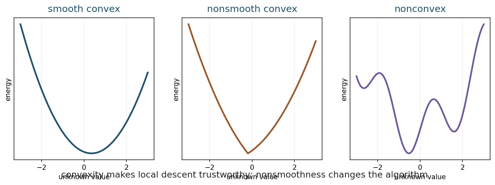
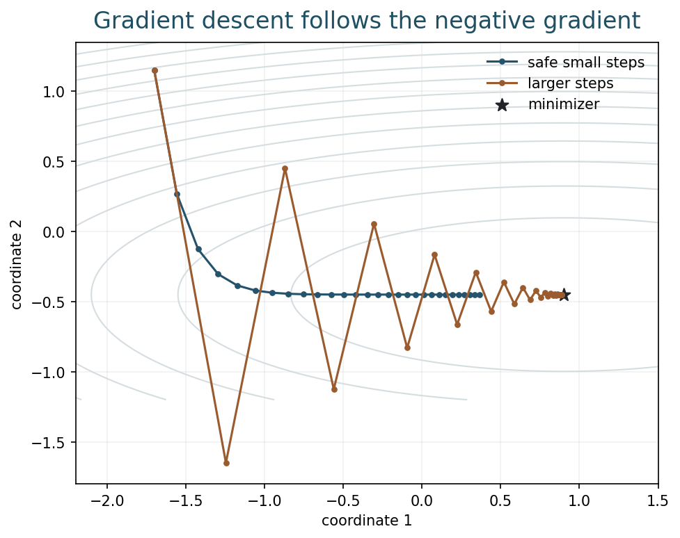
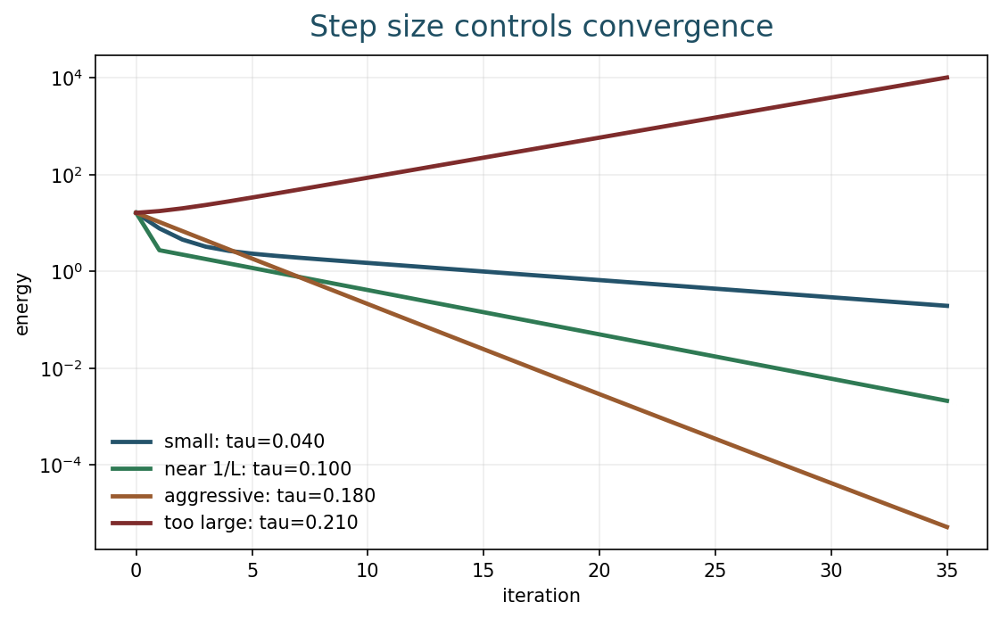
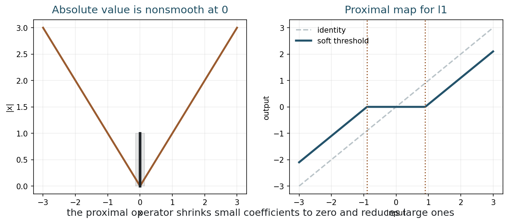
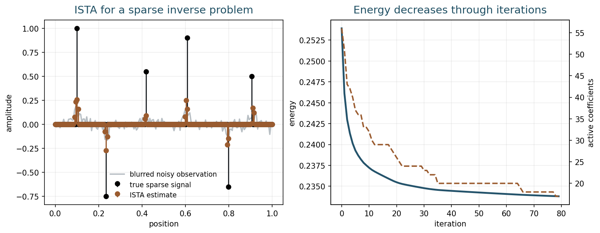
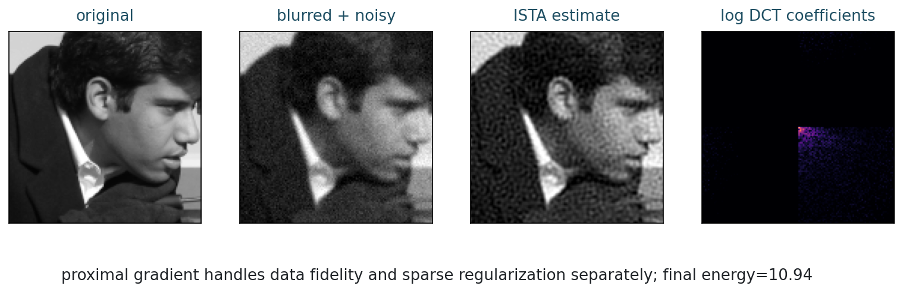

## Opening Question {.inverse-slide}

::: {.section-kicker}
Models are not enough
:::

If the reconstructed image is defined as a minimizer, how do we actually find it?

## Today

::: {.checklist}
- Recognize convex optimization problems in imaging.
- Use gradient descent for smooth energies.
- Explain why step size matters.
- Understand subgradient intuition for nonsmooth terms.
- Use proximal and ISTA ideas for sparse regularization.
:::

## 75-Minute Plan

| Time | Work |
|---:|---|
| 0-8 min | recap: energies from Weeks 7-8 |
| 8-22 min | convexity and why it matters |
| 22-37 min | gradient descent and step size |
| 37-49 min | nonsmooth penalties and subgradients |
| 49-61 min | proximal operators and ISTA |
| 61-71 min | notebook activity |
| 71-75 min | synthesis and exit check |

## Bridge from Week 8

TV denoising asks for

$$
u_\lambda
=
\operatorname*{argmin}_u
\frac12\|u-y\|_2^2+\lambda\operatorname{TV}(u).
$$

::: {.question-box}
What makes this harder than quadratic Tikhonov regularization?
:::

## The Algorithmic Question

A variational model gives an objective:

$$
\min_u E(u).
$$

An optimization method gives a procedure:

$$
u^0,\ u^1,\ u^2,\ldots
$$

::: {.takeaway-box}
Regularization chooses the model; optimization chooses how the model is solved.
:::

## Part 1: Convexity {.section-slide}

::: {.section-kicker}
When descent is trustworthy
:::

No hidden valleys

## Convex Sets

A set $C$ is convex if the segment between any two points in $C$ stays in $C$:

$$
(1-t)x+ty\in C,\qquad 0\leq t\leq 1.
$$

::: {.caption}
For imaging, constraints such as nonnegative intensities often form convex sets.
:::

## Convex Functions

A function $E$ is convex if

$$
E((1-t)x+ty)
\leq
(1-t)E(x)+tE(y).
$$

::: {.takeaway-box}
The graph lies below the line segment joining two points on the graph.
:::

## Convexity Examples

::: {.figure-frame}
{fig-alt="Smooth convex, nonsmooth convex, and nonconvex energy curves"}
:::

## Why Convexity Matters

For a convex energy:

::: {.checklist}
- every local minimum is global;
- descent methods have a target worth reaching;
- optimality conditions are meaningful;
- parameter choice remains hard, but the solver is less mysterious.
:::

## Convex Does Not Mean Easy

TV and l1 energies can be convex but nonsmooth.

::: {.model-box}
Convexity says the landscape is well behaved. Smoothness says which tools are easy to use.
:::

## Activity 1: Classify the Energy

::: {.time-tag}
5 minutes
:::

::: {.exercise-box}
For each term, decide whether it is smooth, nonsmooth, convex, or nonconvex:

1. $\frac12\|u-y\|_2^2$;
2. $\frac{\lambda}{2}\|\nabla u\|_2^2$;
3. $\lambda\operatorname{TV}(u)$;
4. a learned neural network prior.
:::

## Part 2: Smooth Optimization {.section-slide}

::: {.section-kicker}
Follow the slope
:::

Gradient descent

## Gradient Descent

For a differentiable energy $E$:

$$
u^{k+1}=u^k-\tau\nabla E(u^k).
$$

::: {.definition-box}
$\tau>0$ is the step size, also called the learning rate.
:::

## Descent Direction

The gradient points toward fastest local increase.

So $-\nabla E(u^k)$ points toward fastest local decrease.

::: {.question-box}
Why does this only use local information?
:::

## Path on a Quadratic Energy

::: {.figure-frame}
{fig-alt="Gradient descent paths over contour lines of a quadratic energy"}
:::

## Step Size Matters

If $\tau$ is too small:

::: {.checklist}
- progress is safe but slow;
- many iterations are needed.
:::

If $\tau$ is too large:

::: {.checklist}
- the method may oscillate;
- the energy can even increase.
:::

## Energy Through Iterations

::: {.figure-frame}
{fig-alt="Gradient descent energy curves for several step sizes"}
:::

## Rule of Thumb

If $\nabla E$ is Lipschitz with constant $L$, then a typical safe range is

$$
0<\tau<\frac{2}{L}.
$$

Often one uses

$$
\tau \leq \frac{1}{L}
$$

for stable monotone decrease.

## Activity 2: Predict the Iterates

::: {.time-tag}
5 minutes
:::

::: {.exercise-box}
Suppose a method reduces the energy quickly for 5 iterations, then starts increasing.

What would you change first: the model, the step size, or the stopping rule?
:::

## Stopping Criteria

Common stopping rules:

::: {.checklist}
- maximum number of iterations;
- small change in energy;
- small change in the image;
- small gradient norm;
- visual or task-driven stopping.
:::

## Part 3: Nonsmooth Terms {.section-slide}

::: {.section-kicker}
Corners in the energy
:::

TV and l1

## Why Nonsmooth Appears

Sparse and edge-preserving models often use terms like

$$
|x|,
\qquad
\|x\|_1,
\qquad
\operatorname{TV}(u).
$$

These terms have corners.

## The Absolute Value

For $x\neq 0$:

$$
\frac{d}{dx}|x|=\operatorname{sign}(x).
$$

At $x=0$, there is no single derivative.

::: {.takeaway-box}
The corner at zero is exactly what encourages sparsity.
:::

## Subgradient Intuition

At a nonsmooth point, there may be many valid slopes.

For $|x|$ at $x=0$:

$$
\partial |0|=[-1,1].
$$

::: {.caption}
This is an intuitive view; a full convex analysis course makes this precise.
:::

## Activity 3: Why Zero Is Special

::: {.time-tag}
4 minutes
:::

::: {.exercise-box}
Why would a penalty with a corner at zero make exact zero values more likely than a quadratic penalty?
:::

## Part 4: Proximal Operators {.section-slide}

::: {.section-kicker}
Do the hard part exactly
:::

Shrinkage instead of ordinary gradient descent

## Proximal Operator

The proximal operator of $R$ is

$$
\operatorname{prox}_{\tau R}(v)
=
\operatorname*{argmin}_u
\frac12\|u-v\|_2^2+\tau R(u).
$$

::: {.takeaway-box}
It balances staying near $v$ with reducing the regularizer.
:::

## Soft Thresholding

For $R(u)=\lambda\|u\|_1$:

$$
\operatorname{prox}_{\tau\lambda\|\cdot\|_1}(v)
=
\operatorname{sign}(v)\max(|v|-\tau\lambda,0).
$$

::: {.figure-frame}
{fig-alt="Absolute value nonsmoothness and soft-thresholding proximal operator"}
:::

## Reading Soft Thresholding

Soft thresholding:

::: {.checklist}
- sets small coefficients to zero;
- shrinks large coefficients toward zero;
- is nonlinear;
- is the key operation behind many sparse reconstruction methods.
:::

## Proximal Gradient

Split the energy into

$$
E(u)=f(u)+R(u),
$$

where $f$ is smooth and $R$ may be nonsmooth.

Then use

$$
u^{k+1}
=
\operatorname{prox}_{\tau R}
\left(u^k-\tau\nabla f(u^k)\right).
$$

## ISTA

For

$$
\min_x
\frac12\|Ax-y\|_2^2+\lambda\|x\|_1,
$$

ISTA is

$$
x^{k+1}
=
S_{\tau\lambda}
\left(x^k-\tau A^\top(Ax^k-y)\right).
$$

::: {.caption}
$S_{\tau\lambda}$ is soft thresholding.
:::

## Algorithm View

| Step | Meaning |
|---|---|
| compute $Ax^k-y$ | current data mismatch |
| apply $A^\top$ | move mismatch back to image or coefficient space |
| gradient step | improve data fidelity |
| soft threshold | impose sparsity |

## ISTA on a Sparse Signal

::: {.figure-frame}
{fig-alt="Sparse signal reconstruction with ISTA and energy decrease"}
:::

## ISTA on an Image

::: {.figure-frame}
{fig-alt="Original image, blurred noisy observation, ISTA estimate, and sparse DCT coefficients"}
:::

## Imaging Interpretation

The same pattern appears repeatedly:

::: {.checklist}
- data term: explains the measurements;
- gradient step: reduces measurement error;
- regularizer: imposes prior structure;
- proximal step: applies the prior without pretending it is smooth.
:::

## Code Demo: Run Week 9 Examples {.code-small}

From the repository root:

```bash
python3 examples/week09_optimization.py
python3 examples/make_week09_figures.py
python3 scripts/build_notebooks.py
./scripts/quarto render
```

## In-Class Notebook Activity

::: {.time-tag}
10 minutes
:::

::: {.exercise-box}
Open the Week 9 notebook.

1. Change the gradient descent step size.
2. Change the soft-threshold value.
3. Run ISTA with a different regularization weight.
4. Compare energy decrease and image quality.
:::

## Common Failure Modes

::: {.checklist}
- Step size is too large.
- Objective is not the one intended.
- Stopping too early hides convergence.
- Stopping too late overfits noise or wastes computation.
- A nonsmooth term is treated as if it were smooth.
:::

## Quiz-Style Check

::: {.exercise-box}
Match each idea to its role:

1. gradient;
2. step size;
3. subgradient;
4. proximal operator;
5. ISTA.
:::

## Suggested Answers

| Idea | Role |
|---|---|
| gradient | local direction of increase |
| step size | amount of movement |
| subgradient | generalized slope for convex nonsmooth functions |
| proximal operator | solves a small regularized problem |
| ISTA | gradient step plus soft thresholding |

## What Students Should Remember

::: {.takeaway-box}
- Convexity makes minimization conceptually safer.
- Gradient descent solves smooth problems by local descent.
- Step size controls stability.
- l1 and TV are convex but nonsmooth.
- Proximal operators are central for sparse and edge-preserving imaging.
:::

## After Class

::: {.checklist}
- Use the [class roadmap](../classes.html) to find the book chapter, notebook, and weekly practice prompt.
- Run the week notebook and change at least one important parameter.
- Write one claim-evidence-limit sentence about today's model.
:::

## Next Time

Sparse reconstruction:

- sparsity as a prior;
- l1 versus l2 regularization;
- compressed sensing intuition;
- examples in transform domains.
