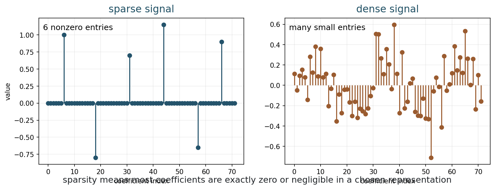
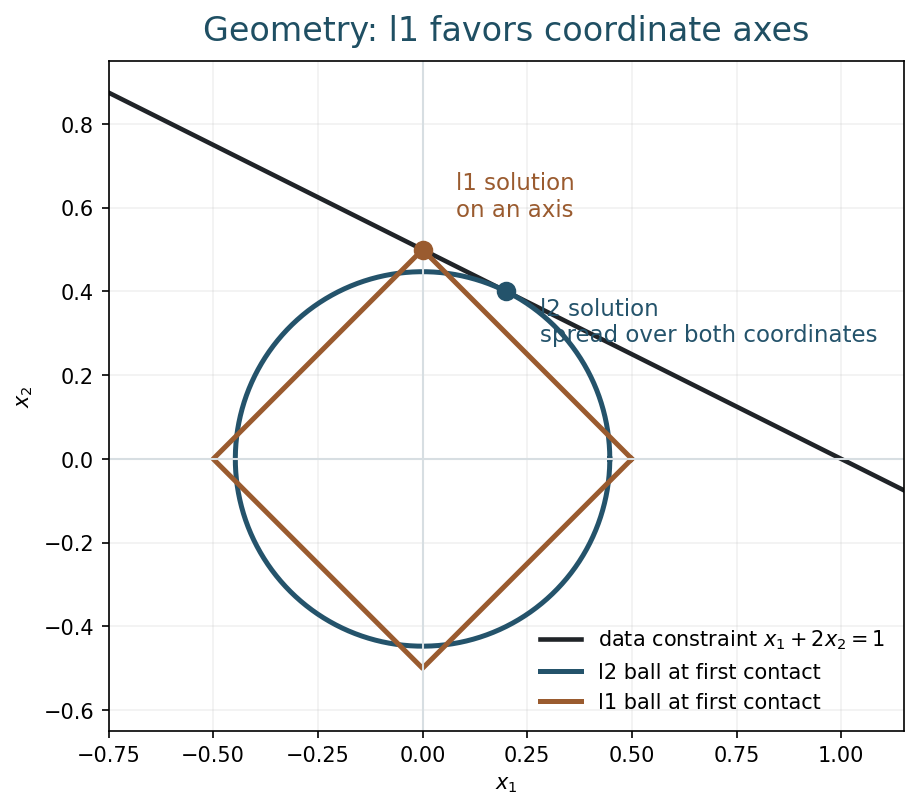
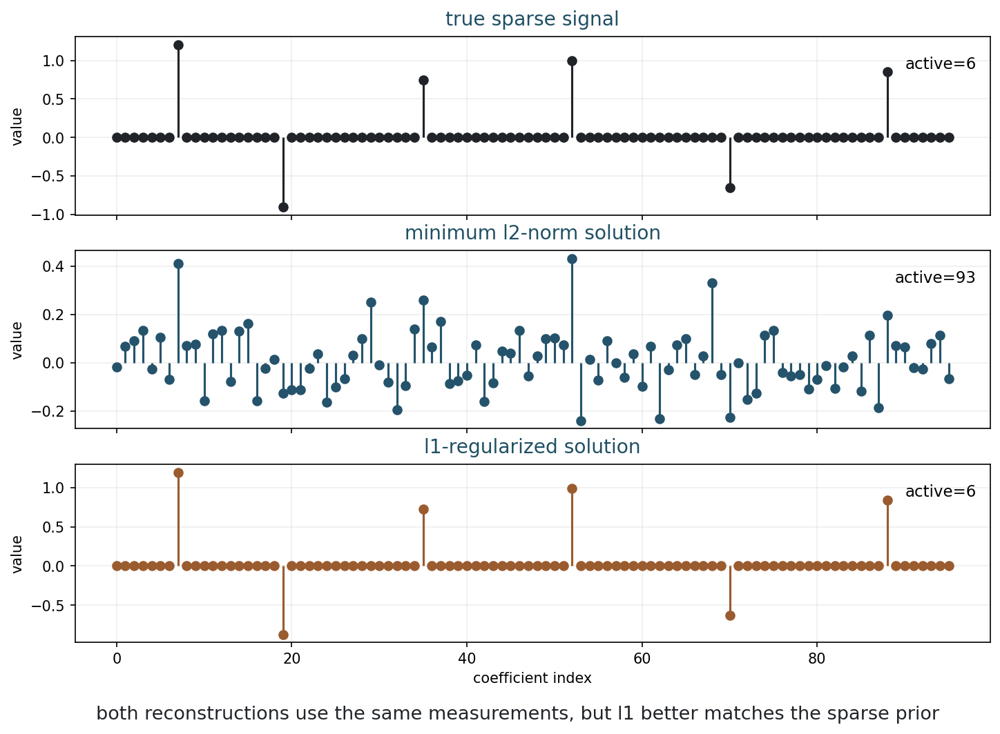
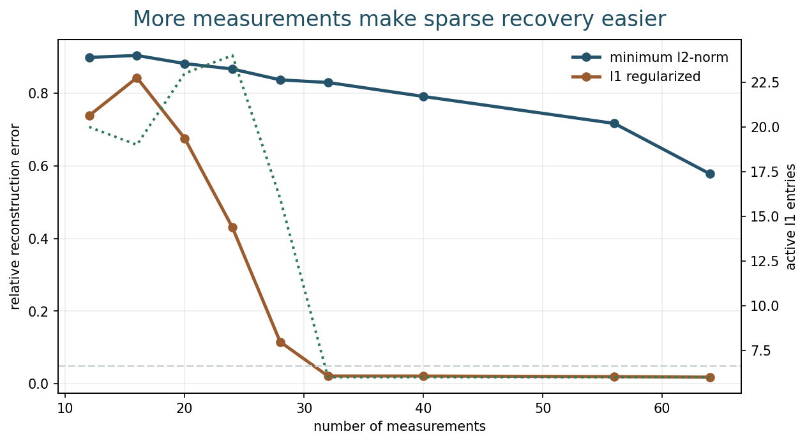
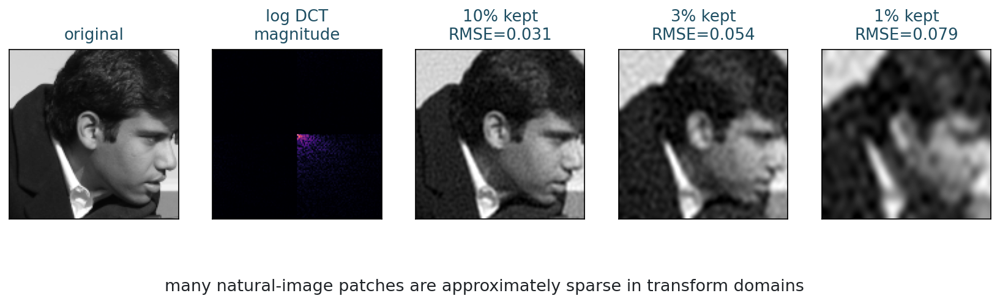
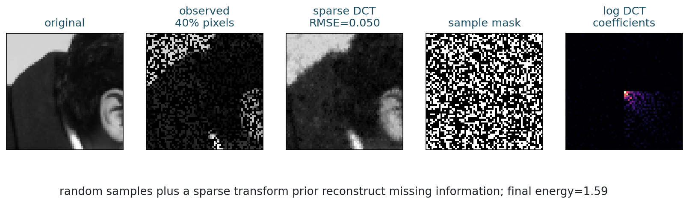

## Opening Question {.inverse-slide}

::: {.section-kicker}
Too few measurements
:::

Can fewer measurements be enough if the unknown image has a simple hidden structure?

## Today

::: {.checklist}
- Define sparsity in a basis or transform.
- Compare l1 and l2 regularization.
- Explain why l1 can recover sparse signals.
- Build compressed sensing intuition.
- Use a sparse DCT prior for image reconstruction.
:::

## 75-Minute Live Path

| Time | Work |
|---:|---|
| 0-8 min | recap: proximal methods and soft thresholding |
| 8-20 min | sparsity and representations |
| 20-34 min | l1 versus l2 geometry |
| 34-49 min | underdetermined sparse recovery |
| 49-60 min | compressed sensing intuition |
| 60-70 min | notebook activity |
| 70-75 min | synthesis and exit check |

## Bridge from Week 9

Week 9 introduced ISTA:

$$
x^{k+1}
=
S_{\tau\lambda}
\left(x^k-\tau A^\top(Ax^k-y)\right).
$$

::: {.question-box}
What modeling assumption is soft thresholding trying to impose?
:::

## Part 1: Sparsity {.section-slide}

::: {.section-kicker}
Most coefficients are zero
:::

But only after choosing a representation

## Sparse Vector

A vector $x\in\mathbb{R}^n$ is $k$-sparse if it has at most $k$ nonzero entries.

$$
\|x\|_0
=
\#\{i:x_i\neq 0\}.
$$

::: {.caption}
$\|\cdot\|_0$ counts nonzeros; it is not a true norm.
:::

## Sparse Versus Dense

::: {.figure-frame}
{fig-alt="Sparse signal and dense signal coefficient plots"}
:::

## Representation Matters

An image may not be sparse as pixels.

It may be sparse or approximately sparse in:

::: {.checklist}
- Fourier coefficients;
- DCT coefficients;
- wavelet coefficients;
- learned dictionaries;
- gradient domain.
:::

## Approximate Sparsity

Natural images often have many small transform coefficients and a few large ones.

::: {.takeaway-box}
Sparse reconstruction does not require exact zeros everywhere; it often relies on coefficients that decay quickly.
:::

## Activity 1: Choose the Basis

::: {.time-tag}
5 minutes
:::

::: {.exercise-box}
Which representation would you try for each object?

1. a smooth sky image;
2. a piecewise-constant segmentation map;
3. a periodic texture;
4. a medical image with sharp organ boundaries.
:::

## Part 2: l1 Versus l2 {.section-slide}

::: {.section-kicker}
Two priors, different geometry
:::

Spread energy or select coefficients

## l2 Regularization

Tikhonov-style regularization uses

$$
\frac12\|Ax-y\|_2^2+\frac{\lambda}{2}\|x\|_2^2.
$$

::: {.takeaway-box}
l2 regularization prefers small energy spread across coefficients.
:::

## l1 Regularization

Sparse reconstruction often uses

$$
\frac12\|Ax-y\|_2^2+\lambda\|x\|_1.
$$

where

$$
\|x\|_1=\sum_i |x_i|.
$$

::: {.takeaway-box}
l1 regularization encourages exact zeros.
:::

## Why l0 Is Not the Default

The ideal sparse model might be:

$$
\min_x \|x\|_0
\quad\text{subject to}\quad
Ax=y.
$$

But this is combinatorial.

::: {.model-box}
l1 is the convex relaxation that keeps much of the sparse behavior.
:::

## Geometry of l1 and l2

::: {.figure-frame}
{fig-alt="Geometry showing l1 diamond and l2 circle touching a data constraint"}
:::

## Reading the Geometry

The l2 ball is round.

The l1 ball has corners on coordinate axes.

::: {.takeaway-box}
When a constraint first touches an l1 ball, it often touches a corner, which means some coordinates are exactly zero.
:::

## Activity 2: Before Seeing the Answer

::: {.time-tag}
4 minutes
:::

::: {.exercise-box}
Suppose many vectors fit the same measurements.

Would l2 or l1 be more likely to choose a vector with only a few nonzero coefficients? Why?
:::

## Part 3: Underdetermined Recovery {.section-slide}

::: {.section-kicker}
More unknowns than equations
:::

The prior chooses among many solutions

## The Linear Model

We observe

$$
y=Ax,
$$

where $A$ has fewer rows than columns.

::: {.question-box}
If $m<n$, why should we expect many possible solutions?
:::

## Minimum l2-Norm Solution

One classical choice is:

$$
\min_x \|x\|_2
\quad\text{subject to}\quad
Ax=y.
$$

This gives the solution with smallest Euclidean norm.

::: {.takeaway-box}
It fits the data, but it may be dense.
:::

## l1-Regularized Solution

Instead solve:

$$
\min_x
\frac12\|Ax-y\|_2^2+\lambda\|x\|_1.
$$

This balances:

::: {.checklist}
- fitting the measurements;
- keeping the coefficient vector sparse.
:::

## Same Measurements, Different Prior

::: {.figure-frame}
{fig-alt="True sparse signal, l2 solution, and l1 solution from the same measurements"}
:::

## What Happened?

Both methods see the same $A$ and $y$.

The difference is the prior.

::: {.takeaway-box}
l2 asks for a small vector; l1 asks for a sparse explanation.
:::

## Important Caveat

l1 does not magically recover every sparse signal.

It needs enough measurements and a measurement operator that mixes information well.

::: {.model-box}
Sparse recovery depends on the pair: sparsity model plus measurement design.
:::

## Part 4: Compressed Sensing Intuition {.section-slide}

::: {.section-kicker}
Sampling below the apparent dimension
:::

When structure reduces degrees of freedom

## Degrees of Freedom

If $x\in\mathbb{R}^{1000}$ is exactly 5-sparse, it is not truly a 1000-degree-of-freedom object.

We need to learn:

::: {.checklist}
- which 5 locations are active;
- the 5 active values.
:::

## Measurement Count

Sparse recovery can work with far fewer than $n$ measurements.

But not usually as few as $k$.

::: {.takeaway-box}
We need enough measurements to identify both support and amplitudes robustly.
:::

## Measurement Sweep

::: {.figure-frame}
{fig-alt="Relative recovery error versus number of measurements for l1 and l2"}
:::

## Reading the Sweep

::: {.checklist}
- With very few measurements, both methods struggle.
- After a threshold, l1 can recover the sparse vector well.
- The l2 solution remains dense because its prior is different.
:::

## Activity 3: Failure Modes

::: {.time-tag}
5 minutes
:::

::: {.exercise-box}
Give one reason sparse recovery could fail even when the true signal is sparse.
:::

## Part 5: Sparse Images {.section-slide}

::: {.section-kicker}
Images are sparse after transformation
:::

DCT example before wavelets

## DCT Compression

The Discrete Cosine Transform represents an image patch as cosine patterns.

Many image patches can be approximated using only a small fraction of DCT coefficients.

::: {.caption}
Wavelets in Week 11 will give a more imaging-focused multiscale representation.
:::

## Few Coefficients, Good Approximation

::: {.figure-frame}
{fig-alt="Image patch, DCT magnitude, and reconstructions using a small fraction of coefficients"}
:::

## Sparse Reconstruction from Pixels

Suppose we observe only a random subset of pixels.

We can reconstruct by solving:

$$
\min_c
\frac12\|M D^{-1}c-y\|_2^2+\lambda\|c\|_1.
$$

::: {.caption}
$D^{-1}c$ maps DCT coefficients back to an image; $M$ keeps observed pixels.
:::

## Random Pixels Plus Sparse Prior

::: {.figure-frame}
{fig-alt="Sparse DCT reconstruction from random observed pixels"}
:::

## What This Does Not Say

This is not a universal promise.

::: {.checklist}
- The representation must be appropriate.
- The measurements must contain useful information.
- The regularization weight matters.
- Real systems include noise, calibration, and model mismatch.
:::

## Comparison: l1 Versus l2

| Feature | l2 | l1 |
|---|---|---|
| Geometry | round | corners |
| Typical coefficients | many small values | many zeros |
| Optimization | smooth | nonsmooth |
| Prior | small energy | sparse explanation |
| Useful when | dense small errors | few active structures |

## Notebook Demo and Code Reference {.code-small}

::: {.checklist}
- Use the Week 10 notebook for the live experiment.
- Example scripts live in `examples/` for after-class reruns.
- General run instructions are on the [notebooks page](../notebooks/index.html).
:::

## In-Class Notebook Activity

::: {.time-tag}
10 minutes
:::

::: {.exercise-box}
Open the Week 10 notebook.

1. Change the number of measurements.
2. Change the sparsity level.
3. Change the l1 regularization weight.
4. Compare l2 and l1 solutions.
5. Try a different observed-pixel fraction for the image example.
:::

## Quiz-Style Check

::: {.exercise-box}
Answer quickly:

1. What does sparse mean?
2. Why does l1 promote zeros?
3. Why can l2 fit the data but fail to recover the sparse signal?
4. What must be chosen before saying an image is sparse?
:::

## What Students Should Remember

::: {.takeaway-box}
- Sparsity is representation-dependent.
- l1 is a convex surrogate for sparse selection.
- l1 and l2 encode different priors.
- Compressed sensing works when measurements and sparse model are compatible.
- Sparse priors can reconstruct images from incomplete data, but only under assumptions.
:::

## After Class

::: {.checklist}
- Use the [class roadmap](../classes.html) to find the book chapter, notebook, and weekly practice prompt.
- Run the week notebook and change at least one important parameter.
- Write one claim-evidence-limit sentence about today's model.
:::

## Next Time

Wavelets and multiscale representation:

- why image detail lives at multiple scales;
- wavelet coefficients;
- thresholding;
- denoising experiments.
