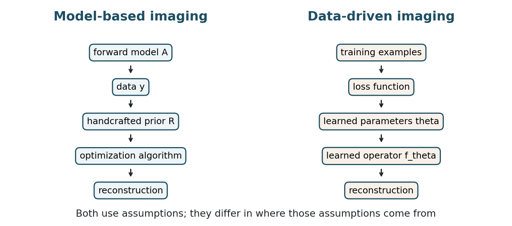
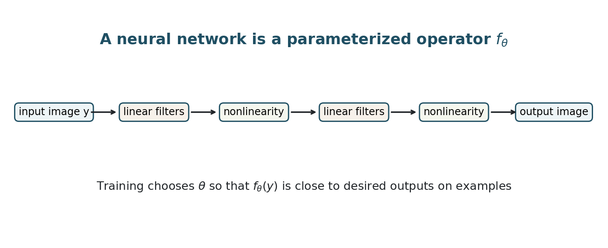
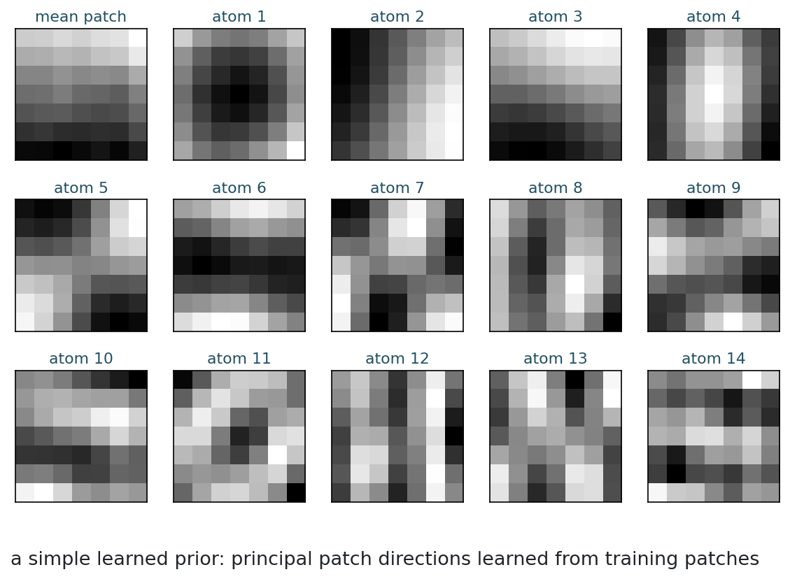
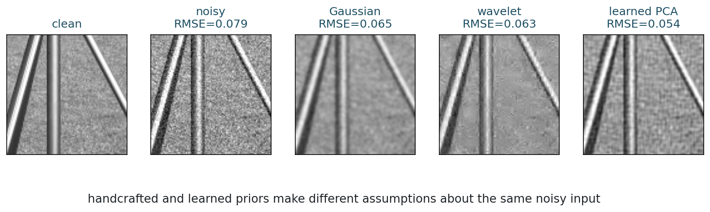
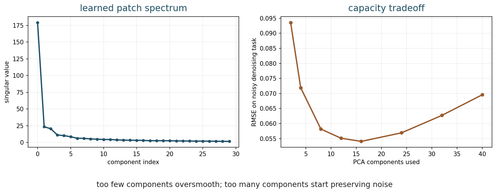
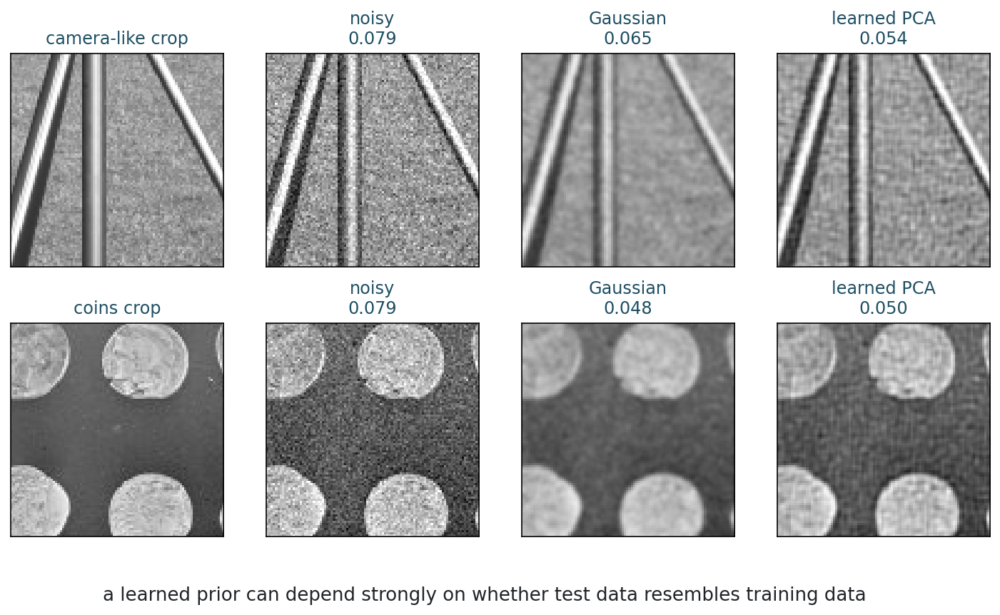

## Opening Question {.inverse-slide}

::: {.section-kicker}
Where does prior knowledge come from?
:::

Should an imaging algorithm use a prior we write down, or one it learns from examples?

## This Week

::: {.checklist}
- Compare model-based and data-driven imaging.
- Explain why neural imaging is still an inverse-problem story.
- Identify forward models, priors, solvers, and training data.
- Interpret a neural network as a parameterized operator.
- Discuss generalization and failure modes.
- Leave the final 20 minutes for Quiz 2.
:::

## Two-Session Plan + Quiz 2

| Session | Focus |
|---|---|
| Session 1 | Model-based and data-driven imaging; neural networks as inverse-problem operators. |
| Session 2 | Learned priors; capacity; distribution shift; evaluation; Quiz 2 in the final 20 minutes. |

## Session 1: From Written Priors to Learned Operators {.section-slide}

::: {.section-kicker}
The inverse-problem story continues
:::

## Bridge from Week 11

Wavelets gave us a handcrafted representation.

We chose:

::: {.checklist}
- the wavelet family;
- the decomposition level;
- the thresholding rule;
- the threshold strength.
:::

::: {.question-box}
What if these choices were learned from data instead?
:::

## Central Identity

::: {.model-box}
Neural imaging = inverse problems + learned image models.
:::

The same questions remain:

::: {.checklist}
- What was measured?
- What information is missing or unstable?
- What prior information is added?
- Where does that prior come from?
- How do we test whether the reconstruction is supported by the data?
:::

## Two Philosophies

::: {.figure-frame}
{fig-alt="Diagram comparing model-based imaging and data-driven imaging workflows"}
:::

## Part 1: Model-Based Imaging {.section-slide}

::: {.section-kicker}
Write the assumptions
:::

Forward model plus prior

## Model-Based Template

A classical reconstruction often solves

$$
\hat{x}
=
\operatorname*{argmin}_x
D(Ax,y)+\lambda R(x).
$$

::: {.definition-box}
$D$ is data fidelity; $R$ is the regularizer or prior.
:::

## What We Specify

In a model-based method, we choose:

::: {.checklist}
- the forward model $A$;
- the noise model or data term;
- the regularizer;
- the parameter $\lambda$;
- the optimization method.
:::

## Examples from This Course

| Week | Model choice |
|---:|---|
| 6 | Tikhonov: small energy or smoothness |
| 8 | TV: sparse gradients |
| 10 | l1: sparse coefficients |
| 11 | wavelets: sparse multiscale detail |

## Strengths

Model-based methods are often:

::: {.checklist}
- interpretable;
- grounded in physics;
- usable with limited training data;
- easier to constrain;
- easier to analyze mathematically.
:::

## Weaknesses

They can struggle when:

::: {.checklist}
- the forward model is incomplete;
- the prior is too simple;
- tuning parameters is difficult;
- the handcrafted prior misses real image structure.
:::

## Activity 1: Name the Assumption

::: {.time-tag}
5 minutes
:::

::: {.exercise-box}
For each regularizer, name the image assumption:

1. $\|\nabla x\|_2^2$;
2. $\operatorname{TV}(x)$;
3. $\|Wx\|_1$ for a wavelet transform $W$.
:::

## Part 2: Data-Driven Imaging {.section-slide}

::: {.section-kicker}
Learn the assumptions
:::

Training data plus loss

## Data-Driven Template

Instead of writing the reconstruction rule by hand, learn a function:

$$
\hat{x}=f_\theta(y).
$$

The parameters $\theta$ are chosen from training data.

## Supervised Training

With training pairs $(y_i,x_i)$:

$$
\min_\theta
\sum_i
\ell(f_\theta(y_i),x_i).
$$

::: {.takeaway-box}
The loss tells the network what counts as a good reconstruction on the training set.
:::

## What We Specify

Even data-driven methods require choices:

::: {.checklist}
- training data;
- architecture;
- loss function;
- optimizer;
- evaluation metric;
- deployment domain.
:::

## Learned Prior View

A learned method can encode image structure that is hard to write as a simple formula.

::: {.model-box}
The prior is no longer a short expression like TV; it is represented by parameters learned from examples.
:::

## What Can Be Learned?

| Learned object | Role in the inverse problem |
|---|---|
| inverse map $f_\theta(y)$ | direct reconstruction rule |
| prior $R_\theta(x)$ | learned image preference |
| denoiser $D_\theta(z)$ | implicit proximal-like step |
| representation $\Phi_\theta(x)$ | learned coordinates |
| update rule $G_\theta$ | learned algorithmic step |

::: {.caption}
Different neural methods learn different parts of the reconstruction story.
:::

## Strengths

Data-driven methods can:

::: {.checklist}
- exploit complex image statistics;
- be very fast at inference time;
- adapt to a specific scanner or modality;
- outperform handcrafted priors when training and test data match.
:::

## Weaknesses

They can fail when:

::: {.checklist}
- the test distribution changes;
- training data is biased;
- the loss rewards the wrong thing;
- uncertainty is hidden;
- hallucinated structure looks plausible.
:::

## Part 3: Neural Networks as Operators {.section-slide}

::: {.section-kicker}
Not magic, just parameterized maps
:::

Input image to output image

## Parameterized Operator

::: {.figure-frame}
{fig-alt="Diagram of a neural network as a parameterized operator from input image to output image"}
:::

## What the Layers Do

At a high level, layers combine:

::: {.checklist}
- linear filtering or mixing;
- nonlinear activation;
- many learned parameters;
- composition of simple operations.
:::

## Why Nonlinearity Matters

A composition of only linear layers is still linear.

Nonlinear activations allow the map to adapt to image content.

::: {.question-box}
Why might a nonlinear reconstruction operator be useful for images?
:::

## Neural Networks and Forward Models

Some methods ignore the explicit forward model:

$$
\hat{x}=f_\theta(y).
$$

Others include it:

$$
x^{k+1}
=
\text{learned step using } A,\ A^\top,\ y.
$$

::: {.caption}
Week 13 will study plug-and-play and learned regularization.
:::

## Activity 2: Operator or Prior?

::: {.time-tag}
5 minutes
:::

::: {.exercise-box}
Classify each idea:

1. a CNN that maps noisy images to clean images;
2. TV inside an optimization problem;
3. a denoiser used as a proximal step;
4. a neural network trained to predict wavelet coefficients.
:::

## Session 2: Learned Priors, Shift, and Quiz 2 {.section-slide}

::: {.section-kicker}
Training data become part of the model
:::

## Part 4: A Small Learned Prior {.section-slide}

::: {.section-kicker}
Learning without a big network
:::

Patch PCA

## Patch Prior

We extract many clean image patches and learn common directions of variation.

This gives:

::: {.checklist}
- a mean patch;
- principal patch directions;
- a low-dimensional patch model.
:::

## Learned Patch Atoms

::: {.figure-frame}
{fig-alt="Mean patch and learned PCA patch atoms from image patches"}
:::

## Denoising with a Learned Patch Prior

For each noisy patch:

::: {.checklist}
- subtract the learned mean patch;
- project onto the first few learned directions;
- reconstruct the patch;
- average overlapping reconstructed patches.
:::

::: {.caption}
This is not a neural network, but it is data-driven.
:::

## Handcrafted Versus Learned Denoising

::: {.figure-frame}
{fig-alt="Clean, noisy, Gaussian, wavelet, and learned PCA denoising comparison"}
:::

## Capacity Tradeoff

::: {.figure-frame}
{fig-alt="Patch PCA singular spectrum and denoising RMSE versus number of components"}
:::

## Reading the Capacity Curve

Too few components:

::: {.checklist}
- the prior is too restrictive;
- details are oversmoothed.
:::

Too many components:

::: {.checklist}
- the prior is too permissive;
- noise can be preserved.
:::

## Distribution Shift

::: {.figure-frame}
{fig-alt="Learned PCA denoising on a camera crop and a coins crop, showing distribution dependence"}
:::

## What Changed?

The learned prior was trained on one image family.

When the test image changes, the learned patch model may no longer be ideal.

::: {.takeaway-box}
Generalization is not a side issue; it is central to learned imaging.
:::

## Part 5: Comparison {.section-slide}

::: {.section-kicker}
Different risks, different strengths
:::

No free reconstruction

## Side-by-Side

| Question | Model-based | Data-driven |
|---|---|---|
| Prior comes from | formulas and modeling | examples and loss |
| Interpretability | usually higher | often lower |
| Data requirement | lower | higher |
| Physics | explicit | sometimes implicit |
| Failure mode | wrong model or prior | distribution shift or hallucination |

## Hallucination Risk

A learned method may produce a plausible image that is not supported by the data.

::: {.question-box}
In medical or scientific imaging, why is plausible-but-false structure dangerous?
:::

## Fit Versus Resemble

A learned reconstruction should be read with two verbs:

::: {.checklist}
- it **fits** the measured data;
- it **resembles** the training examples.
:::

::: {.takeaway-box}
A good reconstruction needs both measurement support and relevant learned prior information.
:::

## Evaluation Matters

Pixel RMSE is not enough.

We may also need:

::: {.checklist}
- task accuracy;
- uncertainty estimates;
- robustness to distribution shift;
- consistency with measured data;
- expert review.
:::

## Hybrid Methods

Many modern methods combine both philosophies:

::: {.checklist}
- explicit forward model;
- learned denoiser or prior;
- iterative algorithm structure;
- data-consistency step.
:::

::: {.caption}
This is the doorway to plug-and-play and learned regularization.
:::

## Before Quiz 2

::: {.exercise-box}
Use the central identity as the organizing question:

1. What part of the method comes from the forward model?
2. What part comes from an explicit prior?
3. What part is learned from examples?
4. How could the reconstruction fail on new data?
:::

## What Students Should Remember

::: {.takeaway-box}
- Model-based methods write assumptions explicitly.
- Data-driven methods learn assumptions from examples.
- Neural networks are parameterized nonlinear operators.
- Learned methods can be powerful but depend on training data.
- Modern imaging often combines physics, optimization, and learning.
:::

## After This Week

::: {.checklist}
- Use the [weekly roadmap](../classes.html) to find the book chapter, notebook, and practice prompt.
- Use Chapter 12 of the book for the model-based/data-driven comparison.
- Run the corresponding notebook and test one distribution shift.
- Write one claim-evidence-limit sentence about this week's model.
:::
