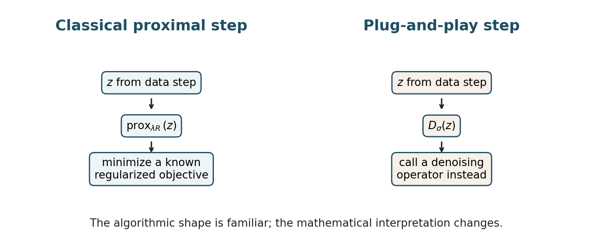
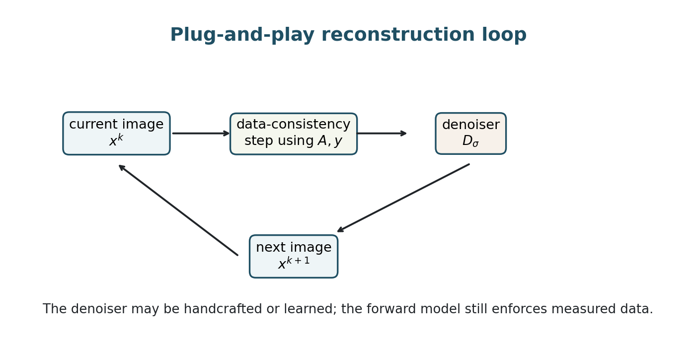
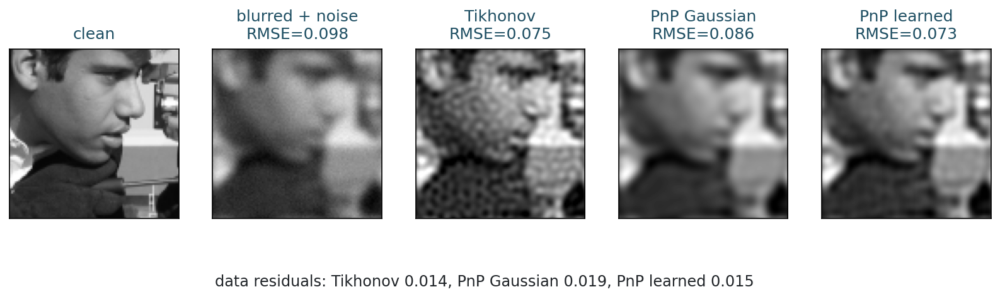
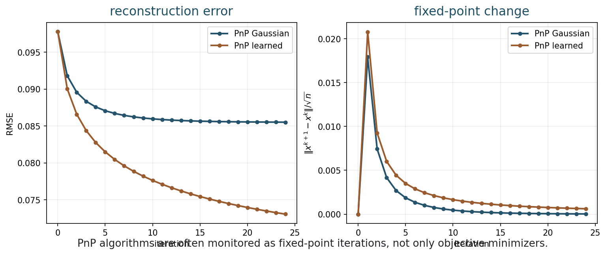
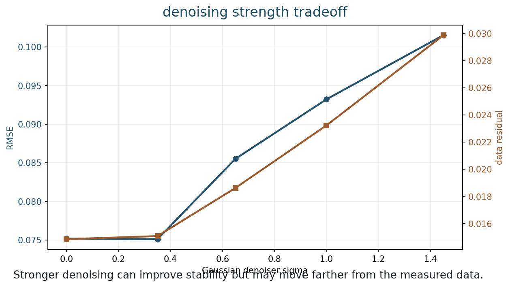
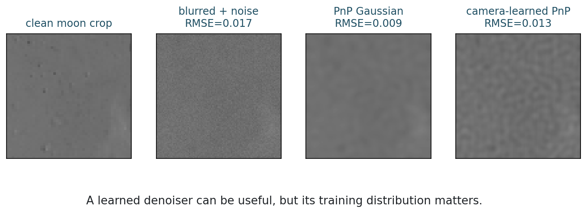

## Opening Question {.inverse-slide}

::: {.section-kicker}
Can a denoiser be a prior?
:::

Suppose you already have a good denoising algorithm.

Can you insert it inside an inverse-problem solver?

## Today

::: {.checklist}
- Recall proximal algorithms for regularized inverse problems.
- Define plug-and-play reconstruction.
- Explain how learned algorithms can keep data consistency in the loop.
- Compare explicit and implicit regularization.
- Run a deblurring example with handcrafted and learned denoisers.
- Discuss fixed points, convergence, and trust.
:::

## 75-Minute Live Path

| Time | Work |
|---:|---|
| 0-8 min | recap: model-based vs data-driven |
| 8-22 min | proximal steps as denoising-like operations |
| 22-38 min | plug-and-play idea and update equations |
| 38-50 min | learned regularization and unrolled algorithms |
| 50-62 min | convergence, fixed points, and failure modes |
| 62-72 min | notebook activity |
| 72-75 min | synthesis and exit check |

## Bridge from Week 12

Week 12 compared:

::: {.checklist}
- model-based methods: write the prior;
- data-driven methods: learn the prior;
- hybrid methods: use both physics and learned image structure.
:::

::: {.takeaway-box}
Plug-and-play is one of the cleanest hybrid ideas.
:::

## The Hybrid Goal

Use the measurement model:

$$
y \approx Ax
$$

and also use an image-restoration tool that knows what plausible images look like.

::: {.question-box}
Where should that image-restoration tool enter the algorithm?
:::

## Part 1: Proximal Algorithms {.section-slide}

::: {.section-kicker}
An old algorithmic doorway
:::

Data step plus prior step

## Regularized Reconstruction

A standard variational model is

$$
\hat{x}
=
\operatorname*{argmin}_x
\frac{1}{2}\|Ax-y\|_2^2+\lambda R(x).
$$

::: {.definition-box}
The data term uses the forward model. The regularizer encodes image structure.
:::

## Gradient Step for the Data Term

For

$$
D(x)=\frac{1}{2}\|Ax-y\|_2^2,
$$

the gradient is

$$
\nabla D(x)=A^\top(Ax-y).
$$

A data-consistency step is:

$$
z^k=x^k-\tau A^\top(Ax^k-y).
$$

## Proximal Step

The proximal operator of $R$ is

$$
\operatorname{prox}_{\lambda R}(z)
=
\operatorname*{argmin}_x
\frac{1}{2}\|x-z\|_2^2+\lambda R(x).
$$

::: {.takeaway-box}
It asks for an image close to $z$, but preferred by the prior $R$.
:::

## Proximal Gradient

Put the two steps together:

$$
z^k=x^k-\tau A^\top(Ax^k-y),
$$

$$
x^{k+1}
=
\operatorname{prox}_{\tau\lambda R}(z^k).
$$

::: {.caption}
This is the algorithmic pattern plug-and-play modifies.
:::

## A Denoising Interpretation

The proximal step receives a corrupted intermediate image $z^k$ and returns a more regular image.

That sounds like denoising.

::: {.question-box}
If a proximal step already behaves like a denoiser, why not use a strong denoiser directly?
:::

## Plug-and-Play Is A Bridge

In proximal gradient, the algorithm alternates:

::: {.checklist}
- move toward the measured data;
- move toward images preferred by the prior.
:::

Plug-and-play keeps this structure, but lets the prior step be a denoiser.

::: {.takeaway-box}
Learning enters where the inverse problem already needed prior information.
:::

## Proximal Step Versus Denoiser

::: {.figure-frame}
{fig-alt="Comparison of a classical proximal step and a plug-and-play denoising step"}
:::

## Part 2: Plug-and-Play {.section-slide}

::: {.section-kicker}
Replace the proximal map
:::

Keep the algorithm; swap the prior step

## Plug-and-Play Update

Plug-and-play reconstruction uses:

$$
z^k=x^k-\tau A^\top(Ax^k-y),
$$

$$
x^{k+1}=D_\sigma(z^k),
$$

where $D_\sigma$ is a denoising operator.

## Reconstruction Loop

::: {.figure-frame}
{fig-alt="Plug-and-play loop with data consistency step and denoiser step"}
:::

## What Is Plugged In?

The denoiser can be:

::: {.checklist}
- Gaussian smoothing;
- median filtering;
- wavelet thresholding;
- non-local means;
- a learned neural-network denoiser;
- a learned patch prior.
:::

## What Is Still Model-Based?

The data-consistency step still uses:

::: {.checklist}
- the forward model $A$;
- the adjoint $A^\top$;
- the measured data $y$;
- the noise model through the data term.
:::

::: {.takeaway-box}
PnP does not throw away physics. It uses physics between denoising steps.
:::

## Data Consistency Keeps Asking

The residual

$$
Ax^k-y
$$

asks how the current image disagrees with the measurement.

The adjoint step sends that disagreement back to image space:

$$
A^\top(Ax^k-y).
$$

::: {.caption}
The denoiser acts after a measurement-based correction, not instead of one.
:::

## What Is No Longer Classical?

If $D_\sigma$ is not exactly a proximal operator, then the iteration may not minimize a known objective.

::: {.model-box}
The prior can be implicit: it is represented by the behavior of the denoiser.
:::

## Activity 1: What Changed?

::: {.time-tag}
5 minutes
:::

::: {.exercise-box}
Compare these two updates:

1. $x^{k+1}=\operatorname{prox}_{\tau\lambda R}(z^k)$;
2. $x^{k+1}=D_\sigma(z^k)$.

What mathematical object is explicit in the first update but implicit in the second?
:::

## Part 3: Learned Regularization {.section-slide}

::: {.section-kicker}
Learning inside inverse problems
:::

Not just post-processing

## Three Learned-Regularization Views

::: {.checklist}
- Learn a denoiser and use it inside an iterative method.
- Learn a regularizer $R_\theta(x)$ and optimize with it.
- Learn an unrolled reconstruction algorithm with data-consistency layers.
:::

## Learned Regularizer Form

One possible model is

$$
\hat{x}
=
\operatorname*{argmin}_x
D(Ax,y)+\lambda R_\theta(x),
$$

where $R_\theta$ is learned from examples.

::: {.caption}
This restores an explicit objective, but the regularizer may be harder to interpret.
:::

## Learned Denoiser Form

Plug-and-play often uses a learned denoiser:

$$
x^{k+1}=D_\theta(z^k).
$$

The denoiser has learned image statistics from training data.

::: {.question-box}
What should the training data resemble if this is used for medical imaging, microscopy, or astronomy?
:::

## Unrolled Algorithm Form

Instead of running an algorithm until convergence, fix a number of iterations:

$$
x^0 \rightarrow x^1 \rightarrow \cdots \rightarrow x^K.
$$

Then learn parameters inside the $K$ stages.

::: {.checklist}
- data-consistency blocks;
- denoising or regularization blocks;
- learned step sizes or filters.
:::

## Unrolled Networks

A schematic learned update is:

$$
x^{k+1}
=
G_{\theta_k}\left(x^k,\ A^\top(Ax^k-y)\right).
$$

::: {.takeaway-box}
This is a neural network, but it is still shaped by the forward model.
:::

## Why This Is Attractive

Hybrid learned methods can:

::: {.checklist}
- respect measured data;
- exploit rich image statistics;
- use fewer training examples than a black-box map;
- give fast inference after training;
- connect to optimization intuition.
:::

## Why This Is Dangerous

Hybrid learned methods can still fail when:

::: {.checklist}
- the denoiser invents plausible structure;
- the forward model is wrong;
- the training distribution is too narrow;
- the iteration converges to a biased fixed point;
- the evaluation metric misses the scientific task.
:::

## Part 4: Deblurring Example {.section-slide}

::: {.section-kicker}
Physics plus denoising
:::

A small plug-and-play experiment

## Example Setup

We use a blurred and noisy image crop:

$$
y=Ax+\eta.
$$

We compare:

::: {.checklist}
- Tikhonov deblurring;
- plug-and-play with Gaussian denoising;
- plug-and-play with a learned PCA patch denoiser.
:::

## Plug-and-Play Deblurring

::: {.figure-frame}
{fig-alt="Deblurring comparison with clean, observation, Tikhonov, Gaussian PnP, and learned PnP reconstructions"}
:::

## Reading the Example

::: {.checklist}
- Tikhonov restores detail but can amplify texture-like noise.
- Gaussian PnP is stable but can oversmooth.
- Learned PnP can preserve plausible structure when training and test images match.
:::

::: {.question-box}
Which result would you trust most without access to the clean image?
:::

## Iteration History

::: {.figure-frame}
{fig-alt="RMSE and fixed-point change versus plug-and-play iteration"}
:::

## Fixed-Point Thinking

PnP is often analyzed as a fixed-point iteration:

$$
x^\star
=
D_\sigma\!\left(x^\star-\tau A^\top(Ax^\star-y)\right).
$$

::: {.takeaway-box}
The fixed point balances data consistency with denoiser preference.
:::

## Denoising Strength Tradeoff

::: {.figure-frame}
{fig-alt="RMSE and data residual as Gaussian denoiser strength changes"}
:::

## Interpreting the Tradeoff

Too weak:

::: {.checklist}
- little regularization;
- noise and inversion artifacts remain.
:::

Too strong:

::: {.checklist}
- details are removed;
- the result may move away from measured data.
:::

## Part 5: Convergence and Trust {.section-slide}

::: {.section-kicker}
What can we guarantee?
:::

The theory changes

## Classical Comfort

For convex $R$ and suitable step size, proximal gradient has a clear story:

::: {.checklist}
- it minimizes a known objective;
- objective values can be monitored;
- convergence can be proved under standard assumptions.
:::

## Plug-and-Play Complication

For a general denoiser:

::: {.checklist}
- there may be no explicit $R$;
- there may be no decreasing objective;
- convergence depends on properties of $D_\sigma$;
- a fixed point may not be a minimizer.
:::

## Useful Questions

When using PnP, ask:

::: {.checklist}
- Is the denoiser stable to small perturbations?
- Does the data residual remain reasonable?
- Does the result change much between iterations?
- Does the method pass tests on out-of-distribution images?
- Does it preserve task-critical structures?
:::

## Distribution Shift Example

::: {.figure-frame}
{fig-alt="Camera-trained learned denoiser applied to a moon image crop, showing distribution shift"}
:::

## What Went Wrong?

The learned denoiser was trained on camera-like patches.

The moon crop has different texture statistics.

::: {.takeaway-box}
A learned prior is not universal just because it is learned.
:::

## Safeguards

Practical learned imaging should report:

::: {.checklist}
- baseline comparisons;
- data-consistency errors;
- sensitivity to denoising strength;
- robustness to distribution shift;
- uncertainty or confidence when possible;
- task-based evaluation.
:::

## Reading A PnP Result

Ask four questions:

::: {.checklist}
- Does $A\hat{x}$ match $y$ within expected noise?
- Was the denoiser trained or chosen for this image family?
- Does the fixed-point change decrease?
- Does the result preserve task-critical structures?
:::

::: {.question-box}
Where do you see measurement evidence, and where do you see prior influence?
:::

## Notebook Demo and Code Reference {.code-small}

::: {.checklist}
- Use the Week 13 notebook for the live experiment.
- Example scripts live in `examples/` for after-class reruns.
- General run instructions are on the [notebooks page](../notebooks/index.html).
:::

## In-Class Notebook Activity

::: {.time-tag}
10 minutes
:::

::: {.exercise-box}
Open the Week 13 notebook.

1. Change the denoiser strength.
2. Change the number of PnP iterations.
3. Compare Tikhonov and PnP residuals.
4. Replace the Gaussian denoiser by the learned patch denoiser.
5. Test the learned denoiser on a different image family.
:::

## Quiz-Style Check

::: {.exercise-box}
Answer quickly:

1. What does a proximal operator do?
2. What does plug-and-play replace?
3. Why might PnP not minimize a known objective?
4. What is a fixed point?
:::

## What Students Should Remember

::: {.takeaway-box}
- Plug-and-play keeps the forward model and inserts a denoiser.
- The denoiser acts as an implicit prior.
- Learned denoisers can improve reconstructions when data match training.
- PnP needs careful validation because objective and convergence guarantees change.
- Always check both image quality and consistency with measurements.
:::

## After Class

::: {.checklist}
- Use the [class roadmap](../classes.html) to find the book chapter, notebook, and weekly practice prompt.
- Run the week notebook and change at least one important parameter.
- Write one claim-evidence-limit sentence about today's model.
:::

## Next Time

Stability, robustness, and ethics:

- parameter sensitivity analysis;
- hallucination artifacts;
- overfitting and distribution shift;
- reliability in high-stakes imaging.
