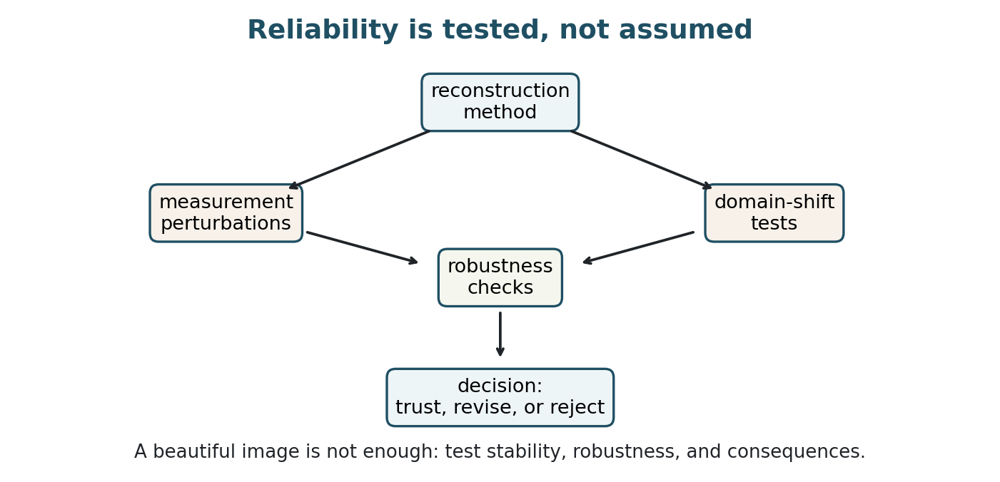
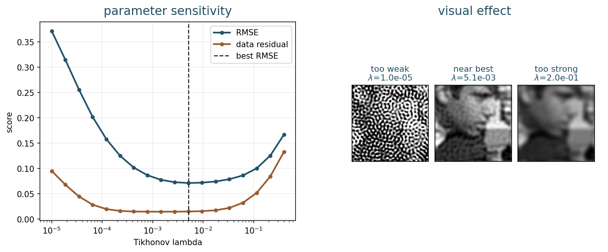
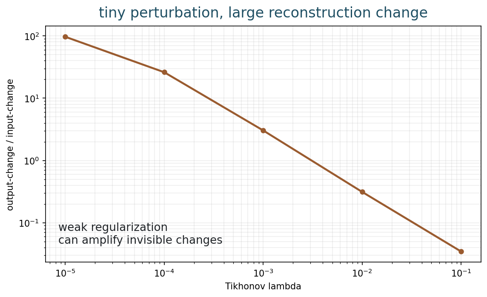
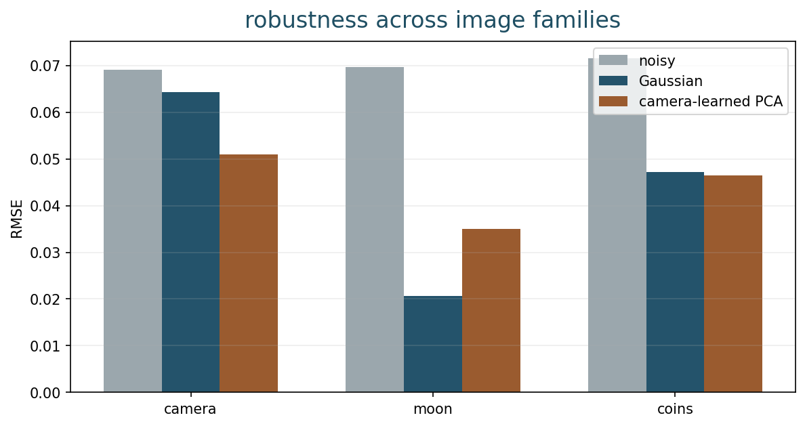
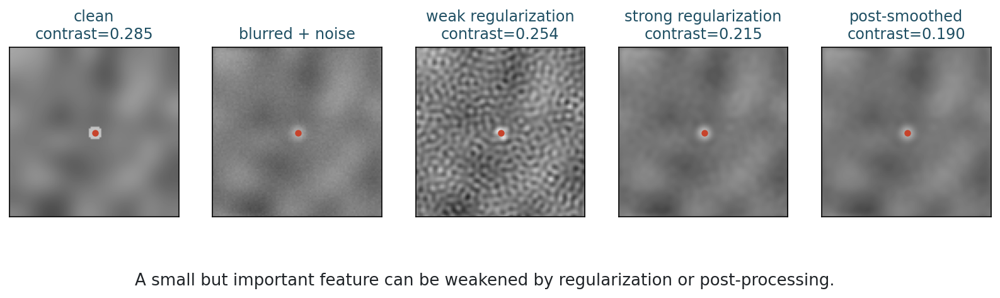
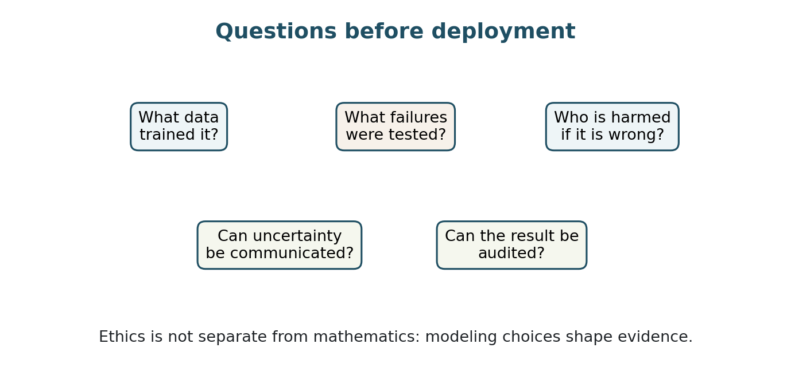

## Opening Question {.inverse-slide}

::: {.section-kicker}
When is a beautiful reconstruction unsafe?
:::

An image can look plausible and still be wrong in a way that matters.

## This Week

::: {.checklist}
- Define stability and parameter sensitivity.
- See how small perturbations can become large reconstruction changes.
- Explain robustness across noise levels, models, and image families.
- Audit learned reconstructions across measurement, training, and decision domains.
- Discuss hallucination and small-feature suppression.
- Connect mathematical validation to ethical responsibility.
:::

## Two-Session Plan

| Session | Focus |
|---|---|
| Session 1 | Stability; parameter sensitivity; perturbation amplification; robustness axes. |
| Session 2 | Hallucination risk; ethics; documentation; project report preparation. |

## Session 1: Stability and Robustness Tests {.section-slide}

::: {.section-kicker}
Trust needs perturbations, not only pretty images
:::

## Bridge from Week 13

Plug-and-play gave us a hybrid loop:

::: {.checklist}
- use the forward model for data consistency;
- use a denoiser as an implicit prior;
- monitor fixed-point behavior.
:::

::: {.question-box}
How do we know whether the result should be trusted?
:::

## Final Course Identity

::: {.model-box}
Neural imaging = inverse problems + learned image models.
:::

Reliability asks whether:

::: {.checklist}
- the measurement supports the reconstruction;
- the prior or training data add relevant information;
- the two sources of information conflict;
- the conflict is visible to the user.
:::

## Reliability Is Tested

::: {.figure-frame}
{fig-alt="Reliability loop showing reconstruction method, perturbation tests, domain-shift tests, robustness checks, and decision"}
:::

## Part 1: Stability {.section-slide}

::: {.section-kicker}
Small input, small output?
:::

The first trust question

## Stability

An imaging method is stable if small changes in the data tend to produce small changes in the reconstruction.

::: {.definition-box}
Stability is about sensitivity to perturbations: noise, calibration error, numerical error, or small modeling changes.
:::

## Why Inverse Problems Are Sensitive

Forward imaging often loses information.

Examples:

::: {.checklist}
- blur attenuates high frequencies;
- subsampling removes pixels or coefficients;
- masking discards observations;
- noise corrupts weak signal components.
:::

Trying to invert lost or weakened information can amplify errors.

## Parameter Sensitivity

::: {.figure-frame}
{fig-alt="Tikhonov parameter sensitivity curve and reconstructions for weak, near-best, and strong regularization"}
:::

## Reading the Sensitivity Curve

Weak regularization:

::: {.checklist}
- fits unstable directions;
- amplifies noise;
- may have low data residual but poor image quality.
:::

Strong regularization:

::: {.checklist}
- suppresses artifacts;
- also suppresses details;
- may fit the data poorly.
:::

## Activity 1: Parameter Choice

::: {.time-tag}
5 minutes
:::

::: {.exercise-box}
Suppose two reconstructions have similar visual quality.

One has lower data residual. The other is smoother and more stable under noise.

Which would you choose, and what extra test would you ask for?
:::

## Part 2: Perturbation Amplification {.section-slide}

::: {.section-kicker}
Invisible changes can matter
:::

Worst-case directions

## A Small Perturbation Test

Take an observation $y$ and add a tiny perturbation $\delta y$.

Compare:

$$
\frac{\|\delta y\|}{\|y\|}
\qquad\text{and}\qquad
\frac{\|\hat{x}(y+\delta y)-\hat{x}(y)\|}{\|\hat{x}(y)\|}.
$$

::: {.takeaway-box}
The output-change/input-change ratio is a practical sensitivity diagnostic.
:::

## Amplification Example

::: {.figure-frame}
{fig-alt="Output-change over input-change versus Tikhonov lambda, showing large amplification for weak regularization"}
:::

## Why This Happens

In singular-value language, unstable directions have small singular values.

Direct inversion multiplies by:

$$
\frac{1}{\sigma_i}.
$$

Regularization limits that multiplication.

## Stability Is Not Only About Noise

Perturbations can come from:

::: {.checklist}
- sensor noise;
- wrong blur kernel;
- calibration drift;
- discretization choices;
- preprocessing;
- changes in acquisition protocol.
:::

## Part 3: Robustness {.section-slide}

::: {.section-kicker}
Does it still work off the happy path?
:::

Beyond one clean experiment

## Robustness

A method is robust if it works acceptably across a meaningful range of conditions.

::: {.definition-box}
Robustness is not a single number. It is a testing plan over expected and stressful cases.
:::

## Robustness Axes

Test across:

::: {.checklist}
- noise levels;
- blur or sampling model mismatch;
- parameter settings;
- image classes;
- acquisition devices;
- rare but important structures.
:::

## A Minimal Robustness Table

| Test | Question |
|---|---|
| noise sweep | Does performance degrade smoothly? |
| parameter sweep | Is there a wide safe range? |
| model mismatch | What if $A$ is wrong? |
| image family shift | Does the prior overfit one domain? |
| small feature test | Are weak structures preserved? |

## Domain Robustness

::: {.figure-frame}
{fig-alt="RMSE of noisy, Gaussian, and camera-trained PCA denoising across camera, moon, and coins image families"}
:::

## Reading the Domain Test

The learned patch prior was trained on camera-like patches.

It helps on a camera crop.

It is less competitive on a different image family.

::: {.takeaway-box}
Learning from data does not remove assumptions. It moves assumptions into the training set.
:::

## Three Domains To Audit

| Domain | Reliability question |
|---|---|
| measurement | Does the forward model match the real acquisition? |
| training | Do examples represent the cases where the method is used? |
| decision | Does the metric match the task or risk? |

::: {.caption}
A neural reconstruction can pass one domain and fail another.
:::

## Overfitting in Inverse Problems

Overfitting can mean:

::: {.checklist}
- excellent results on benchmark images;
- poor robustness on new acquisition conditions;
- learned texture that does not correspond to measured evidence;
- hidden failure on minority or rare cases.
:::

## Activity 2: Robustness Plan

::: {.time-tag}
5 minutes
:::

::: {.exercise-box}
For your project, name:

1. one parameter you will sweep;
2. one model mismatch you will test;
3. one failure case you will show honestly.
:::

## Session 2: Reliability, Ethics, and Project Defense {.section-slide}

::: {.section-kicker}
What must be documented before trust?
:::

## Part 4: Hallucination and Small Features {.section-slide}

::: {.section-kicker}
Plausible is not the same as true
:::

Image quality can deceive

## Hallucination

In reconstruction, hallucination means producing structure that looks plausible but is not supported by the measurements.

::: {.question-box}
What is worse: inventing a false feature, or removing a real weak feature?
:::

## Small Feature Risk

::: {.figure-frame}
{fig-alt="Small bright feature weakened by regularization and smoothing"}
:::

## Reading the Small Feature Example

The feature is visible in the clean image.

With blur and noise, it is hard to recover.

Strong regularization and smoothing make the image look calmer, but reduce feature contrast.

::: {.takeaway-box}
The right reconstruction depends on the task, not only on visual smoothness.
:::

## Same Question, Different Mechanism

Different priors can erase small information in different ways:

::: {.checklist}
- TV may remove weak texture by preferring piecewise smooth regions.
- Wavelet thresholding may remove small coefficients.
- A learned prior may remove structures absent from training data.
:::

::: {.question-box}
Did the method preserve the information needed for the task?
:::

## Data Consistency Is Necessary

An output should be compatible with the measurement model:

$$
Ax \approx y.
$$

But data consistency alone is not enough when the inverse problem is ill-posed.

::: {.model-box}
Many images may explain the same measurement within noise tolerance.
:::

## Image Quality Is Not Enough

Common visual scores can miss:

::: {.checklist}
- rare features;
- small structures;
- localized artifacts;
- downstream decision errors;
- confidence calibration.
:::

## Better Evaluation

Use several checks:

::: {.checklist}
- data residual;
- RMSE or PSNR when ground truth exists;
- feature contrast or task-specific measurements;
- robustness sweeps;
- expert or domain review;
- uncertainty or confidence reporting.
:::

## Part 5: Ethics and Responsibility {.section-slide}

::: {.section-kicker}
Mathematics has consequences
:::

Especially in scientific and medical imaging

## Reliability in Medical Imaging

For medical or high-stakes scientific use, a reconstruction can influence decisions.

That means we should ask:

::: {.checklist}
- What evidence supports the output?
- What could be hidden by the algorithm?
- Who is affected by a false positive or false negative?
- Can a user see uncertainty and limitations?
:::

## Questions Before Deployment

::: {.figure-frame}
{fig-alt="Ethics questions before deployment: training data, tested failures, harm, uncertainty, auditability"}
:::

## Ethical Failure Modes

::: {.checklist}
- A model works worse for some populations or acquisition sites.
- A reconstruction removes rare but important signs.
- A plausible output is treated as direct measurement.
- Users are not told when the method is outside its tested domain.
- Code and parameters are not reproducible.
:::

## What To Document

For a reconstruction method, document:

::: {.checklist}
- forward model and assumptions;
- training data or priors;
- parameter choices;
- validation cases;
- known failures;
- uncertainty and limitations;
- intended use and non-use.
:::

## Project Reports Due

::: {.time-tag}
Project report
:::

Your project report should include:

::: {.checklist}
- mathematical model;
- reconstruction algorithm;
- parameter study;
- results on multiple cases;
- failure or limitation analysis;
- code and reproducibility notes.
:::

## Notebook Demo and Code Reference {.code-small}

::: {.checklist}
- Use the corresponding notebook for the live experiment.
- Example scripts live in `examples/` for later reruns.
- General run instructions are on the [notebooks page](../notebooks/index.html).
:::

## In-Class Notebook Activity

::: {.time-tag}
10 minutes
:::

::: {.exercise-box}
Open the corresponding notebook.

1. Sweep Tikhonov lambda.
2. Measure perturbation amplification.
3. Track small-feature contrast.
4. Compare learned denoising across image families.
5. Write a reliability checklist for your project.
:::

## Quiz-Style Check

::: {.exercise-box}
Answer quickly:

1. What does stability mean?
2. What is parameter sensitivity?
3. What is hallucination in reconstruction?
4. Why is robustness testing an ethical issue?
:::

## What Students Should Remember

::: {.takeaway-box}
- Ill-posed inverse problems require stability checks.
- A good-looking image can still be unreliable.
- Learned priors inherit assumptions from training data.
- Robustness must be tested across realistic and stressful cases.
- Ethical reconstruction means documenting assumptions, failures, and limits.
:::

## Final Boundary Question

::: {.question-box}
Which parts of the reconstruction are dictated by the measurement, and which parts are supplied by prior knowledge?
:::

This is the boundary modern imaging has to test.

## After This Week

::: {.checklist}
- Use the [weekly roadmap](../classes.html) to find the book chapter, notebook, and practice prompt.
- Use Chapter 14 of the book as the reliability checklist for projects.
- Run the corresponding notebook and change at least one important parameter.
- Write one claim-evidence-limit sentence about this week's model.
:::

## Next Week

Oral defenses:

- explain your model clearly;
- justify algorithm and parameters;
- interpret results and failures;
- show that both teammates understand the whole project.
